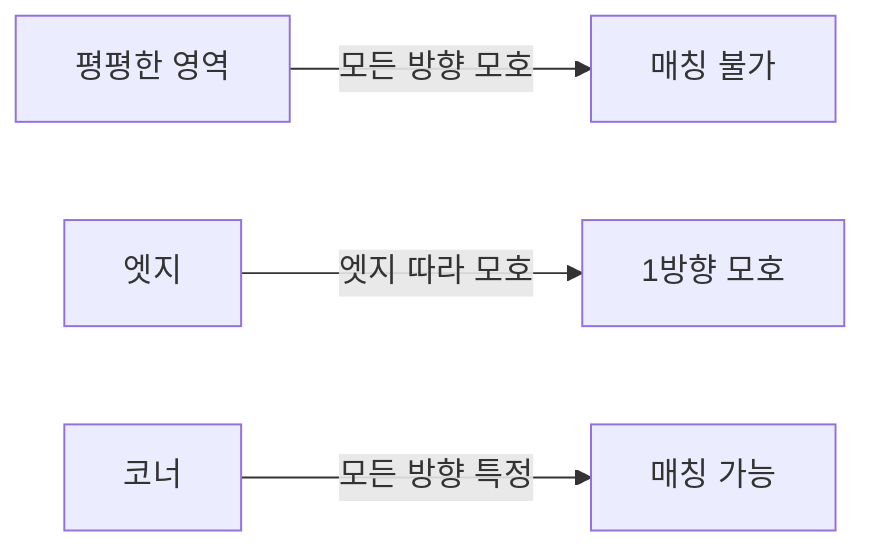
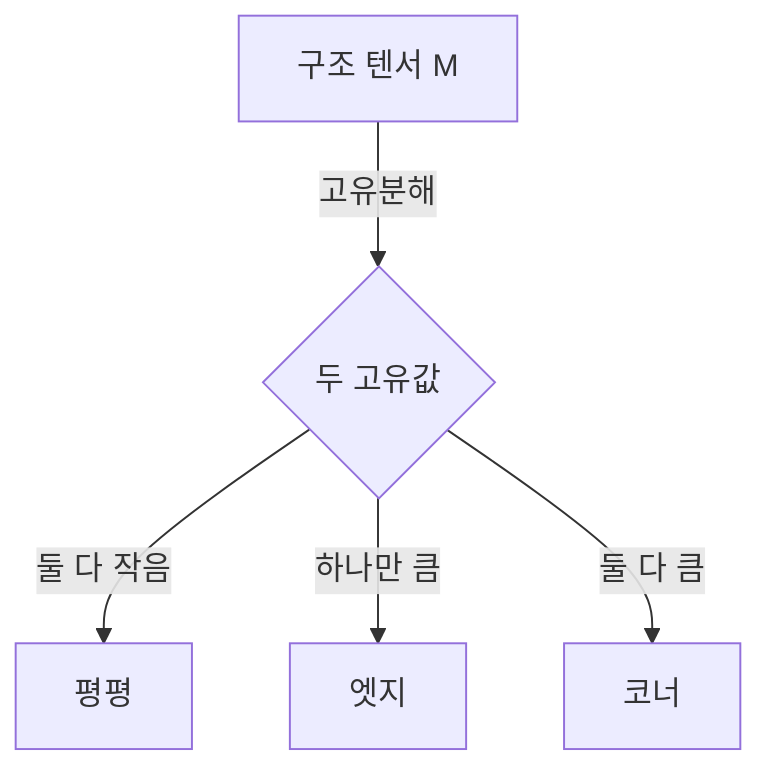

> 두 이미지를 매칭하려면 "어디를 매칭할지" 정해야 한다. 평평한 영역이나 엣지 위의 점은 모호하고, 코너만이 명확히 특정된다. 코너가 왜 좋은 특징인지, 어떻게 찾는지가 이 항목이다.
---
## 1. 정의
**코너(corner)** 는 두 방향 모두로 밝기가 크게 변하는 점이다. 엣지가 한 방향으로만 변한다면, 코너는 모든 방향으로 변해 위치가 유일하게 특정된다.
**Harris 코너 검출(Harris corner detector)** 은 작은 윈도우를 조금 움직였을 때 밝기 변화량을 측정해 코너를 찾는다. 변화량은 구조 텐서(second moment matrix) $M$ 으로 요약된다.
$$
M = \sum_{(x,y) \in W} w(x,y)
\begin{bmatrix} I_x^2 & I_x I_y \\ I_x I_y & I_y^2 \end{bmatrix}
$$
$I_x, I_y$ 는 밝기 그래디언트(이전 항목), $w$ 는 윈도우 가중치(보통 가우시안)다. $M$ 의 두 고유값이 코너 여부를 결정한다.
## 2. 의미 — 왜 필요한가
특징점 매칭, 추적, SLAM의 첫 단계는 "반복 검출 가능하고(repeatable) 유일하게 특정되는(distinctive) 점"을 찾는 것이다. 이 조건을 만족하는 게 코너다. 왜 코너여야 하는지는 "조리개 문제(aperture problem)"로 이해된다.

작은 윈도우로 한 점을 보면, 평평한 영역에서는 어디로 움직여도 똑같아 위치를 못 정한다. 엣지에서는 엣지를 따라 움직이면 똑같아 한 방향이 모호하다(조리개 문제). 오직 코너에서만 어느 방향으로 움직여도 모습이 바뀌어 위치가 유일하게 정해진다. 그래서 코너가 "좋은 추적 점(good features to track)"이다.
## 3. 원리와 유도
### 3.1 윈도우 이동에 따른 밝기 변화
윈도우를 $(\Delta x, \Delta y)$ 만큼 움직였을 때의 밝기 변화 제곱합을 보자.
$$
E(\Delta x, \Delta y) = \sum_{(x,y)\in W} w(x,y)\,[I(x+\Delta x, y+\Delta y) - I(x, y)]^2
$$
테일러 1차 근사 $I(x+\Delta x, y+\Delta y) \approx I + I_x\Delta x + I_y\Delta y$ 를 넣으면
$$
E(\Delta x, \Delta y) \approx \begin{bmatrix} \Delta x & \Delta y \end{bmatrix} M \begin{bmatrix} \Delta x \\ \Delta y \end{bmatrix}
$$
즉 변화량 $E$ 가 구조 텐서 $M$ 으로 만들어지는 이차형식이 된다. $M$ 이 모든 방향의 변화 정보를 담는다.
### 3.2 고유값으로 코너 판별
$M$ 은 대칭행렬이라 직교 고유분해된다(Part 0-2). 두 고유값 $\lambda_1, \lambda_2$ 가 두 주축 방향의 변화량을 나타낸다.
- $\lambda_1 \approx \lambda_2 \approx 0$: 평평한 영역 (어느 방향도 변화 없음)
- $\lambda_1 \gg \lambda_2 \approx 0$: 엣지 (한 방향만 변화)
- $\lambda_1, \lambda_2$ 모두 큼: 코너 (모든 방향 변화)
$M$ 의 고유값 타원이 곧 "어느 방향으로 얼마나 변하는가"의 그림이다 — 2번 항목의 공분산 타원과 같은 구조다.
### 3.3 Harris 응답 함수: 고유값 계산을 피하다
고유값을 직접 구하는 건 비싸다. Harris는 행렬식과 대각합으로 우회한다.
$$
R = \det(M) - k\,(\text{tr}\,M)^2 = \lambda_1\lambda_2 - k(\lambda_1 + \lambda_2)^2
$$
$\det M = \lambda_1\lambda_2$, $\text{tr}\,M = \lambda_1 + \lambda_2$ 라는 성질을 쓴다(고유값을 안 구해도 됨). $R$ 이 크고 양수면 코너, 음수면 엣지, 작으면 평평한 영역이다. $k$ 는 보통 0.04\~0.06. 이후 비최대 억제(NMS)로 국소 최대만 남긴다.
## 4. 기하적 직관

구조 텐서의 고유값 타원을 떠올리면 명쾌하다. 평평한 영역은 타원이 점에 가깝고(변화 없음), 엣지는 한 축만 긴 납작한 타원(한 방향만 변화), 코너는 두 축이 모두 긴 원에 가까운 타원(모든 방향 변화)이다. Harris 응답 $R$ 은 이 타원의 "둥글고 큰 정도"를 하나의 점수로 요약한 것이다.
## 5. 심화 — 비전에서의 활용
- **Shi-Tomasi (Good Features to Track).** Harris의 변형으로, $\min(\lambda_1, \lambda_2)$ 를 응답으로 쓴다. 추적에 더 안정적이라 광류(KLT)의 표준 특징.
- **회전 불변, 스케일 불변 아님.** Harris는 회전에 불변이지만(고유값은 회전 불변) 스케일이 바뀌면 코너가 엣지로 보일 수 있다. 이 한계가 다음 항목 SIFT(스케일 불변)의 동기다.
- **서브픽셀 정밀화.** 코너 위치를 정수 픽셀이 아니라 응답 함수의 이차 근사로 서브픽셀까지 구해, 캘리브레이션·정합 정밀도를 높인다.
## 6. 흔한 함정
- **※ 스케일 불변 아님.** Harris는 고정 윈도우라 스케일이 바뀌면 검출이 불안정하다. 멀티스케일이 필요하면 SIFT/ORB로.
- **※ **$k$** 와 임계값 민감.** $k$ 와 응답 임계값에 따라 코너 수가 크게 변한다. 장면마다 튜닝이 필요할 수 있다.
- **※ NMS 생략.** 비최대 억제 없이 임계값만 쓰면 한 코너 주변에 점이 뭉친다. 국소 최대만 남겨야 한다.
- **※ 노이즈에 민감한 그래디언트.** $I_x, I_y$ 계산 전 가우시안 평활화를 안 하면 노이즈가 가짜 코너를 만든다(이전 항목과 연결).
## 7. 코드로 확인
아래는 OpenCV로 실행해 검증한 코드다.
```python
import numpy as np
import cv2

# 사각형 -> 네 코너가 있어야 함
im = np.zeros((100, 100), np.uint8)
im[30:70, 30:70] = 255

# Harris 코너 응답
dst = cv2.cornerHarris(np.float32(im), blockSize=2, ksize=3, k=0.04)
print(round(dst.max(), 2) > 0)              # True (코너에서 큰 응답)

# 임계값으로 코너 위치 추출
corners = np.argwhere(dst > 0.01 * dst.max())
print(len(corners) > 0)                     # True (사각형 모서리 검출)

# Shi-Tomasi (Good Features to Track) 비교
pts = cv2.goodFeaturesToTrack(im, maxCorners=10,
                               qualityLevel=0.01, minDistance=10)
print(pts.shape[0])   # 4 근방 (사각형 네 코너)
```
Harris가 사각형 모서리에서 강한 응답을 내고, Shi-Tomasi가 네 코너를 안정적으로 찾는 것이 확인된다.
## 8. 면접 예상 질문
**Q1. 왜 엣지가 아니라 코너를 특징점으로 쓰나요? (조리개 문제)**
작은 윈도우로 볼 때 엣지 위의 점은 엣지를 따라 움직여도 모습이 같아 위치가 한 방향으로 모호하다(조리개 문제). 코너는 어느 방향으로 움직여도 모습이 바뀌어 위치가 유일하게 특정된다. 그래서 반복 검출과 매칭에 코너가 적합하다.
**Q2. Harris 검출의 구조 텐서 **$M$** 의 고유값은 무엇을 의미하나요?**
$M$ 의 두 고유값은 두 주축 방향의 밝기 변화량이다. 둘 다 작으면 평평, 하나만 크면 엣지, 둘 다 크면 코너다. 고유값 타원이 "어느 방향으로 얼마나 변하는가"를 나타낸다.
**Q3. Harris 응답 **$R = \det M - k(\text{tr}\,M)^2$** 에서 왜 고유값을 직접 안 구하나요?**
고유값 계산은 비싸다. $\det M = \lambda_1\lambda_2$, $\text{tr}\,M = \lambda_1+\lambda_2$ 라는 관계를 쓰면 행렬식과 대각합만으로 응답을 계산할 수 있어, 고유값을 직접 구하지 않고도 코너 여부를 판별한다.
**Q4. Harris의 한계와 그 해결책은?**
Harris는 회전에는 불변이지만 스케일에는 불변이 아니다. 고정 윈도우라 물체가 커지거나 작아지면 코너가 엣지처럼 보여 검출이 불안정해진다. 이 한계가 스케일 공간에서 특징을 찾는 SIFT, 그리고 빠른 ORB의 동기가 됐다.
## 9. 레퍼런스
- Harris & Stephens, *A Combined Corner and Edge Detector* (1988) — [https://www.bmva.org/bmvc/1988/avc-88-023.pdf](https://www.bmva.org/bmvc/1988/avc-88-023.pdf)
- Szeliski, *Computer Vision* 2nd ed., Ch.7.1 (특징 검출) — [https://szeliski.org/Book/](https://szeliski.org/Book/)
- Shi & Tomasi, *Good Features to Track* (1994) — [https://www.ces.clemson.edu/\~stb/klt/shi-tomasi-good-features-cvpr1994.pdf](https://www.ces.clemson.edu/~stb/klt/shi-tomasi-good-features-cvpr1994.pdf)
