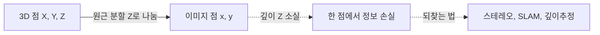
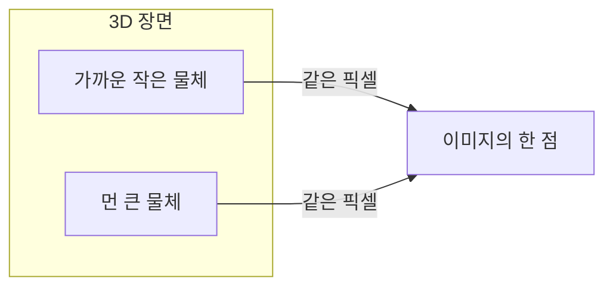

> 카메라는 3D 세계를 2D 이미지로 누른다. 이 과정에서 무엇이 보존되고 무엇이 사라지는가 — 그 답이 핀홀 모델이고, 모든 비전 기하의 출발점이다.
---
## 1. 정의
**핀홀 카메라 모델(pinhole camera model)** 은 카메라를 "작은 구멍 하나로 빛이 들어와 뒤쪽 평면에 상이 맺히는" 이상화된 장치로 본다. 3D 점 $\mathbf{X} = (X, Y, Z)$ 가 초점거리 $f$ 의 카메라에서 이미지 평면에 맺히는 위치는
$$
x = f\frac{X}{Z}, \qquad y = f\frac{Y}{Z}
$$
핵심은 $Z$(깊이)로 나누는 **원근 분할(perspective division)** 이다. 멀리 있을수록($Z$ 큼) 작게 맺힌다. 이 나눗셈이 원근 효과의 수학적 정체이자, 동시에 깊이 정보가 사라지는 지점이다.
**이미지 형성(image formation)** 은 빛이 장면에서 출발해 렌즈를 거쳐 센서에 도달하고 픽셀값으로 기록되는 전 과정이다. 기하적 측면(어디에 맺히는가)은 핀홀 모델이, 광도적 측면(얼마나 밝게 맺히는가)은 복사/반사 모델이 다룬다. 이 항목은 기하에 집중한다.
## 2. 의미 — 왜 필요한가
비전의 첫 질문은 "3D 점이 이미지의 어디에 찍히는가"다. 이 사상을 모르면 역으로 "이미지의 점이 3D 어디서 왔는가"(복원)도 풀 수 없다. 핀홀 모델은 이 정사상(forward projection)을 정의하고, SLAM·삼각측량·캘리브레이션이 전부 이 모델의 역문제다.

가장 중요한 통찰은 **원근투영이 깊이를 지운다**는 것이다. $x = fX/Z$ 에서 $X$ 와 $Z$ 가 같은 비율로 커지면 $x$ 는 변하지 않는다. 즉 "가까운 작은 물체"와 "먼 큰 물체"가 같은 픽셀에 맺힌다. 한 장의 이미지만으로는 절대 깊이를 알 수 없다는 이 사실이, 이후 모든 3D 복원 기법(스테레오, SLAM, 깊이 추정)이 존재하는 근본 이유다. 비전의 큰 줄기는 "사라진 깊이를 어떻게 되찾는가"라는 한 질문으로 꿰어진다.
## 3. 원리와 유도
### 3.1 닮은 삼각형에서 원근투영 유도
핀홀(초점)을 원점에 두고, 이미지 평면을 광축 위 거리 $f$ 에 놓자. 3D 점 $(X, Y, Z)$ 와 그 상 $(x, y)$ 는 핀홀을 지나는 같은 직선 위에 있다. 광축 방향으로 본 단면에서 닮은 삼각형이 성립한다.
$$
\frac{x}{f} = \frac{X}{Z} \;\Longrightarrow\; x = f\frac{X}{Z}
$$
$y$ 도 같은 방식으로 $y = fY/Z$. 이 단순한 비례가 원근투영의 전부다. 실제 카메라는 상이 뒤집혀 맺히지만(센서가 핀홀 뒤에 있으므로), 수학적으로는 핀홀 앞 거리 $f$ 에 "가상 이미지 평면"을 두어 부호 뒤집힘을 없앤 모델을 쓴다.
### 3.2 동차좌표로 선형화
3.1의 식에는 나눗셈이 있어 선형변환이 아니다. 동차좌표(Part 0-3)로 올리면 행렬 곱이 된다.
$$
\begin{bmatrix} x \\ y \\ 1 \end{bmatrix}
\sim
\begin{bmatrix} f & 0 & 0 & 0 \\ 0 & f & 0 & 0 \\ 0 & 0 & 1 & 0 \end{bmatrix}
\begin{bmatrix} X \\ Y \\ Z \\ 1 \end{bmatrix}
=
\begin{bmatrix} fX \\ fY \\ Z \end{bmatrix}
$$
마지막 성분이 $Z$ 가 되고, dehomogenization으로 $Z$ 로 나누면 $(fX/Z, fY/Z)$ 가 복원된다. 나눗셈을 "맨 마지막 한 번"으로 미루는 동차좌표의 위력이 여기서 발휘된다.
### 3.3 픽셀 좌표로의 변환
위 식은 이미지 평면의 물리 좌표(미터 등)다. 실제 픽셀 좌표로 바꾸려면 두 가지가 더 필요하다. 픽셀 스케일($m_x, m_y$: 단위 길이당 픽셀 수)과 주점($c_x, c_y$: 광축이 이미지와 만나는 픽셀 위치, 보통 이미지 중심 근처). 이를 합치면 다음 항목의 내부 파라미터 행렬 $K$ 가 된다.
$$
\begin{bmatrix} u \\ v \\ 1 \end{bmatrix}
\sim
\underbrace{\begin{bmatrix} f_x & 0 & c_x \\ 0 & f_y & c_y \\ 0 & 0 & 1 \end{bmatrix}}_{K}
\begin{bmatrix} X/Z \\ Y/Z \\ 1 \end{bmatrix}
$$
여기서 $f_x = f m_x$, $f_y = f m_y$ 다. 초점거리가 픽셀 단위로 흡수된다.
## 4. 기하적 직관

핀홀을 꼭짓점으로 하는 광선 다발을 떠올리면 직관이 잡힌다. 한 광선 위의 모든 3D 점은 같은 픽셀에 맺힌다 — 이것이 깊이 소실의 기하적 그림이다. 픽셀 하나는 3D 공간의 한 점이 아니라 "핀홀에서 뻗어나가는 한 광선" 전체에 대응한다. 그래서 한 픽셀에서 3D를 복원하려면 또 다른 시점(광선)이 필요하고, 두 광선의 교점이 3D 점이 된다(삼각측량, Part 3).
## 5. 심화 — 비전에서의 활용
- **전체 투영 파이프라인.** $\mathbf{x} \sim K[R|\mathbf{t}]\mathbf{X}_w$ 로, 월드 점이 외부 파라미터로 카메라 좌표가 되고 내부 파라미터로 픽셀이 된다(다음 항목).
- **역투영(back-projection).** 픽셀 $(u,v)$ 와 깊이 $Z$ 가 주어지면 3D 점을 복원할 수 있다($X = (u-c_x)Z/f_x$). RGB-D 카메라가 정확히 이 연산으로 점군을 만든다.
- **약한 원근(weak perspective).** 물체의 깊이 변화가 거리에 비해 작으면 원근을 아핀으로 근사할 수 있다. 계산이 단순해져 일부 추정 문제의 초기화에 쓰인다.
## 6. 흔한 함정
- **※ 초점거리의 단위.** $f$(물리 단위)와 $f_x, f_y$(픽셀 단위)를 혼동하면 안 된다. 캘리브레이션이 주는 건 픽셀 단위 $f_x, f_y$ 다.
- **※ **$f_x \neq f_y$** 가능.** 픽셀이 정사각형이 아니거나 센서 비대칭이면 둘이 다르다. 보통 비슷하지만 같다고 가정하면 안 된다.
- **※ 주점을 이미지 중심으로 단정.** $c_x, c_y$ 는 대략 중심이지만 정확히 중심은 아니다. 렌즈 정렬 오차로 수\~수십 픽셀 어긋나며, 정밀 작업에서는 캘리브레이션 값을 써야 한다.
- **※ 깊이를 이미지에서 직접 얻으려는 시도.** 단일 핀홀 이미지에는 절대 깊이 정보가 없다. 깊이는 추가 시점·센서·학습된 사전지식에서만 온다.
## 7. 코드로 확인
아래는 실제 NumPy로 실행해 검증한 코드다.
```python
import numpy as np

# 내부 파라미터
f, cx, cy = 800., 320., 240.
K = np.array([[f, 0, cx],
              [0, f, cy],
              [0, 0, 1.]])

# 카메라 좌표의 3D 점을 픽셀로 투영
X = np.array([1.0, 0.5, 4.0])     # (X, Y, Z)
x = K @ X
print(x[:2] / x[2])               # [520. 340.]

# 검산: u = f*X/Z + cx
print(f*X[0]/X[2] + cx, f*X[1]/X[2] + cy)   # 520.0 340.0

# 깊이 소실 확인: (X,Y,Z)와 (2X,2Y,2Z)는 같은 픽셀
X2 = 2 * X
print(np.allclose((K@X)[:2]/(K@X)[2], (K@X2)[:2]/(K@X2)[2]))   # True
```
투영 공식과 닫힌 형태가 일치하고, 깊이를 두 배로 늘려도(같은 광선 위) 같은 픽셀에 맺힘이 확인된다 — 깊이 소실의 직접적 증거다.
## 8. 면접 예상 질문
**Q1. 핀홀 카메라에서 원근투영 공식을 유도해보세요.**
핀홀을 원점, 이미지 평면을 거리 $f$ 에 두면, 3D 점 $(X,Y,Z)$ 와 상 $(x,y)$ 는 핀홀을 지나는 같은 직선 위에 있다. 닮은 삼각형에서 $x/f = X/Z$ 이므로 $x = fX/Z$, 같은 방식으로 $y = fY/Z$. 핵심은 깊이 $Z$ 로 나누는 원근 분할이다.
**Q2. 한 장의 이미지로 절대 깊이를 알 수 없는 이유는?**
$x = fX/Z$ 에서 $X$ 와 $Z$ 가 같은 비율로 커지면 $x$ 가 불변이다. 즉 핀홀에서 뻗는 한 광선 위의 모든 점이 같은 픽셀에 맺힌다. 따라서 픽셀 하나는 3D 점이 아니라 광선 전체에 대응하며, 깊이를 결정하려면 다른 시점이나 센서, 학습된 사전지식이 필요하다.
**Q3. 내부 파라미터에서 **$f_x$** 와 **$f_y$** 가 다를 수 있나요?**
가능하다. 픽셀이 정사각형이 아니거나 센서의 가로·세로 픽셀 밀도가 다르면 $f_x = f m_x$, $f_y = f m_y$ 에서 $m_x \neq m_y$ 가 되어 둘이 달라진다. 보통은 비슷하지만 같다고 단정하면 안 되고, 캘리브레이션으로 각각 구한다.
**Q4. 원근투영을 왜 동차좌표로 표현하나요?**
$x = fX/Z$ 의 나눗셈 때문에 투영이 선형변환이 아닌데, 동차좌표로 올리면 $3\times4$ 행렬 곱으로 표현되고 마지막 성분이 $Z$ 가 된다. dehomogenization에서 $Z$ 로 나누면 원래 식이 복원된다. 나눗셈을 마지막으로 미뤄, 회전·이동·투영을 모두 행렬 곱으로 합성할 수 있게 된다.
## 9. 레퍼런스
- Szeliski, *Computer Vision* 2nd ed., Ch.2.1 (이미지 형성) — [https://szeliski.org/Book/](https://szeliski.org/Book/)
- Hartley & Zisserman, *Multiple View Geometry*, Ch.6 (카메라 모델) — [https://www.robots.ox.ac.uk/\~vgg/hzbook/](https://www.robots.ox.ac.uk/~vgg/hzbook/)
- 다크프로그래머, 카메라 모델과 캘리브레이션 — [https://darkpgmr.tistory.com/32](https://darkpgmr.tistory.com/32)
