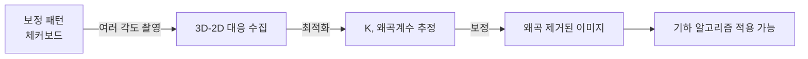
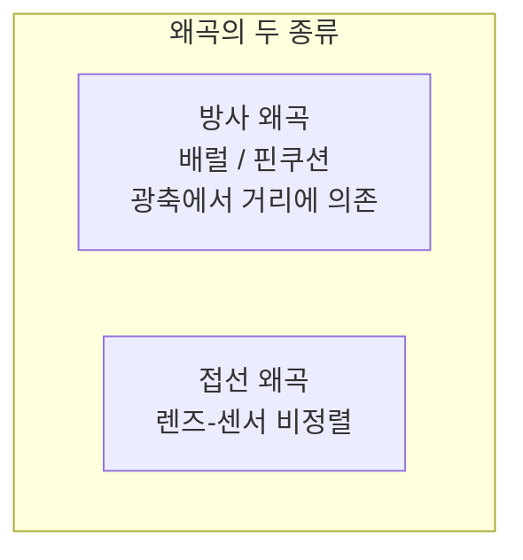

> 실제 렌즈는 핀홀 모델을 따르지 않는다. 직선이 휘어 보이는 왜곡이 있고, 내부 파라미터도 처음엔 모른다. 이 둘을 알려진 패턴으로 풀어내는 것이 캘리브레이션이다.
---
## 1. 정의
**렌즈 왜곡(lens distortion)** 은 실제 렌즈가 이상적 핀홀 투영에서 벗어나는 현상이다. 가장 큰 두 종류는 방사 왜곡과 접선 왜곡이다. 정규화 좌표 $(x, y)$ 와 반경 $r^2 = x^2 + y^2$ 에 대해
$$
\begin{aligned}
x_d &= x(1 + k_1 r^2 + k_2 r^4 + k_3 r^6) + \underbrace{2p_1 xy + p_2(r^2 + 2x^2)}_{\text{접선 왜곡}} \\
y_d &= y(1 + k_1 r^2 + k_2 r^4 + k_3 r^6) + p_1(r^2 + 2y^2) + 2p_2 xy
\end{aligned}
$$
$k_1, k_2, k_3$ 은 방사 왜곡 계수(광축에서 멀수록 강해짐), $p_1, p_2$ 는 접선 왜곡 계수(렌즈-센서 비정렬)다.
**카메라 캘리브레이션(calibration)** 은 알려진 기하의 보정 패턴(체커보드 등)을 여러 각도에서 촬영해, 내부 파라미터 $K$ 와 왜곡 계수를 추정하는 과정이다.
## 2. 의미 — 왜 필요한가
핀홀 모델은 "직선은 직선으로 투영된다"고 말하지만, 실제 광각 렌즈로 찍으면 이미지 가장자리의 직선이 활처럼 휜다(배럴 왜곡). 이 왜곡을 보정하지 않으면 삼각측량·SLAM·정밀 측정이 전부 어긋난다. 비전의 모든 기하 알고리즘은 "왜곡이 제거된 핀홀 이미지"를 전제로 하기 때문이다.

캘리브레이션이 필요한 이유는 두 가지가 동시에 미지이기 때문이다. 카메라의 내부 특성($K$)도 모르고, 렌즈가 얼마나 휘게 하는지(왜곡 계수)도 모른다. 체커보드처럼 "실제 기하를 정확히 아는" 패턴을 이용하면, 관측된 이미지 점과 모델이 예측한 점의 차이(재투영 오차)를 최소화하는 방향으로 이 미지수들을 한꺼번에 풀 수 있다.
## 3. 원리와 유도
### 3.1 Zhang의 평면 캘리브레이션 원리
Zhang(2000)의 방법이 사실상 표준이다. 핵심 아이디어는 평면 패턴(체커보드)을 쓰면 패턴 평면을 $Z=0$ 으로 놓을 수 있어, 투영이 호모그래피로 단순해진다는 것이다. 패턴 평면의 점 $(X, Y, 0)$ 에 대해
$$
\mathbf{x} \sim K[\mathbf{r}_1\ \mathbf{r}_2\ \mathbf{r}_3\ \mathbf{t}]\begin{bmatrix}X\\Y\\0\\1\end{bmatrix} = K[\mathbf{r}_1\ \mathbf{r}_2\ \mathbf{t}]\begin{bmatrix}X\\Y\\1\end{bmatrix} = H\begin{bmatrix}X\\Y\\1\end{bmatrix}
$$
각 사진이 하나의 호모그래피 $H = K[\mathbf{r}_1\ \mathbf{r}_2\ \mathbf{t}]$ 를 준다. 회전 열의 직교성($\mathbf{r}_1^\top\mathbf{r}_2 = 0$, $\|\mathbf{r}_1\| = \|\mathbf{r}_2\|$)이 $K$ 에 대한 제약 두 개를 만든다. 여러 사진의 제약을 모으면 $K$ 를 선형으로 풀 수 있고, 이후 왜곡 계수까지 비선형 최적화로 정제한다.
### 3.2 왜 여러 각도가 필요한가
한 사진은 $K$ 에 대한 제약 2개를 준다. $K$ 의 미지수는 5개($f_x, f_y, c_x, c_y, s$)이므로 최소 3장이 필요하다(2×3=6 ≥ 5). 실제로는 노이즈·왜곡까지 안정적으로 풀기 위해 10\~20장을 다양한 각도·거리로 찍는다. 각도가 다양할수록 제약이 독립적이어서 해가 안정적이다 — 모든 사진을 정면에서만 찍으면 제약이 중복돼 풀리지 않는다.
### 3.3 캘리브레이션 = 재투영 오차 최소화
최종 단계는 비선형 최소제곱이다(Part 0-5). 추정할 파라미터 $\boldsymbol{\theta} = \{K, k_1, k_2, p_1, p_2, \{R_i, \mathbf{t}_i\}\}$ 에 대해, 모든 패턴 점의 관측 위치 $\mathbf{x}_{ij}$ 와 모델 예측 $\hat{\mathbf{x}}(\boldsymbol{\theta})$ 의 차이를 최소화한다.
$$
\min_{\boldsymbol{\theta}} \sum_i \sum_j \big\| \mathbf{x}_{ij} - \hat{\mathbf{x}}(K, \text{왜곡}, R_i, \mathbf{t}_i, \mathbf{X}_j) \big\|^2
$$
Levenberg-Marquardt로 푼다. 이 재투영 오차(보통 픽셀 단위 RMS)가 캘리브레이션 품질의 척도이며, 0.5픽셀 이하면 양호하다.
## 4. 기하적 직관

방사 왜곡은 광축(이미지 중심)에서 멀어질수록 강해진다. $k_1 < 0$ 이면 가장자리가 안으로 말리는 배럴 왜곡(광각 렌즈), $k_1 > 0$ 이면 밖으로 펴지는 핀쿠션 왜곡(망원). 보정의 본질은 "휜 직선을 다시 직선으로 펴는 것"이다. 체커보드의 직선 격자가 이미지에서 휘어 보이는 정도를 측정해, 그걸 펴는 역변환의 계수를 찾는 것이 캘리브레이션이다.
## 5. 심화 — 비전에서의 활용
- **undistortion.** 추정한 왜곡 계수로 이미지 전체를 보정해 핀홀 이미지로 만든다. 이후 모든 기하 알고리즘의 전처리.
- **어안·광각 모델.** 일반 다항식 모델로 부족한 초광각·어안 렌즈는 별도 모델(Kannala-Brandt, equidistant 등)을 쓴다. 화각 180도 이상에서 필수.
- **온라인 캘리브레이션.** 일부 SLAM 시스템은 주행 중 내부 파라미터를 미세 조정한다. 초기값은 사전 캘리브레이션에서 얻는다.
## 6. 흔한 함정
- **※ 단일 각도 촬영.** 모든 사진을 정면·같은 거리에서 찍으면 제약이 중복돼 $K$ 가 안 풀리거나 부정확하다. 기울기·거리·위치를 다양화해야 한다.
- **※ 왜곡 보정 순서.** 왜곡은 정규화 좌표(카메라 좌표를 $Z$ 로 나눈 것)에서 적용되고, 그 다음 $K$ 로 픽셀화된다. 픽셀 좌표에 직접 왜곡 공식을 적용하면 틀린다.
- **※ 고차 계수 과적합.** $k_3$ 까지 무리하게 추정하면 데이터에 과적합돼 외삽이 불안정해진다. 렌즈에 따라 $k_1, k_2$ 만으로 충분한 경우가 많다.
- **※ 재투영 오차만 맹신.** 낮은 재투영 오차가 항상 좋은 건 아니다. 파라미터가 많으면 오차는 줄어도 일반화가 나빠질 수 있다. 다양한 검증 이미지로 확인한다.
## 7. 코드로 확인
아래는 OpenCV로 실행해 검증한 코드다.
```python
import numpy as np
import cv2

# 내부 K와 왜곡 계수
f, cx, cy = 800., 320., 240.
K = np.array([[f, 0, cx],
              [0, f, cy],
              [0, 0, 1.]])
dist = np.array([-0.2, 0.05, 0., 0., 0.])   # k1, k2, p1, p2, k3

# 방사 왜곡 모델 직접 계산 (정규화 좌표)
x, y = 0.3, 0.2
r2 = x**2 + y**2
k1, k2 = dist[0], dist[1]
xd = x * (1 + k1*r2 + k2*r2**2)
yd = y * (1 + k1*r2 + k2*r2**2)
print(round(xd, 4), round(yd, 4))   # 0.2925 0.195

# OpenCV projectPoints로 교차 검증 (왜곡 포함)
theta = np.deg2rad(20)
R = np.array([[np.cos(theta),0,np.sin(theta)],
              [0,1,0],[-np.sin(theta),0,np.cos(theta)]])
rvec, _ = cv2.Rodrigues(R)
t = np.array([0.5, -0.2, 3.0])
pts = np.array([[1., 1., 2.]])
img, _ = cv2.projectPoints(pts, rvec, t, K, dist)
print(img.ravel())   # [676.88 374.44] (왜곡 반영된 픽셀)

# 실제 캘리브레이션은 다음 흐름 (의사코드)
# objpoints: 체커보드 3D 격자점들 (여러 장)
# imgpoints: 각 이미지에서 검출된 코너들
# ret, K, dist, rvecs, tvecs = cv2.calibrateCamera(
#     objpoints, imgpoints, image_size, None, None)
```
방사 왜곡 공식과 OpenCV의 결과가 일관되며, 실제 캘리브레이션은 `cv2.calibrateCamera`가 여러 장의 3D-2D 대응으로 재투영 오차를 최소화해 $K$ 와 왜곡 계수를 반환한다(마지막 블록은 흐름을 보이는 의사코드).
## 8. 면접 예상 질문
**Q1. 렌즈 왜곡에는 어떤 종류가 있나요?**
방사 왜곡과 접선 왜곡이 있다. 방사 왜곡은 광축에서 거리($r$)에 의존하며 $k_1<0$ 이면 배럴(광각), $k_1>0$ 이면 핀쿠션(망원)이다. 접선 왜곡은 렌즈와 센서가 완전히 평행하지 않을 때 생기며 $p_1, p_2$ 로 모델링한다. 보통 방사 왜곡이 지배적이다.
**Q2. Zhang의 캘리브레이션은 왜 평면 패턴을 쓰나요?**
패턴이 평면이면 $Z=0$ 으로 놓을 수 있어 투영이 호모그래피로 단순해진다. 각 사진의 호모그래피 $H = K[\mathbf{r}_1\,\mathbf{r}_2\,\mathbf{t}]$ 에서 회전 열의 직교성이 $K$ 에 대한 제약을 주고, 여러 사진의 제약을 모아 $K$ 를 선형으로 푼다. 평면 패턴은 만들기 쉽고 정확해 실용적이다.
**Q3. 캘리브레이션에 사진이 몇 장 필요한가요? 왜 여러 각도인가요?**
한 사진이 $K$ 에 제약 2개를 주고 $K$ 미지수는 5개라 최소 3장이지만, 노이즈·왜곡까지 풀려면 보통 10\~20장을 쓴다. 각도를 다양화하는 이유는 제약의 독립성 때문이다. 모두 정면에서 찍으면 제약이 중복돼 해가 불안정하거나 안 풀린다.
**Q4. 왜곡 보정은 픽셀 좌표에서 하나요, 정규화 좌표에서 하나요?**
정규화 좌표(카메라 좌표를 $Z$ 로 나눈 것)에서 한다. 투영 순서가 "정규화 좌표 → 왜곡 적용 → $K$ 로 픽셀화"이기 때문이다. 픽셀 좌표에 직접 왜곡 공식을 적용하면 틀린다. 보정 시에는 이 과정을 역으로 푼다.
## 9. 레퍼런스
- Zhang, *A Flexible New Technique for Camera Calibration* (2000) — [https://www.microsoft.com/en-us/research/publication/a-flexible-new-technique-for-camera-calibration/](https://www.microsoft.com/en-us/research/publication/a-flexible-new-technique-for-camera-calibration/)
- OpenCV, Camera Calibration 문서 — [https://docs.opencv.org/4.x/dc/dbb/tutorial_py_calibration.html](https://docs.opencv.org/4.x/dc/dbb/tutorial_py_calibration.html)
- 다크프로그래머, 카메라 캘리브레이션 — [https://darkpgmr.tistory.com/32](https://darkpgmr.tistory.com/32)
