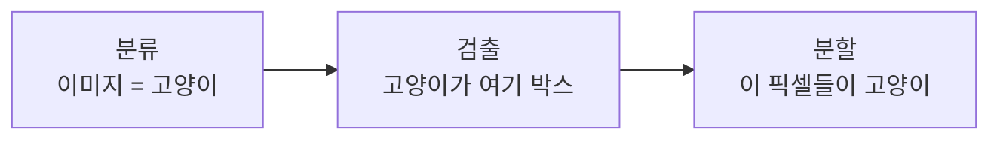
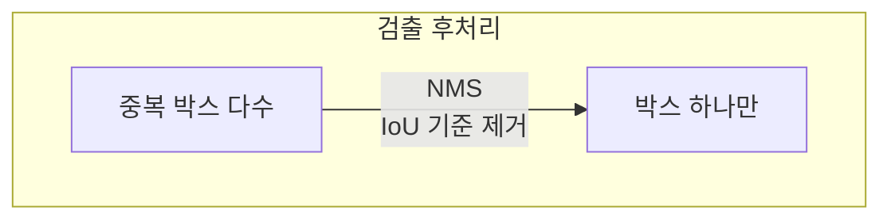

> 분류가 "이 이미지가 무엇인가"라면, 검출은 "무엇이 어디에 있는가", 분할은 "어느 픽셀이 무엇인가"다. 로봇이 물체를 잡거나 피하려면 위치와 경계가 필요하므로, 이 태스크들이 로보틱스 비전의 핵심이다.
---
## 1. 정의
**객체 검출(object detection)** 은 이미지에서 물체의 위치(바운딩 박스)와 클래스를 함께 찾는다. 출력은 박스 좌표 $(x, y, w, h)$ 와 클래스·신뢰도다.
**시맨틱 분할(semantic segmentation)** 은 모든 픽셀에 클래스 레이블을 부여한다(이 픽셀은 도로, 저 픽셀은 하늘). 같은 클래스의 다른 개체는 구분하지 않는다.
**인스턴스 분할(instance segmentation)** 은 픽셀 레이블에 더해 개별 객체를 구분한다(이 사람과 저 사람을 다른 마스크로). 검출 + 분할의 결합이다.
## 2. 의미 — 왜 필요한가
분류(Part 4-17)는 이미지당 레이블 하나라, 여러 물체가 있거나 위치가 필요한 상황엔 부족하다. 로봇이 "컵을 집어라"를 수행하려면 컵이 **어디** 있는지(검출), 그 **경계**가 어딘지(분할) 알아야 한다.

태스크가 정밀해질수록 로봇에게 유용하다. 검출은 충돌 회피·타겟 지정에, 분할은 정밀 파지·장면 이해에 쓰인다. 자율주행은 검출(차·보행자 박스)과 분할(도로·차선 픽셀)을 모두 쓰고, 로봇 조작은 인스턴스 분할로 잡을 물체의 정확한 경계를 얻는다. 6D 자세 추정(다음 항목)의 입력도 이 검출·분할 결과다.
## 3. 원리와 유도
### 3.1 2-스테이지 vs 1-스테이지 검출
검출은 두 접근으로 갈린다. 2-스테이지(R-CNN 계열)는 먼저 물체가 있을 만한 영역(region proposal)을 찾고, 각 영역을 분류·정제한다. 정확하지만 느리다. 1-스테이지(YOLO, SSD)는 이미지를 격자로 나눠 각 셀에서 박스와 클래스를 **한 번에** 예측한다. 빠르고 실시간 가능하다.
YOLO의 핵심은 검출을 회귀 문제로 재정의한 것이다. 이미지를 $S\times S$ 격자로 나누고, 각 셀이 박스 좌표·신뢰도·클래스 확률을 직접 출력한다. "한 번 보고(You Only Look Once)" 전체를 예측해 실시간이 된다.
### 3.2 IoU와 NMS
검출 평가·후처리의 핵심 개념이 IoU(Intersection over Union)다. 두 박스의 겹침 정도를 측정한다.
$$
\text{IoU} = \frac{\text{교집합 면적}}{\text{합집합 면적}}
$$
한 물체에 여러 박스가 겹쳐 예측되면, NMS(Non-Maximum Suppression)로 정리한다. 신뢰도가 가장 높은 박스를 남기고, 그것과 IoU가 임계값 이상인 박스들을 제거하는 과정을 반복한다. IoU는 평가 지표(예측이 정답과 충분히 겹치는가)로도 쓰인다.
### 3.3 DETR: 트랜스포머로 검출을 단순화
DETR(Detection Transformer)은 NMS 같은 수작업 후처리를 없앴다. 트랜스포머의 어텐션으로 이미지 전역 관계를 보고, 객체 쿼리(object query) 집합이 직접 박스 집합을 예측한다. 예측과 정답을 이분 매칭(Hungarian matching)으로 일대일 대응시켜 학습하므로, 중복 박스가 원천적으로 안 생긴다. 검출을 "집합 예측(set prediction)" 문제로 재정의한 것이다.
### 3.4 Mask R-CNN: 검출에 분할을 더하다
Mask R-CNN은 2-스테이지 검출기(Faster R-CNN)에 마스크 예측 분기를 추가해 인스턴스 분할을 한다. 각 검출된 박스 영역에 대해 픽셀별 마스크를 예측한다. 핵심 기여는 RoIAlign — 영역 특징을 추출할 때 양선형 보간으로 정렬해, 픽셀 단위 정밀도를 확보한다. 검출 박스 안에서 "어느 픽셀이 그 물체인가"를 분리한다.
## 4. 기하적 직관

검출을 "박스 제안과 정리"로 보면 이해가 쉽다. 모델은 일단 후보 박스를 많이 내놓고(특히 1-스테이지는 격자마다), IoU 기반 NMS로 겹치는 중복을 쳐내 최종 박스를 남긴다. DETR은 이 "많이 내고 정리하는" 방식 대신, 처음부터 정해진 수의 박스를 일대일로 예측해 정리 단계를 없앤 것이다.
## 5. 심화 — 비전에서의 활용
- **YOLO 계열 발전.** v1\~v11로 이어지며 속도·정확도를 끌어올렸다. 실시간 검출의 사실상 표준으로 로봇·감시·자율주행에 널리 쓰인다.
- **파놉틱 분할(panoptic).** 시맨틱(배경)과 인스턴스(물체)를 통합해 모든 픽셀을 빠짐없이 레이블링한다. 완전한 장면 이해.
- **SAM (Segment Anything).** 프롬프트로 임의 물체를 분할하는 파운데이션 모델. 제로샷 분할로 로보틱스 인식의 전처리를 바꾸고 있다.
## 6. 흔한 함정
- **※ NMS 임계값.** IoU 임계값이 너무 낮으면 가까운 다른 물체를 지우고, 너무 높으면 중복이 남는다. 밀집 장면에서 특히 민감.
- **※ 작은 물체.** 다운샘플링으로 작은 물체의 특징이 사라진다. 멀티스케일 특징(FPN)이 필요.
- **※ 클래스 불균형.** 1-스테이지 검출은 배경 박스가 압도적으로 많아 학습이 치우친다. Focal loss 등으로 완화.
- **※ 검출 박스 = 정밀 위치 오해.** 바운딩 박스는 대략적 위치다. 정밀 파지엔 인스턴스 분할이나 6D 자세(다음 항목)가 필요하다.
## 7. 코드로 확인
아래는 IoU와 NMS 핵심 로직을 검증한 코드다.
```python
import numpy as np

# IoU 계산
def iou(a, b):   # a, b = [x1, y1, x2, y2]
    x1, y1 = max(a[0], b[0]), max(a[1], b[1])
    x2, y2 = min(a[2], b[2]), min(a[3], b[3])
    inter = max(0, x2-x1) * max(0, y2-y1)
    union = (a[2]-a[0])*(a[3]-a[1]) + (b[2]-b[0])*(b[3]-b[1]) - inter
    return inter / union

print(round(iou([0,0,2,2], [1,1,3,3]), 4))   # 0.1429

# NMS (의사코드 수준의 간단 구현)
def nms(boxes, scores, thr=0.5):
    idxs = np.argsort(scores)[::-1]   # 신뢰도 높은 순
    keep = []
    while len(idxs) > 0:
        i = idxs[0]; keep.append(i)
        idxs = [j for j in idxs[1:] if iou(boxes[i], boxes[j]) < thr]
    return keep

boxes = [[0,0,2,2],[0.1,0.1,2.1,2.1],[5,5,7,7]]
scores = [0.9, 0.8, 0.7]
print(nms(boxes, scores))   # [0, 2] (겹친 1번 제거, 떨어진 2번 유지)
```
IoU가 겹침을 정확히 계산하고, NMS가 겹친 중복 박스를 제거하며 떨어진 박스는 유지하는 것이 확인된다.
## 8. 면접 예상 질문
**Q1. 1-스테이지와 2-스테이지 검출기의 차이는?**
2-스테이지(R-CNN 계열)는 영역 제안 후 각 영역을 분류·정제해 정확하지만 느리다. 1-스테이지(YOLO, SSD)는 격자 각 셀에서 박스와 클래스를 한 번에 회귀해 빠르고 실시간 가능하다. 속도-정확도 트레이드오프이며, 최근 1-스테이지가 정확도 격차를 많이 좁혔다.
**Q2. NMS는 무엇이고 왜 필요한가요?**
한 물체에 여러 박스가 겹쳐 예측되므로, 신뢰도 최고 박스를 남기고 그것과 IoU가 임계값 이상인 박스를 제거하는 과정을 반복해 중복을 정리한다. IoU(교집합/합집합)로 겹침을 측정한다. 후처리지만 검출 품질에 큰 영향을 준다.
**Q3. DETR이 기존 검출기와 다른 점은?**
트랜스포머 어텐션으로 전역 관계를 보고, 정해진 수의 객체 쿼리가 박스 집합을 직접 예측한다. 예측-정답을 이분 매칭으로 일대일 대응시켜 학습하므로 중복 박스가 안 생겨 NMS가 필요 없다. 검출을 집합 예측 문제로 재정의했다.
**Q4. 시맨틱 분할과 인스턴스 분할의 차이는?**
시맨틱 분할은 모든 픽셀에 클래스를 주지만 같은 클래스의 개체를 구분하지 않는다(사람들이 한 덩어리). 인스턴스 분할은 개별 객체를 구분해 각자 마스크를 준다(사람1, 사람2 분리). Mask R-CNN이 검출 박스마다 마스크를 예측해 인스턴스 분할을 한다.
## 9. 레퍼런스
- Redmon et al., *You Only Look Once (YOLO)* (2016) — [https://arxiv.org/abs/1506.02640](https://arxiv.org/abs/1506.02640)
- Carion et al., *End-to-End Object Detection with Transformers (DETR)* (2020) — [https://arxiv.org/abs/2005.12872](https://arxiv.org/abs/2005.12872)
- He et al., *Mask R-CNN* (2017) — [https://arxiv.org/abs/1703.06870](https://arxiv.org/abs/1703.06870)
- Kirillov et al., *Segment Anything (SAM)* (2023) — [https://arxiv.org/abs/2304.02643](https://arxiv.org/abs/2304.02643)
