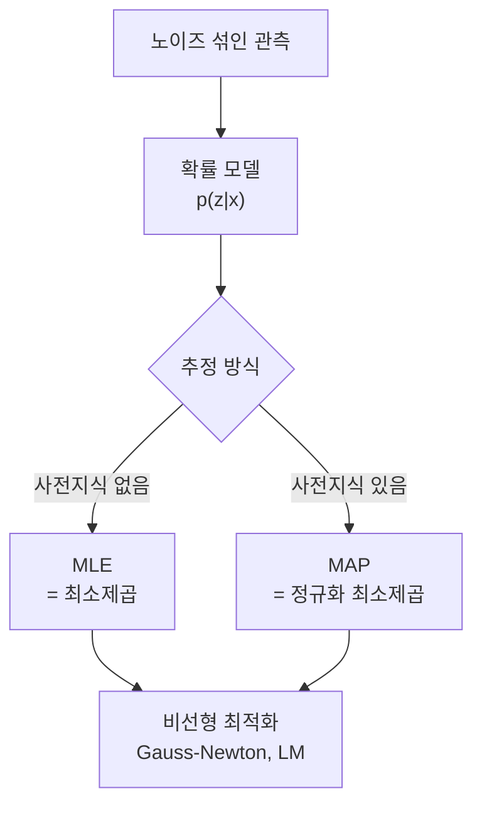
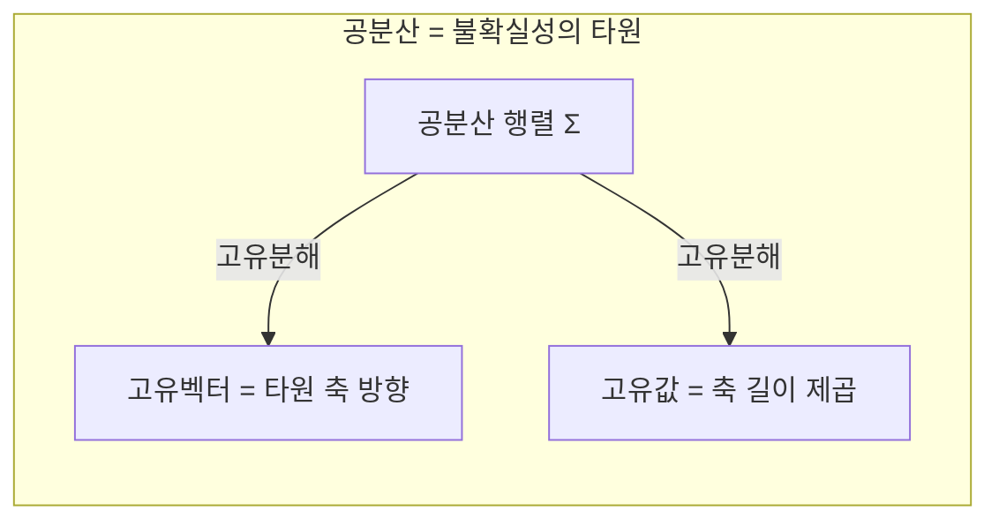

> 실제 카메라 관측에는 노이즈가 있다. 그래서 비전의 추정은 "정확한 해를 계산"하는 게 아니라 "불확실성 속에서 가장 그럴듯한 해를 추정"하는 일이다. 이 관점이 확률·추정·최적화이며, Part 3의 SLAM·번들 조정으로 가는 다리다.
---
## 1. 정의
**추정(estimation)** 은 노이즈 섞인 관측 $\mathbf{z}$ 로부터 미지의 상태 $\mathbf{x}$ 를 추론하는 문제다. 두 가지 패러다임이 있다.
$$
\text{MLE:}\ \hat{\mathbf{x}} = \arg\max_{\mathbf{x}} p(\mathbf{z}\mid\mathbf{x})
\qquad
\text{MAP:}\ \hat{\mathbf{x}} = \arg\max_{\mathbf{x}} p(\mathbf{x}\mid\mathbf{z})
$$
MLE(최대우도)는 "이 관측이 나올 가능성을 최대화하는 상태"를, MAP(최대사후)는 사전지식 $p(\mathbf{x})$ 까지 반영해 "관측을 본 뒤 가장 그럴듯한 상태"를 찾는다. 베이즈 정리 $p(\mathbf{x}\mid\mathbf{z}) \propto p(\mathbf{z}\mid\mathbf{x})\,p(\mathbf{x})$ 로 둘이 연결된다.
**가우시안 분포**는 추정의 기본 노이즈 모델이다. 다변량 가우시안 $\mathcal{N}(\boldsymbol{\mu}, \Sigma)$ 에서 공분산 $\Sigma$ 는 불확실성의 "모양"을 담는다.
$$
p(\mathbf{x}) = \frac{1}{\sqrt{(2\pi)^n |\Sigma|}} \exp\!\left(-\tfrac{1}{2}(\mathbf{x}-\boldsymbol{\mu})^\top \Sigma^{-1} (\mathbf{x}-\boldsymbol{\mu})\right)
$$
**최소제곱(least squares)** 은 잔차 제곱합을 최소화하는 추정이다. 뒤에서 보듯 이것은 가우시안 가정 하의 MLE와 정확히 같다.
$$
\hat{\mathbf{x}} = \arg\min_{\mathbf{x}} \sum_i \|\mathbf{r}_i(\mathbf{x})\|^2
$$
## 2. 의미 — 왜 필요한가
비전의 모든 측정은 불완전하다. 픽셀 위치는 부정확하고, 특징점 매칭에는 오류가 섞이고, 센서에는 노이즈가 있다. 그래서 카메라 캘리브레이션, 삼각측량, PnP, 번들 조정은 모두 "정확한 해가 없는" 과결정 문제이며, "가장 그럴듯한 해"를 추정하는 것이 목표다.

이 항목은 Part 0의 종착점이자 Part 3로 가는 직접적 다리다. 번들 조정은 본질적으로 거대한 비선형 최소제곱이고, SLAM 백엔드는 MAP 추정이며, RANSAC은 outlier 섞인 현실 데이터를 다루는 필수 도구다. "왜 최소제곱이 최대우도와 같은가", "왜 Gauss-Newton이 동작하는가"를 여기서 잡아두면 뒤가 수월하다.
## 3. 원리와 유도
### 3.1 최소제곱 = 가우시안 가정 하의 MLE
"왜 하필 제곱오차냐"의 답이다. 관측 노이즈가 독립이고 평균 0의 가우시안 $\mathcal{N}(0, \sigma^2)$ 이라 가정하면, 우도는 가우시안들의 곱이다. 로그를 취하면
$$
\log p(\mathbf{z}\mid\mathbf{x}) = \sum_i \log \frac{1}{\sqrt{2\pi}\sigma} \exp\!\left(-\frac{r_i(\mathbf{x})^2}{2\sigma^2}\right) = C - \frac{1}{2\sigma^2}\sum_i r_i(\mathbf{x})^2
$$
상수 $C$ 와 양의 계수를 무시하면, **우도 최대화 = 잔차 제곱합 **$\sum r_i^2$** 최소화**다. 즉 제곱오차는 임의의 선택이 아니라 가우시안 노이즈 가정의 필연적 귀결이다. MAP는 여기에 사전분포의 로그항이 더해진 것으로, 정규화(regularization)의 확률적 정체가 바로 이것이다.
### 3.2 최소제곱은 직교투영이다
선형 $A\mathbf{x}=\mathbf{b}$ 에 해가 없을 때, $\|A\mathbf{x}-\mathbf{b}\|^2$ 를 최소화한다. 잔차 $\mathbf{r} = A\mathbf{x}-\mathbf{b}$ 가 최소이려면 $\mathbf{r}$ 이 $A$ 의 열공간에 수직이어야 한다($A^\top\mathbf{r}=0$). 정리하면 정규방정식이 나온다.
$$
A^\top A\,\mathbf{x} = A^\top\mathbf{b}
$$
기하적으로 $\mathbf{b}$ 를 $A$ 의 열공간으로 직교투영하는 것이다(2번 항목과 연결). 단, 수치적으로는 $A^\top A$ 를 직접 만들지 않고 QR/SVD로 푼다.
### 3.3 비선형 최소제곱: 선형화의 반복
비전의 비용함수(재투영 오차 등)는 비선형이라 닫힌 해가 없다. Gauss-Newton은 현재 추정점에서 잔차를 야코비안 $J$ 로 1차 선형화한다.
$$
\mathbf{r}(\mathbf{x}+\Delta\mathbf{x}) \approx \mathbf{r}(\mathbf{x}) + J\,\Delta\mathbf{x}
$$
이를 최소화하는 갱신량은 정규방정식을 푼 것이다.
$$
J^\top J\,\Delta\mathbf{x} = -J^\top\mathbf{r}
$$
$J^\top J$ 가 헤시안의 근사다. **Levenberg-Marquardt(LM)** 는 여기에 감쇠항을 더해
$$
(J^\top J + \lambda I)\,\Delta\mathbf{x} = -J^\top\mathbf{r}
$$
멀리서는($\lambda$ 큼) 경사하강처럼 안전하게, 가까이서는($\lambda$ 작음) Gauss-Newton처럼 빠르게 수렴한다 — 신뢰영역(trust region) 아이디어. 번들 조정이 정확히 이 알고리즘이다.
### 3.4 Robust 추정: outlier 한 개가 해를 망친다
제곱오차는 큰 잔차에 제곱으로 벌점을 줘서, 매칭 오류 하나가 전체 해를 끌고 간다. 두 가지 처방이 있다. M-estimator는 큰 잔차의 영향을 포화시키는 손실함수(Huber 등)를 쓴다. RANSAC은 무작위 최소표본으로 모델을 세우고 inlier가 가장 많은 모델을 채택한다. 매칭에 outlier가 흔한 비전에서 RANSAC은 사실상 필수 전처리다.
## 4. 기하적 직관

공분산 $\Sigma$ 의 고유분해(2번 항목!)가 불확실성 타원의 축 방향과 크기를 준다. 추정값에 "얼마나 믿을 수 있는가"를 타원으로 함께 들고 다니는 것이 로보틱스 추정의 핵심이다. 마할라노비스 거리 $\mathbf{r}^\top\Sigma^{-1}\mathbf{r}$ 는 "공분산을 감안한 거리"로, 불확실성이 큰 방향의 오차는 덜 벌점한다. 가중 최소제곱의 가중치가 곧 $\Sigma^{-1}$ 인 이유다.
## 5. 심화 — 비전에서의 활용
- **번들 조정.** 모든 카메라 포즈와 3D 점을 동시에 최적화해 재투영 오차 $\sum\|\mathbf{x}_{ij} - \pi(C_i, X_j)\|^2$ 를 최소화한다. LM으로 풀며, 야코비안의 희소 구조(Schur complement)를 활용해 대규모 문제를 처리한다(Part 3).
- **칼만 필터·VIO.** 상태와 공분산을 함께 전파·갱신하는 재귀적 가우시안 추정. 카메라-IMU 융합(VIO)의 백본이다.
- **RANSAC + 정제.** Fundamental/호모그래피 추정에서 RANSAC으로 inlier를 거른 뒤, 그 inlier만으로 최소제곱 정제를 한다. "거칠게 거르고 정밀하게 다듬는" 2단계가 표준이다.
## 6. 흔한 함정
- **※ 최소제곱을 무비판적으로.** 제곱오차 최소화는 "가우시안 노이즈"라는 숨은 가정 위에 있다. 노이즈가 heavy-tail이거나 outlier가 있으면 가정이 깨지고, robust 기법 없이는 추정이 무너진다.
- **※ 공분산을 버리고 점추정만.** 값만 들고 불확실성 $\Sigma$ 를 버리면 센서 융합에서 "어느 관측을 얼마나 믿을지" 결정할 수 없다. 추정은 항상 "값 + 불확실성" 쌍으로.
- **※ Gauss-Newton 발산.** 초기값이 나쁘거나 $J^\top J$ 가 특이에 가까우면 발산한다. LM의 감쇠항이 이를 막으며, 좋은 초기화(예: 8-point → 번들 조정)가 중요하다.
- **※ RANSAC 만능 오해.** inlier 비율이 낮거나 모델 자유도가 높으면 필요한 반복 횟수가 폭증한다. 임계값·반복수에 민감하고 확률적이라 결과가 매번 미세하게 다를 수 있다.
## 7. 코드로 확인
아래는 실제 NumPy로 실행해 검증한 코드다.
```python
import numpy as np

# 3.1 선형 최소제곱 = 가우시안 MLE (직선 피팅)
np.random.seed(0)
x = np.linspace(0, 10, 50)
y = 2.*x + 1. + np.random.normal(0, 1., 50)   # 참값 a=2, b=1
A = np.vstack([x, np.ones_like(x)]).T
coef, *_ = np.linalg.lstsq(A, y, rcond=None)
print(coef.round(3))   # [1.859 1.846] 근방 (노이즈로 약간 벗어남)

# 3.3 Gauss-Newton으로 비선형(지수) 피팅
xs = np.linspace(0, 4, 30)
ys = 2.0*np.exp(0.5*xs) + np.random.normal(0, 0.5, 30)   # 참값 a=2, b=0.5
a, b = 1.0, 1.0                                          # 초기값
for _ in range(20):
    r = a*np.exp(b*xs) - ys
    J = np.vstack([np.exp(b*xs), a*xs*np.exp(b*xs)]).T   # 야코비안
    delta = np.linalg.solve(J.T@J, -J.T@r)              # 정규방정식
    a += delta[0]; b += delta[1]
print(round(a, 3), round(b, 3))   # ≈ 2.0, 0.5 로 수렴

# 4. 공분산의 고유분해 = 불확실성 타원의 축
cov = np.array([[4., 1.], [1., 1.]])
eigval, eigvec = np.linalg.eigh(cov)
print(eigval.round(3))   # [0.697 4.303] -> 타원 두 축 길이의 제곱
```
선형 최소제곱이 참값을 회복하고, Gauss-Newton이 비선형 문제를 참값으로 수렴시키며, 공분산의 고유값이 불확실성 타원의 축 크기를 주는 것이 확인된다.
## 8. 면접 예상 질문
**Q1. 왜 하필 "제곱"오차를 최소화하나요?**
관측 노이즈가 평균 0의 가우시안이라고 가정하면, 우도를 최대화하는 것(MLE)이 잔차 제곱합을 최소화하는 것과 정확히 같아진다. 로그우도에서 가우시안의 지수가 제곱항으로 떨어지기 때문이다. 즉 제곱오차는 임의의 선택이 아니라 가우시안 노이즈 가정의 필연적 귀결이다.
**Q2. Gauss-Newton과 Levenberg-Marquardt의 차이는?**
둘 다 비선형 최소제곱을 선형화 반복으로 푼다. GN은 $J^\top J\,\Delta\mathbf{x} = -J^\top\mathbf{r}$ 를 풀어 갱신하는데, 초기값이 나쁘거나 $J^\top J$ 가 특이에 가까우면 발산한다. LM은 감쇠항 $\lambda I$ 를 더해, 멀리서는 경사하강처럼 안전하게 가까이서는 GN처럼 빠르게 수렴하도록 한 신뢰영역 방법이다.
**Q3. 추정에서 공분산을 왜 함께 들고 다니나요?**
공분산은 추정의 불확실성을 나타내며, 그 고유분해가 불확실성 타원의 축 방향·크기를 준다. 센서 융합(예: VIO)에서 여러 관측을 합칠 때 "어느 관측을 얼마나 믿을지"를 결정하려면 불확실성이 필요하다. 가중 최소제곱의 가중치가 곧 $\Sigma^{-1}$ 이다.
**Q4. outlier가 있을 때 최소제곱이 실패하는 이유와 대처는?**
제곱오차는 큰 잔차에 제곱으로 벌점을 줘서, outlier 하나가 전체 해를 끌고 간다. 대처는 두 가지다. M-estimator(Huber 등)로 큰 잔차의 영향을 포화시키거나, RANSAC으로 무작위 최소표본에서 inlier가 가장 많은 모델을 찾아 outlier를 걸러낸다. 보통 RANSAC으로 거른 뒤 inlier만으로 정제한다.
## 9. 레퍼런스
- Thrun, Burgard & Fox, *Probabilistic Robotics*, Ch.2–3 — [http://www.probabilistic-robotics.org/](http://www.probabilistic-robotics.org/)
- Hartley & Zisserman, *Multiple View Geometry*, Ch.4–5 (추정·robust) — [https://www.robots.ox.ac.uk/\~vgg/hzbook/](https://www.robots.ox.ac.uk/~vgg/hzbook/)
- Fischler & Bolles, *Random Sample Consensus* (RANSAC 원논문) — [https://dl.acm.org/doi/10.1145/358669.358692](https://dl.acm.org/doi/10.1145/358669.358692)
- 다크프로그래머, 최소자승법 / RANSAC — [https://darkpgmr.tistory.com/56](https://darkpgmr.tistory.com/56)
