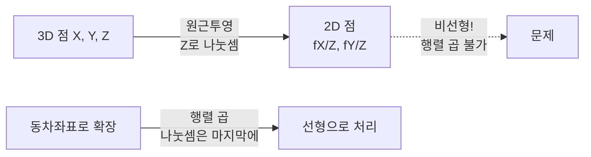
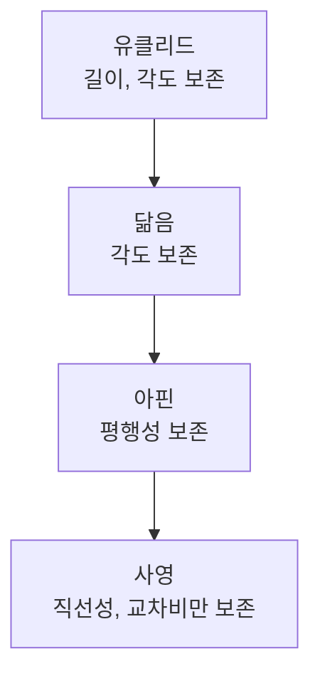

> 핀홀 카메라의 원근투영에는 나눗셈이 들어가서 선형변환이 아니다. 차원을 하나 늘려 이 비선형을 선형으로 바꾸는 트릭이 동차좌표이고, 그 무대가 사영기하다.
---
## 1. 정의
**동차좌표(homogeneous coordinates)** 는 $n$ 차원 점을 $n+1$ 개의 숫자로 표현하는 방식이다. 2D 점 $(x,y)$ 는 다음처럼 한 차원 늘려 쓴다.
$$
(x, y) \;\longrightarrow\; (x, y, 1) \;\sim\; (xw, yw, w), \quad w \neq 0
$$
핵심은 **스케일 불변성**이다. $(x,y,w)$ 와 $(\lambda x, \lambda y, \lambda w)$ 는 같은 점을 가리킨다($\lambda \neq 0$). 실제 좌표로 되돌릴 때는 마지막 성분으로 나눈다($x/w, y/w$). 이 "되돌리기"를 dehomogenization이라 한다.
**사영공간(projective space)** $\mathbb{P}^n$ 은 이런 동차좌표로 표현되는 점들의 공간이며, 유클리드 공간 $\mathbb{R}^n$ 에 "무한원점(point at infinity)"을 더한 것이다. $w=0$ 인 점 $(x,y,0)$ 이 바로 무한원점으로, 유클리드 평면에는 대응점이 없는 "방향"을 나타낸다.
**사영변환(projective transformation, homography)** 은 사영공간의 점을 다른 점으로 보내는 가역 선형변환으로, 2D에서는 $3\times3$ 행렬 $H$ 로 표현된다.
$$
\mathbf{x}' \sim H\mathbf{x}, \qquad H \in \mathbb{R}^{3\times3}, \quad \det H \neq 0
$$
여기서 $\sim$ 는 "스케일을 무시하고 같다"는 의미다. 따라서 $H$ 의 원소는 9개지만 전체 스케일이 무의미하므로 자유도는 8이다.
## 2. 의미 — 왜 필요한가
핀홀 카메라의 투영을 생각해보자. 3D 점 $(X,Y,Z)$ 가 이미지 평면에 맺히는 위치는 $(fX/Z,\ fY/Z)$ 다. 여기 $Z$ 로 나누는 연산이 있어서, 이 사상은 행렬 곱으로 표현되지 않는다. 나눗셈이 섞이면 변환을 합성할 때마다 분수가 중첩돼 다루기 어렵다.

동차좌표는 이 나눗셈을 **"맨 마지막 한 번"으로 미룬다**. 그 전까지의 회전·이동·투영을 전부 행렬 곱으로 합성하고, 픽셀이 실제로 필요한 순간에만 $w$ 로 나눈다. 덕분에 카메라 투영 $\mathbf{x} \sim K[R|\mathbf{t}]\mathbf{X}$ 처럼 여러 변환을 하나의 행렬 곱으로 쌓을 수 있다.
더 근본적으로, 사영기하는 원근 현상을 다루는 정확한 언어다. "평행선이 소실점에서 만난다", "원근에서 길이·각도·평행은 깨지지만 직선성과 교차비는 보존된다" 같은 카메라의 본질적 왜곡을 유클리드 기하로는 기술할 수 없다. 사영기하라야 평행선의 교차(무한원점)를 유한한 픽셀(소실점)로 자연스럽게 다룬다.
## 3. 원리와 유도
### 3.1 왜 차원을 늘리면 평행이동이 선형이 되는가
유클리드 평면에서 평행이동 $\mathbf{x}' = \mathbf{x} + \mathbf{t}$ 은 선형변환이 아니다(원점이 옮겨지므로). 그런데 동차좌표로 올리면 행렬 곱이 된다.
$$
\begin{bmatrix} x' \\ y' \\ 1 \end{bmatrix}
=
\begin{bmatrix} 1 & 0 & t_x \\ 0 & 1 & t_y \\ 0 & 0 & 1 \end{bmatrix}
\begin{bmatrix} x \\ y \\ 1 \end{bmatrix}
=
\begin{bmatrix} x + t_x \\ y + t_y \\ 1 \end{bmatrix}
$$
마지막 성분 1이 평행이동량 $\mathbf{t}$ 를 "받아주는" 자리가 된다. 차원을 늘린 덕분에 회전·스케일·평행이동·투영이 모두 단일 행렬 곱으로 통일된다.
### 3.2 무한원점: 평행선은 어디서 만나는가
두 직선의 동차 표현 $\mathbf{l}_1, \mathbf{l}_2$ 의 교점은 외적으로 구한다($\mathbf{x} = \mathbf{l}_1 \times \mathbf{l}_2$). 평행한 두 수평선 $y=1$ 과 $y=2$, 즉 $\mathbf{l}_1 = (0,1,-1)^\top$, $\mathbf{l}_2 = (0,1,-2)^\top$ 의 교점을 계산하면
$$
\mathbf{l}_1 \times \mathbf{l}_2 = (-1, 0, 0)^\top
$$
마지막 성분 $w=0$ 이다. 즉 평행선은 무한원점에서 만나며, 그 무한원점은 "수평 방향"을 가리킨다. 유클리드에서 "안 만난다"가 사영기하에서는 "무한원점에서 만난다"로 깔끔하게 처리된다. 이것이 사진에서 철길이 소실점으로 모이는 현상의 수학적 정체다.
### 3.3 변환의 위계와 불변량
변환은 자유도가 늘수록 보존하는 성질이 줄어드는 위계를 이룬다.
$$
\text{유클리드} \subset \text{닮음} \subset \text{아핀} \subset \text{사영}
$$
- **유클리드**(회전+이동, 3 DOF): 길이·각도 보존
- **닮음**(+스케일, 4 DOF): 각도·길이비 보존
- **아핀**(+전단, 6 DOF): 평행성·면적비 보존
- **사영**(8 DOF): 직선성과 **교차비(cross-ratio)** 만 보존
위로 갈수록 일반적이고, 사영변환에서 끝까지 살아남는 불변량은 교차비뿐이다. "원근 사진에서 평행이 깨져도 직선은 직선으로 남는다"가 사영변환의 정체성이다.
## 4. 기하적 직관

동차좌표를 "원점을 지나는 광선"으로 보는 그림도 유용하다. 2D 점 $(x,y)$ 를 3D의 $(x,y,1)$ 로 올리면, 스케일 불변성 $(xw,yw,w)$ 은 곧 원점을 지나는 한 직선(광선) 전체가 하나의 사영 점에 대응함을 뜻한다. $w=1$ 평면과의 교점이 실제 2D 점이고, 그 광선이 $w=1$ 평면과 평행해지는(즉 $w=0$) 극한이 무한원점이다.
## 5. 심화 — 비전에서의 활용
- **카메라 투영행렬.** 전체 투영 $\mathbf{x} \sim K[R|\mathbf{t}]\mathbf{X}$ 가 동차좌표 덕분에 $3\times4$ 행렬 하나로 표현된다(Part 1). 마지막에 $w$ 로 나눠 픽셀을 얻는다.
- **호모그래피 추정.** 평면 장면의 영상 정합, 파노라마 모자이킹, 마커 기반 자세 추정이 전부 호모그래피 $H$ 추정이다. 자유도 8이라 대응점 4쌍(점당 제약 2개)이면 풀린다 — DLT로 $A\mathbf{h}=0$ 형태가 되고 SVD로 해결(2번 항목과 연결).
- **소실점과 3D 단서.** 평행선들의 소실점을 찾으면 장면의 방향·카메라 자세를 추정할 수 있다. 무한원점의 투영이 곧 소실점이다.
## 6. 흔한 함정
- **※ dehomogenization 누락.** 동차좌표끼리는 자유롭게 곱하지만, 실제 픽셀이 필요한 순간 반드시 $w$ 로 나눠야 한다. 이걸 빼먹으면 좌표가 스케일만큼 어긋난다.
- **※ 자유도 착각.** $3\times3$ 호모그래피 원소는 9개지만 스케일 불변이라 자유도는 8. 추정에 필요한 대응점은 최소 4쌍이다.
- **※ 사영변환에 유클리드 직관 적용.** 사영변환 후엔 중점이 중점으로 가지 않고 수직이 수직으로 보존되지 않는다. "이미지에서 가까워 보이니 실제로 가깝다"는 깊이 없이는 성립하지 않는다.
- **※ 무한원점을 버그로 오해.** $w=0$ 은 예외 처리할 에러가 아니라 방향을 가리키는 정상적인 점이다. 동차좌표를 제대로 쓰면 유한점과 무한점을 같은 코드로 다룬다.
## 7. 코드로 확인
아래는 실제 NumPy로 실행해 검증한 코드다.
```python
import numpy as np

# 3.1 호모그래피 변환 후 dehomogenize
H = np.array([[1.2, 0.1, 30.],
              [0.05, 1.1, 20.],
              [0.0003, 0.0002, 1.]])
p = np.array([100., 150., 1.])      # 동차좌표 점
ph = H @ p
print(ph[:2] / ph[2])               # [155.66 179.25] -> w로 나눠 픽셀 복원

# 3.2 평행선의 교점은 무한원점 (w=0)
lineA = np.array([0., 1., -1.])     # y = 1
lineB = np.array([0., 1., -2.])     # y = 2 (평행)
inter = np.cross(lineA, lineB)
print(inter)                        # [-1. 0. 0.] -> w=0, 무한원점(수평 방향)
```
호모그래피 변환 후 $w$ 로 나눠야 올바른 픽셀이 나오고, 평행선의 교점이 $w=0$ 인 무한원점으로 떨어지는 것이 확인된다.
## 8. 면접 예상 질문
**Q1. 동차좌표를 쓰는 이유가 무엇인가요?**
원근투영의 나눗셈($X/Z$) 때문에 투영이 선형변환이 아닌데, 차원을 하나 늘리면 이 나눗셈을 "맨 마지막 한 번"으로 미룰 수 있다. 그 전까지의 회전·이동·투영을 전부 행렬 곱으로 합성·연쇄할 수 있게 되는 것이 핵심 이득이다. 평행이동도 동차좌표에서는 행렬 곱이 된다.
**Q2. **$w=0$** 인 동차좌표는 무엇을 의미하나요?**
무한원점, 즉 방향이다. 유클리드 평면에 대응점이 없으며 평행선이 만나는 지점을 나타낸다. 사진의 소실점이 이 무한원점의 투영이다. 예외가 아니라 정상적인 점이라, 동차좌표를 쓰면 유한점과 무한점을 같은 연산으로 다룰 수 있다.
**Q3. **$3\times3$** 호모그래피의 자유도가 왜 8인가요? 추정에 점 몇 개가 필요한가요?**
원소는 9개지만 사영변환은 스케일 불변($\mathbf{x}' \sim Hmathbf{x}$)이라 전체 스케일 1개가 무의미해 자유도는 8이다. 대응점 한 쌍이 제약 2개를 주므로 최소 4쌍이면 푼다. 실제로는 $A\mathbf{h}=0$ 형태로 만들어 SVD의 최소 특이값 방향으로 구한다.
**Q4. 사영변환에서 보존되는 것과 깨지는 것은?**
길이·각도·평행성·면적비는 깨진다. 끝까지 보존되는 것은 직선성(직선은 직선으로)과 교차비(cross-ratio)뿐이다. 그래서 원근 사진에서 평행선이 만나는 것처럼 보여도 직선 자체는 휘지 않는다.
## 9. 레퍼런스
- Hartley & Zisserman, *Multiple View Geometry*, Ch.2–3 (사영기하) — [https://www.robots.ox.ac.uk/\~vgg/hzbook/](https://www.robots.ox.ac.uk/~vgg/hzbook/)
- Szeliski, *Computer Vision* 2nd ed., Ch.2.1 (기하 프리미티브) — [https://szeliski.org/Book/](https://szeliski.org/Book/)
- 다크프로그래머, 호모그래피의 이해 — [https://darkpgmr.tistory.com/79](https://darkpgmr.tistory.com/79)
