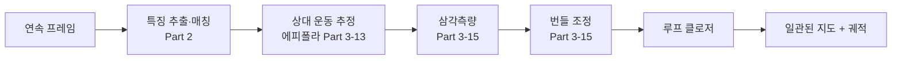
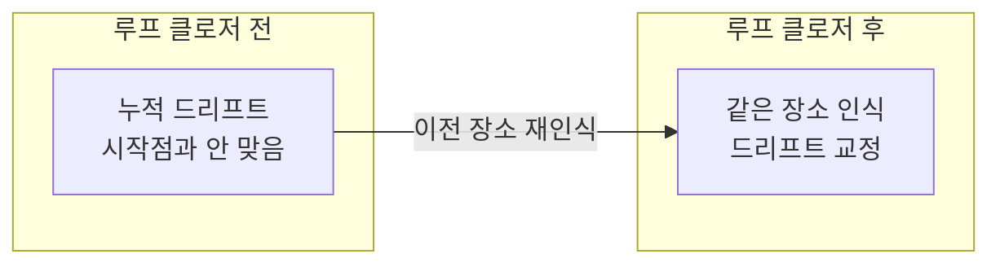

> 카메라만으로 "내가 어디 있고, 주변은 어떻게 생겼는가"를 동시에 푸는 것이 Visual SLAM이다. 앞선 모든 항목(특징·에피폴라·삼각측량·번들 조정)이 여기서 하나의 시스템으로 합쳐진다.

---

## 1. 정의

**Visual Odometry (VO)** 는 연속된 이미지로부터 카메라의 움직임(궤적)을 추정한다. 자동차의 주행거리계(odometry)처럼, 프레임 간 상대 운동을 누적해 경로를 만든다.

**Visual SLAM (Simultaneous Localization and Mapping)** 은 카메라 위치 추정(localization)과 환경 지도 작성(mapping)을 동시에 수행한다. VO에 지도와 루프 클로저를 더한 것이다.

핵심 차이: VO는 국소 운동만 누적해 드리프트가 쌓이고, SLAM은 전역 지도를 유지하며 이전에 온 곳을 다시 인식(loop closure)해 드리프트를 교정한다.

## 2. 의미 — 왜 필요한가

GPS가 안 되는 실내·지하·우주에서 로봇이 자기 위치를 알려면, 센서만으로 위치와 지도를 스스로 만들어야 한다. 카메라는 싸고 정보가 풍부해 이 문제의 매력적인 해법이다.



Visual SLAM이 이 로드맵의 한 정점인 이유는, 지금까지 배운 모든 조각이 여기서 하나로 맞물리기 때문이다. 특징 검출·매칭(Part 2)으로 대응을 찾고, 에피폴라 기하(Part 3-13)로 상대 운동을, 삼각측량(Part 3-15)으로 지도점을, PnP로 새 프레임 자세를, 번들 조정(Part 3-15)으로 전체를 정제한다. AR(공간에 가상 물체 고정), 자율주행, 드론, 로봇 청소기가 전부 이 위에서 작동한다.

## 3. 원리와 유도

### 3.1 VO 파이프라인

가장 기본적인 특징 기반 VO의 흐름이다. 매 프레임마다 (1) 특징 검출·매칭(Part 2-12), (2) 에피폴라 기하로 Essential 행렬 추정 후 분해해 상대 자세 $R, \mathbf{t}$ 획득(Part 3-13), (3) 삼각측량으로 3D 점 갱신(Part 3-15), (4) 누적. 단, $E$ 분해는 스케일이 미정이라(모노큘러), 첫 baseline을 1로 고정하거나 다른 센서로 스케일을 정한다.

### 3.2 직접법 vs 특징법

VO/SLAM은 크게 두 갈래다. 특징법(feature-based)은 특징점을 추출·매칭해 재투영 오차를 최소화한다(ORB-SLAM). 직접법(direct)은 특징 추출 없이 픽셀 밝기를 직접 비교해 광도 오차(photometric error)를 최소화한다(LSD-SLAM, DSO).

$$
\text{특징법: } \min \sum \|\mathbf{x}_{obs} - \pi(\mathbf{X})\|^2
\qquad
\text{직접법: } \min \sum \|I_1(\mathbf{x}) - I_2(\pi(\mathbf{x}))\|^2
$$

특징법은 텍스처가 풍부할 때 강건하고, 직접법은 텍스처가 약한 곳에서도 작동하지만 밝기 일정성 가정에 민감하다.

### 3.3 드리프트와 루프 클로저

VO는 프레임 간 오차가 누적돼 시간이 지날수록 궤적이 실제에서 벗어난다(드리프트). SLAM의 핵심 기여는 루프 클로저다. 이전에 방문한 장소를 다시 인식하면(장소 인식, place recognition), "여기는 아까 그곳"이라는 제약이 생긴다. 이 제약을 pose graph에 추가하고 전역 최적화하면, 누적된 드리프트가 한꺼번에 교정된다.

### 3.4 백엔드: pose graph 최적화

SLAM 백엔드는 카메라 자세들을 노드로, 자세 간 상대 변환을 엣지로 하는 그래프를 최적화한다(Part 0-5의 비선형 최소제곱, Part 0-4의 SE(3)).

$$
\min_{\{T_i\}} \sum_{(i,j)} \big\| \log(T_{ij}^{-1}\, T_i^{-1} T_j) \big\|^2_{\Sigma}
$$

$T_{ij}$ 는 측정된 상대 자세, $T_i^{-1}T_j$ 는 현재 추정된 상대 자세다. 둘의 불일치를 SE(3)의 로그 사상으로 측정해 최소화한다. 루프 클로저 엣지가 추가되면 이 최적화가 전역 일관성을 회복시킨다.

## 4. 기하적 직관



복도를 한 바퀴 돌아 출발점에 돌아왔다고 하자. VO만 쓰면 누적 오차로 추정 궤적의 끝이 시작점과 어긋난다. SLAM은 "이 장면은 출발할 때 봤던 곳"이라고 인식하고, 끝과 시작을 잇는 제약을 추가한다. 그러면 고무줄처럼 전체 궤적이 당겨지며 일관된 지도가 된다. 이것이 SLAM이 VO보다 정확한 근본 이유다.

## 5. 심화 — 비전에서의 활용

- **ORB-SLAM.** 특징 기반 Visual SLAM의 대표. 추적·로컬 매핑·루프 클로저를 병렬 스레드로 실행하며, 모노/스테레오/RGB-D를 모두 지원한다.
- **VIO (Visual-Inertial Odometry).** 카메라 + IMU 융합으로 모노큘러 스케일 모호성을 해결하고 빠른 움직임에 강건해진다. VINS-Mono, ROVIO 등. 드론·AR의 표준(Part 1-9와 연결).
- **학습 기반 SLAM.** DROID-SLAM 등은 신경망으로 대응·깊이를 학습해 고전 SLAM을 능가하기 시작했다(Part 4와 연결).

## 6. 흔한 함정

- **※ 모노큘러 스케일.** 모노 VO/SLAM은 절대 스케일이 없다. IMU·스테레오·알려진 크기로 정해야 실제 거리가 나온다.
- **※ 순수 회전.** 카메라가 제자리 회전만 하면 baseline이 없어 삼각측량이 불가하다(Part 3-13). 초기화·추적이 실패할 수 있다.
- **※ 동적 물체.** 움직이는 물체의 특징을 정적 지도점으로 쓰면 자세 추정이 오염된다. RANSAC·동적 객체 제거가 필요.
- **※ 루프 클로저 오인식.** 비슷하게 생긴 다른 장소를 같은 곳으로 오인하면(perceptual aliasing) 지도가 망가진다. 강건한 장소 인식과 기하 검증이 필수.

## 7. 코드로 확인

아래는 VO 한 스텝(상대 자세 추정)을 검증한 코드다.

```python
import numpy as np
import cv2

# Estimate Essential matrix from correspondences -> recover relative pose
np.random.seed(1)
R_true = cv2.Rodrigues(np.array([0., 0.1, 0.]))[0]
t_true = np.array([0.5, 0, 0.1])

# Project 3D points into both frames (normalized coords, K=I)
X = np.random.randn(3, 100) * 2; X[2] += 5
x1 = (X / X[2])[:2].T
X2 = R_true @ X + t_true.reshape(3, 1); x2 = (X2 / X2[2])[:2].T

# Essential matrix estimation + pose recovery (core VO step)
E, _ = cv2.findEssentialMat(x1, x2, np.eye(3))
_, R_est, t_est, _ = cv2.recoverPose(E, x1, x2, np.eye(3))
print(np.allclose(R_est, R_true, atol=1e-2))   # True (rotation recovered)
# t is scale-ambiguous: only direction matches (monocular scale ambiguity)
print(np.allclose(t_est.ravel()/np.linalg.norm(t_est),
                  t_true/np.linalg.norm(t_true), atol=1e-2))  # True
```

대응점에서 Essential 행렬을 추정해 회전을 정확히 복원하고, 이동은 방향만 일치(스케일 미정)하는 모노큘러 VO의 본질이 드러난다. 전체 SLAM 시스템은 여기에 지도 관리·루프 클로저·번들 조정을 더한 것이다.

## 8. 면접 예상 질문

**Q1. Visual Odometry와 Visual SLAM의 차이는?**

VO는 연속 프레임의 상대 운동을 누적해 궤적만 추정하므로 드리프트가 쌓인다. SLAM은 전역 지도를 유지하고 이전 방문 장소를 재인식(루프 클로저)해 누적 드리프트를 교정한다. SLAM = VO + 지도 + 루프 클로저로 볼 수 있다.

**Q2. 특징법과 직접법 SLAM의 차이는?**

특징법은 특징점을 추출·매칭해 재투영 오차(기하 오차)를 최소화한다(ORB-SLAM). 직접법은 특징 없이 픽셀 밝기를 직접 비교해 광도 오차를 최소화한다(DSO). 특징법은 텍스처가 풍부할 때 강건하고, 직접법은 텍스처 약한 곳에서도 작동하지만 밝기 일정성 가정에 민감하다.

**Q3. 루프 클로저가 왜 중요하고 어떻게 작동하나요?**

VO는 오차 누적으로 드리프트가 생긴다. 루프 클로저는 이전에 방문한 장소를 다시 인식하면 "같은 곳"이라는 제약을 pose graph에 추가하고, 전역 최적화로 누적 드리프트를 한꺼번에 교정한다. 한 바퀴 돌아온 궤적의 끝과 시작을 맞춰 전역 일관성을 회복한다.

**Q4. 모노큘러 SLAM의 스케일 모호성은 어떻게 해결하나요?**

모노큘러는 절대 스케일을 알 수 없다(Part 1-9). IMU를 융합하거나(VIO), 스테레오 baseline을 쓰거나, 장면 내 알려진 크기의 물체를 이용해 스케일을 고정한다. VIO가 가장 일반적인 해법으로, IMU가 절대 스케일과 단기 운동을 제공하고 카메라가 IMU 드리프트를 보정한다.

## 9. 레퍼런스

- Mur-Artal et al., *ORB-SLAM* (2015) — [arxiv.org/abs/1502.00956](https://arxiv.org/abs/1502.00956)
- Scaramuzza & Fraundorfer, *Visual Odometry Tutorial* (2011) — [rpg.ifi.uzh.ch/docs/VO_Part_I_Scaramuzza.pdf](https://rpg.ifi.uzh.ch/docs/VO_Part_I_Scaramuzza.pdf)
- Engel et al., *Direct Sparse Odometry (DSO)* (2016) — [arxiv.org/abs/1607.02565](https://arxiv.org/abs/1607.02565)
- Qin et al., *VINS-Mono* (2018) — [arxiv.org/abs/1708.03852](https://arxiv.org/abs/1708.03852)
