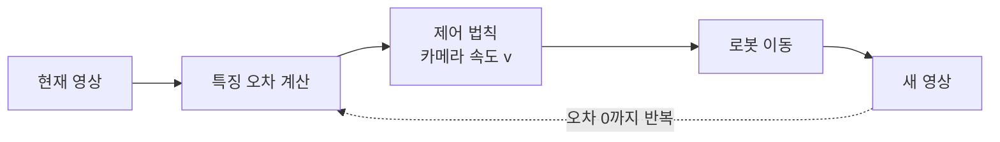
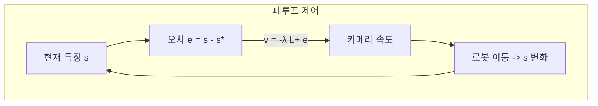

> 지금까지는 "보는 것"이었다. Visual Servoing은 본 것으로 "로봇을 움직이는 것"이다. 비전과 제어가 만나는 지점이자, 이 로드맵이 로보틱스로 귀결되는 종착점이다.
---
## 1. 정의
**Visual Servoing (시각 기반 제어)** 은 카메라 영상을 피드백으로 사용해 로봇(주로 매니퓰레이터)의 움직임을 제어하는 방법이다. 목표는 현재 영상이 원하는 영상이 되도록 로봇을 움직이는 것이다.
두 가지 주요 방식이 있다.
- **IBVS (Image-Based Visual Servoing)**: 이미지 평면의 특징 위치 오차를 직접 줄인다. 제어가 이미지 공간에서 정의된다.
- **PBVS (Position-Based Visual Servoing)**: 영상에서 물체의 3D 자세를 추정하고, 3D 공간에서 자세 오차를 줄인다.
## 2. 의미 — 왜 필요한가
로봇이 카메라로 물체를 보고 정확히 잡으려면, "보는 것"과 "움직이는 것"을 연결하는 피드백 루프가 필요하다. 미리 계산한 한 번의 움직임은 보정 오차·물체 이동에 취약하다. Visual Servoing은 매 순간 영상을 보며 움직임을 교정한다.

이것이 이 로드맵의 종착점인 이유는, 앞서 배운 모든 것이 행동으로 닫히기 때문이다. 특징 검출(Part 2), 자세 추정(Part 3·4)으로 "본" 정보가, 여기서 로봇 속도 명령으로 변환된다. 폐루프 제어라 캘리브레이션 오차나 물체 이동에 강건하다. 산업용 조립, 비주얼 그래스핑, 드론의 시각 추적이 전부 Visual Servoing이다.
## 3. 원리와 유도
### 3.1 제어 목표
특징 벡터 $\mathbf{s}$(예: 이미지 점들의 좌표)와 목표 특징 $\mathbf{s}^*$ 의 오차를 정의한다.
$$
\mathbf{e}(t) = \mathbf{s}(t) - \mathbf{s}^*
$$
목표는 이 오차를 0으로 만드는 것이다. 보통 오차가 지수적으로 감소하도록 $\dot{\mathbf{e}} = -\lambda\mathbf{e}$ 를 설계한다($\lambda > 0$ 은 수렴 속도).
### 3.2 상호작용 행렬 (interaction matrix)
IBVS의 핵심이다. 카메라 속도 $\mathbf{v} = (v_x, v_y, v_z, \omega_x, \omega_y, \omega_z)$ 와 이미지 특징 변화율 $\dot{\mathbf{s}}$ 의 관계가 상호작용 행렬(image Jacobian) $L_s$ 로 연결된다.
$$
\dot{\mathbf{s}} = L_s\,\mathbf{v}
$$
이미지 점 $(x, y)$ 하나에 대한 상호작용 행렬은 깊이 $Z$ 를 포함한다.
$$
L_s = \begin{bmatrix}
-1/Z & 0 & x/Z & xy & -(1+x^2) & y \\
0 & -1/Z & y/Z & 1+y^2 & -xy & -x
\end{bmatrix}
$$
이 행렬은 "카메라를 각 방향으로 움직이면 이미지 특징이 어떻게 움직이는가"를 기술한다. 점의 깊이 $Z$ 가 들어가는 게 핵심 — 같은 카메라 움직임도 가까운 점과 먼 점에서 이미지 변화가 다르기 때문이다.
### 3.3 IBVS 제어 법칙
$\dot{\mathbf{e}} = L_s\mathbf{v}$ 와 목표 $\dot{\mathbf{e}} = -\lambda\mathbf{e}$ 를 결합하면, 필요한 카메라 속도가 나온다. $L_s$ 가 정방이 아니므로 의사역행렬(Part 0-2)을 쓴다.
$$
\mathbf{v} = -\lambda\, L_s^+\, \mathbf{e}
$$
$L_s^+ = (L_s^\top L_s)^{-1}L_s^\top$ 는 최소제곱 해를 준다(Part 0-5). 여러 특징점을 쓰면 $L_s$ 를 쌓아 과결정 시스템이 되고, 의사역행렬이 오차를 최소화하는 속도를 찾는다. Part 0의 의사역행렬·최소제곱이 로봇 제어에서 결실을 맺는 순간이다.
### 3.4 IBVS vs PBVS 비교
|  | IBVS | PBVS |
| --- | --- | --- |
| 오차 공간 | 이미지 평면 | 3D 자세 |
| 깊이 추정 | 근사로 충분 | 정확히 필요 |
| 강건성 | 캘리브레이션 오차에 강함 | 자세 추정 정확도에 의존 |
| 궤적 | 이미지에서 직선, 3D에서 곡선 | 3D에서 직선, 이미지서 벗어날 수 있음 |
IBVS는 이미지 공간에서 제어해 캘리브레이션 오차에 강건하지만 3D 궤적이 비효율적일 수 있다. PBVS는 3D에서 깔끔한 직선 궤적이지만 자세 추정(Part 4-19)이 정확해야 한다.
## 4. 기하적 직관

IBVS를 "이미지에서 점들을 목표 위치로 끌어당기기"로 보면 직관적이다. 현재 특징점들이 목표 위치와 어긋나 있으면, 상호작용 행렬이 "그 어긋남을 줄이려면 카메라를 어디로 움직여야 하는가"를 알려준다. 매 순간 이 계산을 반복하면 특징점들이 목표로 미끄러져 가고, 그에 따라 로봇이 물체 앞 정확한 위치에 도달한다.
## 5. 심화 — 비전에서의 활용
- **eye-in-hand vs eye-to-hand.** 카메라가 로봇 손에 달렸으면(eye-in-hand) 움직임이 직접 시야를 바꾸고, 고정 카메라가 로봇을 보면(eye-to-hand) 외부 관점이다. 상호작용 행렬 구성이 달라진다.
- **하이브리드(2.5D) 서보잉.** IBVS와 PBVS의 장점을 결합해, 일부는 이미지에서 일부는 3D에서 제어한다.
- **학습 기반 visual servoing.** 상호작용 행렬을 손으로 유도하는 대신 신경망으로 영상→속도 매핑을 학습한다. 다음 항목 visuomotor policy로 이어진다.
## 6. 흔한 함정
- **※ 깊이 **$Z$** 추정.** 상호작용 행렬에 $Z$ 가 필요한데 정확한 깊이는 모르는 경우가 많다. 근사값(목표 깊이)을 쓰며, IBVS는 이 오차에 비교적 강건하다.
- **※ 특이 구성.** 특정 특징 배치에서 $L_s$ 가 랭크를 잃어(특이) 제어가 불안정해진다. 충분하고 잘 분산된 특징이 필요.
- **※ 특징이 시야를 벗어남.** IBVS 중 특징점이 이미지 밖으로 나가면 제어가 실패한다. 궤적 계획이나 특징 유지 제약이 필요.
- **※ 로컬 미니멈.** 여러 특징점의 오차를 동시에 줄이다 보면 3D에서 비현실적 운동이나 지역 최소에 빠질 수 있다.
## 7. 코드로 확인
아래는 IBVS 제어 법칙을 검증한 코드다.
```python
import numpy as np

# 점 특징의 상호작용 행렬 (2x6)
def L_point(x, y, Z):
    return np.array([
        [-1/Z, 0,    x/Z,  x*y,      -(1+x**2), y],
        [0,    -1/Z, y/Z,  1+y**2,   -x*y,      -x]
    ])

# 현재 특징과 목표 특징의 오차
L = L_point(0.1, 0.2, 2.0)
e = np.array([0.05, -0.03])      # s - s*

# IBVS 제어 법칙: v = -λ L+ e
lam = 0.5
v = -lam * np.linalg.pinv(L) @ e
print(v.round(4))   # 6D 카메라 속도 (vx,vy,vz,wx,wy,wz)

# 검증: 이 속도가 오차를 줄이는 방향인가 (de = L v, -λe와 같아야)
de = L @ v
print(np.allclose(de, -lam * e))   # True (오차 지수 감소)
```
상호작용 행렬과 의사역행렬로 계산한 카메라 속도가 특징 오차를 의도대로($\dot{\mathbf{e}} = -\lambda\mathbf{e}$) 감소시킴이 확인된다.
## 8. 면접 예상 질문
**Q1. IBVS와 PBVS의 차이는?**
IBVS는 이미지 평면의 특징 위치 오차를 직접 줄여 제어 공간이 이미지다. PBVS는 영상에서 3D 자세를 추정해 3D 공간에서 오차를 줄인다. IBVS는 캘리브레이션 오차에 강건하나 3D 궤적이 비효율적일 수 있고, PBVS는 3D 직선 궤적이지만 자세 추정 정확도에 의존한다.
**Q2. 상호작용 행렬(image Jacobian)이란 무엇인가요?**
카메라의 6D 속도와 이미지 특징의 변화율을 연결하는 행렬 $\dot{\mathbf{s}} = L_s\mathbf{v}$ 다. "카메라를 각 방향으로 움직이면 이미지 특징이 어떻게 변하는가"를 기술한다. 점 특징의 경우 깊이 $Z$ 를 포함하는데, 같은 움직임도 가까운 점과 먼 점에서 이미지 변화가 다르기 때문이다.
**Q3. IBVS 제어 법칙 **$\mathbf{v} = -\lambda L_s^+\mathbf{e}$** 를 설명하세요.**
오차가 지수적으로 감소하도록 $\dot{\mathbf{e}} = -\lambda\mathbf{e}$ 를 목표로 하고, $\dot{\mathbf{e}} = L_s\mathbf{v}$ 와 결합한 것이다. $L_s$ 가 정방이 아니라 의사역행렬 $L_s^+$ 로 최소제곱 해를 구한다. 여러 특징점이면 과결정 시스템이 되고 의사역행렬이 오차를 최소화하는 속도를 준다.
**Q4. eye-in-hand와 eye-to-hand의 차이는?**
eye-in-hand는 카메라가 로봇 손에 장착돼 로봇이 움직이면 시야가 직접 바뀐다. eye-to-hand는 고정 카메라가 외부에서 로봇과 물체를 본다. 둘은 카메라 속도와 로봇 관절 속도의 관계, 그리고 상호작용 행렬 구성이 달라 제어 설계가 다르다.
## 9. 레퍼런스
- Chaumette & Hutchinson, *Visual Servo Control Part I* (2006) — [https://hal.inria.fr/inria-00350283/document](https://hal.inria.fr/inria-00350283/document)
- Corke, *Robotics, Vision and Control*, Ch.15 (Visual Servoing) — [https://petercorke.com/rvc/](https://petercorke.com/rvc/)
- Hutchinson et al., *A Tutorial on Visual Servo Control* (1996) — [https://ieeexplore.ieee.org/document/538972](https://ieeexplore.ieee.org/document/538972)
