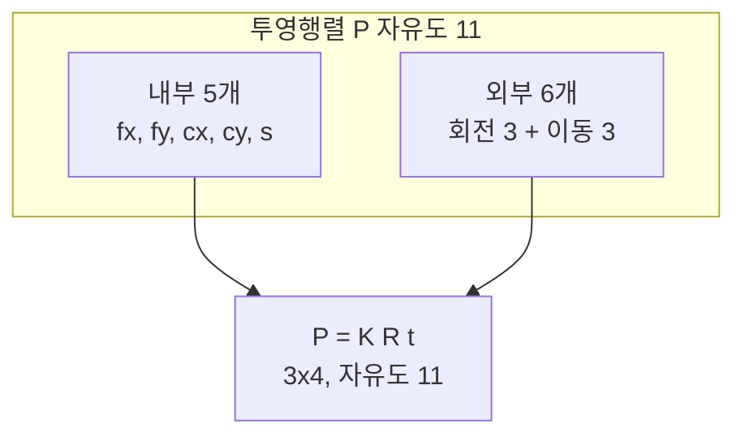

> 카메라의 전체 투영은 "카메라가 어디에 어떻게 놓였는가"(외부)와 "카메라 내부의 광학 특성"(내부)으로 분리된다. 이 둘의 곱이 투영행렬이며, 둘을 나누는 것이 캘리브레이션과 자세 추정의 출발점이다.
---
## 1. 정의
**외부 파라미터(extrinsic parameters)** 는 월드 좌표계에 대한 카메라의 위치와 자세, 즉 강체 변환 $[R\,|\,\mathbf{t}]$ 다(Part 0-4). 월드 점 $\mathbf{X}_w$ 를 카메라 좌표 $\mathbf{X}_c$ 로 옮긴다.
$$
\mathbf{X}_c = R\,\mathbf{X}_w + \mathbf{t}
$$
**내부 파라미터(intrinsic parameters)** 는 카메라 좌표의 3D 점을 픽셀로 사상하는 광학적 특성으로, $3\times3$ 행렬 $K$ 에 담긴다.
$$
K = \begin{bmatrix} f_x & s & c_x \\ 0 & f_y & c_y \\ 0 & 0 & 1 \end{bmatrix}
$$
$f_x, f_y$ 는 픽셀 단위 초점거리, $c_x, c_y$ 는 주점, $s$ 는 비대칭 계수(skew, 보통 0)다.
**투영행렬(projection matrix)** $P$ 는 내부와 외부를 곱한 $3\times4$ 행렬로, 월드 점을 픽셀로 직접 사상한다.
$$
\mathbf{x} \sim P\,\mathbf{X}_w, \qquad P = K\,[R\,|\,\mathbf{t}]
$$
## 2. 의미 — 왜 필요한가
내부와 외부를 분리하는 것이 왜 중요한가? 둘이 본질적으로 다른 정보이기 때문이다. 내부 $K$ 는 카메라 자체의 고정 특성(렌즈·센서)이라 한 번 캘리브레이션하면 변하지 않는다. 외부 $[R|\mathbf{t}]$ 는 카메라가 움직일 때마다 바뀐다. 이 분리 덕분에 "카메라를 한 번 보정해두고(내부 고정), 매 프레임 자세만 추정(외부 갱신)"하는 구조가 가능하다.

이것이 비전·로보틱스의 핵심 작업 흐름을 정의한다. SLAM·VO는 내부 $K$ 를 알고 있다고 보고 매 프레임 외부 $[R|\mathbf{t}]$ 를 추정한다. 캘리브레이션은 알려진 패턴으로 내부 $K$ 를 먼저 구한다. PnP는 3D-2D 대응으로 외부를 구한다. 모두 $P = K[R|\mathbf{t}]$ 라는 한 분해를 어느 쪽에서 푸느냐의 차이다.
## 3. 원리와 유도
### 3.1 전체 투영 사슬
월드 점이 픽셀이 되기까지 세 단계를 거친다. 동차좌표로 쓰면 전부 행렬 곱이다.
$$
\mathbf{x} \sim
\underbrace{K}_{\text{내부}}
\underbrace{[R\,|\,\mathbf{t}]}_{\text{외부}}
\mathbf{X}_w
= P\,\mathbf{X}_w
$$
단계별로 보면, $[R|\mathbf{t}]$ 가 월드→카메라 좌표 변환(4×4를 3×4로 축약), $K$ 가 카메라 좌표→픽셀 변환이다. 곱의 순서가 곧 변환의 순서다(Part 0-1). 결과 $P$ 는 $3\times4$ 행렬이며, $\mathbf{X}_w$ 는 동차 4-벡터, $\mathbf{x}$ 는 동차 3-벡터다.
### 3.2 내부 파라미터 $K$ 의 구성 요소
$K$ 의 각 원소는 물리적 의미를 가진다.
- $f_x, f_y$: 픽셀 단위 초점거리. $f_x = f \cdot m_x$(물리 초점거리 × 단위 길이당 픽셀). 픽셀이 비정사각이면 $f_x \neq f_y$.
- $c_x, c_y$: 주점. 광축이 이미지 센서와 만나는 픽셀 위치. 대략 이미지 중심.
- $s$: skew. 픽셀 축이 직교하지 않을 때의 비대칭. 현대 센서에서는 사실상 0.
### 3.3 투영행렬의 자유도
$P$ 는 $3\times4 = 12$ 원소지만, 사영 스케일이 무의미하므로 자유도는 11이다. 이를 분해하면 내부 5(=$f_x, f_y, c_x, c_y, s$) + 외부 6(=회전 3 + 이동 3) = 11로 정확히 맞는다. 캘리브레이션은 알려진 3D-2D 대응으로 이 11 자유도를 푸는 문제이며, DLT로 $P$ 를 먼저 구한 뒤 RQ 분해로 $K$ 와 $[R|\mathbf{t}]$ 를 갈라낸다.
### 3.4 P에서 K, R, t 복원 (RQ 분해)
$P = K[R|\mathbf{t}]$ 에서 왼쪽 $3\times3$ 블록 $M = KR$ 이다. $K$ 는 상삼각, $R$ 은 직교라는 사실을 이용하면, $M$ 의 RQ 분해가 유일하게 $K$(상삼각)와 $R$(직교)을 준다. 이동은 $\mathbf{t} = K^{-1}\mathbf{p}_4$($\mathbf{p}_4$ 는 $P$ 의 4열)로 복원한다. 부호 모호성은 $K$ 의 대각원소를 양수로 강제해 해결한다.
## 4. 기하적 직관

외부는 "세계 속 카메라의 위치/방향"이라 카메라를 들고 움직이면 바뀌는 값이고, 내부는 "카메라라는 도구 자체의 성질"이라 렌즈를 바꾸지 않는 한 고정이다. 한 카메라로 여러 장 찍으면 내부 $K$ 는 모든 사진에서 공통이고 외부만 사진마다 다르다 — 이 구조가 캘리브레이션에서 여러 장의 체커보드로 $K$ 를 안정적으로 추정하는 원리다.
## 5. 심화 — 비전에서의 활용
- **PnP (Perspective-n-Point).** 알려진 3D 점들과 그 이미지 투영의 대응으로 외부 $[R|\mathbf{t}]$ 를 구한다. $K$ 를 안다고 가정하며, AR·로봇 자세 추정의 핵심(Part 3).
- **번들 조정.** 여러 카메라의 $P_i$ 와 3D 점들을 동시에 최적화해 재투영 오차를 최소화한다. 외부(때로 내부까지)를 정제(Part 3).
- **정규화 좌표(normalized coordinates).** $K^{-1}$ 을 픽셀에 곱하면 내부 영향을 제거한 정규화 좌표가 된다. 에피폴라 기하에서 Fundamental 대신 Essential 행렬을 쓸 수 있게 하는 전처리(Part 3).
## 6. 흔한 함정
- **※ 곱 순서.** $P = K[R|\mathbf{t}]$ 이지 $[R|\mathbf{t}]K$ 가 아니다. 내부가 왼쪽(나중 적용), 외부가 오른쪽(먼저 적용)이다.
- **※ **$\mathbf{t}$** 는 카메라 위치가 아니다.** $[R|\mathbf{t}]$ 의 $\mathbf{t}$ 는 "월드 원점이 카메라 좌표에서 보이는 위치"다. 카메라 중심(월드 좌표)은 $\mathbf{C} = -R^\top\mathbf{t}$ 다. 이 둘을 혼동하는 게 흔한 실수.
- **※ 내부를 매 프레임 재추정.** 같은 카메라라면 $K$ 는 고정이다. VO/SLAM에서 프레임마다 $K$ 를 다시 풀려 하면 불안정해진다. 한 번 캘리브레이션해 고정한다.
- **※ skew를 무시 못 할 것으로 가정.** 현대 카메라에서 $s \approx 0$ 이다. 굳이 추정하려 하면 자유도만 늘려 불안정해질 수 있다.
## 7. 코드로 확인
아래는 실제 NumPy로 실행해 검증한 코드다.
```python
import numpy as np

# 내부 K
f, cx, cy = 800., 320., 240.
K = np.array([[f, 0, cx],
              [0, f, cy],
              [0, 0, 1.]])

# 외부 [R | t] : y축 20도 회전 + 이동
theta = np.deg2rad(20)
R = np.array([[ np.cos(theta), 0, np.sin(theta)],
              [ 0,             1, 0],
              [-np.sin(theta), 0, np.cos(theta)]])
t = np.array([0.5, -0.2, 3.0])

# 투영행렬 P = K [R | t]
P = K @ np.hstack([R, t.reshape(3, 1)])
print(P.shape)   # (3, 4)

# 월드 점을 픽셀로 투영
Xw = np.array([1., 1., 2., 1.])   # 동차 월드 점
xh = P @ Xw
print(xh[:2] / xh[2])             # [694.44 381.05]

# 카메라 중심(월드 좌표) = -R^T t  (t와 다름에 주의)
C = -R.T @ t
print(C)                          # [-1.477 0.2 -2.756] 근방
```
투영행렬이 월드 점을 픽셀로 바로 사상하고, 카메라 중심이 $-R^\top\mathbf{t}$ 로 $\mathbf{t}$ 와 다르게 복원되는 것이 확인된다.
## 8. 면접 예상 질문
**Q1. 내부 파라미터와 외부 파라미터를 구분하는 이유는?**
내부 $K$ 는 렌즈·센서 같은 카메라 자체의 고정 특성이라 한 번 캘리브레이션하면 변하지 않고, 외부 $[R|\mathbf{t}]$ 는 카메라 위치·자세라 움직일 때마다 바뀐다. 이 분리 덕분에 "내부는 한 번 보정해 고정, 외부는 매 프레임 추정"하는 SLAM·VO 구조가 성립한다.
**Q2. 투영행렬 **$P$** 의 자유도는 몇이고 어떻게 나뉘나요?**
$3\times4 = 12$ 원소지만 사영 스케일이 무의미해 자유도는 11이다. 내부 5개($f_x, f_y, c_x, c_y, s$)와 외부 6개(회전 3 + 이동 3)로 정확히 나뉜다. 캘리브레이션은 이 11 자유도를 3D-2D 대응으로 푸는 문제다.
**Q3. **$[R|\mathbf{t}]$** 의 **$\mathbf{t}$** 가 카메라 위치인가요?**
아니다. $\mathbf{t}$ 는 "월드 원점이 카메라 좌표계에서 보이는 위치"다. 카메라 중심을 월드 좌표로 표현하면 $\mathbf{C} = -R^\top\mathbf{t}$ 다. 이 둘을 혼동하는 것이 매우 흔한 실수이며, $\mathbf{X}_c = R\mathbf{X}_w + \mathbf{t}$ 에 월드 원점 $\mathbf{X}_w=0$ 을 넣으면 $\mathbf{t}$ 의 의미가 분명해진다.
**Q4. 투영행렬 **$P$** 에서 **$K$** 와 **$R$** 을 어떻게 분리하나요?**
$P$ 의 왼쪽 $3\times3$ 블록 $M = KR$ 에서, $K$ 는 상삼각이고 $R$ 은 직교라는 성질을 이용해 RQ 분해하면 유일하게 갈라진다. 이동은 $\mathbf{t} = K^{-1}\mathbf{p}_4$ 로 구한다. $K$ 대각원소를 양수로 강제해 부호 모호성을 없앤다.
## 9. 레퍼런스
- Hartley & Zisserman, *Multiple View Geometry*, Ch.6 (카메라 모델) — [https://www.robots.ox.ac.uk/\~vgg/hzbook/](https://www.robots.ox.ac.uk/~vgg/hzbook/)
- Szeliski, *Computer Vision* 2nd ed., Ch.2.1, Ch.11 — [https://szeliski.org/Book/](https://szeliski.org/Book/)
- 다크프로그래머, 카메라 캘리브레이션 — [https://darkpgmr.tistory.com/32](https://darkpgmr.tistory.com/32)
