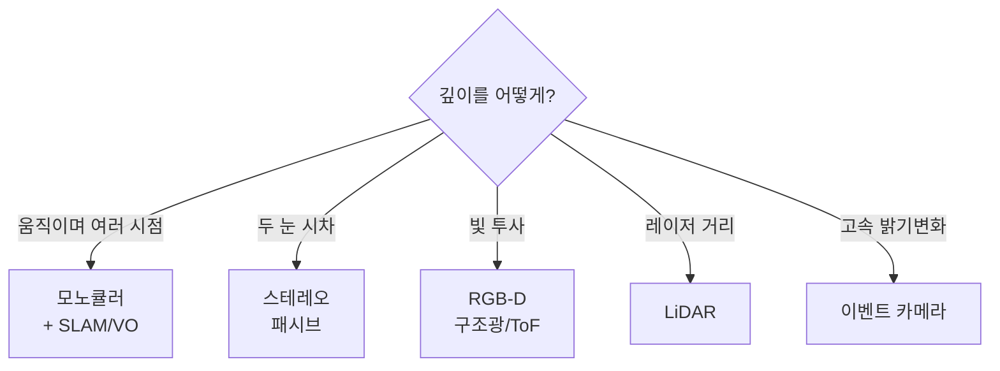
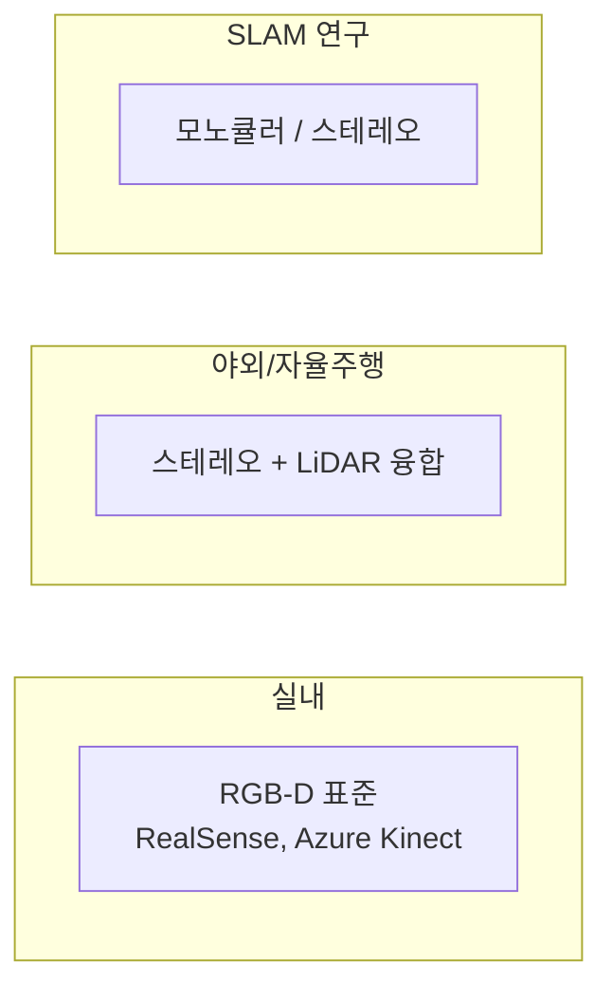

> 로보틱스 비전에서 카메라 선택의 핵심 기준은 "3D 정보(깊이)를 얻을 수 있는가, 어떻게 얻는가"다. 로봇은 물리 공간에서 움직여야 하므로 2D 색상만으로는 부족하고 거리·형상이 필요하기 때문이다.
---
## 1. 정의
카메라는 깊이 획득 방식에 따라 분류된다. 핵심 구분은 **패시브(passive, 자연광만 사용)** 와 **액티브(active, 빛을 투사)** 다.
- **모노큘러(monocular)**: 일반 RGB 카메라 한 대. 단일 영상으로는 절대 깊이를 못 얻음(패시브).
- **스테레오(stereo)**: 두 카메라의 시차(disparity)로 깊이 계산(패시브).
- **RGB-D**: 색상 + 픽셀별 깊이를 동시 제공. 구조광 또는 ToF 방식(액티브).
- **LiDAR**: 레이저로 정밀 점군(point cloud) 획득(액티브).
- **이벤트 카메라(event camera)**: 밝기 변화를 비동기로 감지하는 신경모방 센서.
## 2. 의미 — 왜 필요한가
Part 1-6에서 봤듯 단일 핀홀 이미지는 깊이를 지운다. 그런데 로봇은 "저 물체가 얼마나 멀리 있는가"를 알아야 잡거나 피할 수 있다. 그래서 카메라 선택은 곧 "사라진 깊이를 어떻게 되찾을 것인가"의 선택이다.

용도가 기준을 정한다. 입문·SLAM 연구에는 모노큘러/스테레오, 실내 조작(manipulation)·3D 인식에는 RGB-D가 사실상 표준이고, 야외·자율주행으로 가면 스테레오+LiDAR 융합으로 넘어간다. 각 방식의 물리적 원리와 한계를 알아야 상황에 맞게 고를 수 있다.
## 3. 원리
### 3.1 모노큘러 — 움직임으로 깊이를 만든다
카메라 한 대는 한 시점에서 깊이를 못 얻는다(절대 스케일 모호). 대신 카메라가 움직이면 여러 시점이 생기고, 시점 간 시차로 3D를 복원한다(Structure from Motion, Monocular SLAM). 단, 절대 스케일은 추가 정보(IMU, 알려진 크기) 없이는 결정 불가 — "스케일 모호성"이 모노큘러의 본질적 한계다.
### 3.2 스테레오 — 시차가 곧 깊이
baseline $B$ 만큼 떨어진 두 카메라에서, 같은 점이 좌우 영상에 맺히는 위치 차이가 시차 $d$ 다. 깊이는 시차에 반비례한다.
$$
Z = \frac{f \cdot B}{d}
$$
가까울수록 시차가 크다. 패시브라 야외·강한 조명에서 잘 작동하지만, 텍스처 없는 평면(흰 벽)에서는 좌우 대응점을 못 찾아 깊이가 비는 약점이 있다.
### 3.3 RGB-D — 빛을 쏴서 잰다
두 방식이 있다. 구조광(structured light)은 알려진 패턴을 투사하고 그 왜곡을 분석한다(초기 Kinect v1). ToF(Time-of-Flight)는 빛이 왕복하는 시간을 측정한다(Kinect v2, Azure Kinect). 둘 다 적외선 기반이라 실내에서 강력하지만, 햇빛이 강한 야외에서는 적외선이 묻혀 성능이 급락한다.
### 3.4 LiDAR와 이벤트 카메라
LiDAR는 레이저 펄스의 왕복 시간으로 정밀 거리를 재 점군을 만든다. 자율주행·실외 모바일 로봇의 핵심이며 카메라와 융합(LiDAR-Camera fusion)해 쓴다. 이벤트 카메라는 픽셀별 밝기 변화를 비동기로 감지해, 매우 빠른 움직임과 극단적 명암 대비에 강하다 — 고속 드론·로봇 연구에서 주목받는다.
## 4. 직관 — 선택 기준

한 줄 요약: 빛을 통제할 수 있는 실내에선 액티브 방식(RGB-D)이 편하고, 빛을 통제 못 하는 야외에선 패시브(스테레오)나 강력한 액티브(LiDAR)로 간다. 모노큘러는 가장 싸고 가볍지만 스케일 모호성을 다른 센서로 메워야 한다.
## 5. 심화 — 대표 제품과 융합
- **RealSense (Intel D435 등)**: 스테레오 + 적외선 패턴 투사 혼합. 실내 로봇 조작의 사실상 표준.
- **Azure Kinect / Orbbec**: ToF 기반 RGB-D. 고품질 깊이.
- **ZED**: 패시브 스테레오, 야외에 강함.
- **VIO (Visual-Inertial Odometry)**: 카메라 + IMU 융합. 모노큘러의 스케일 모호성을 IMU가 해결. 드론·AR의 핵심(Part 3).
- **LiDAR-Camera fusion**: LiDAR의 정밀 거리 + 카메라의 풍부한 색상/텍스처를 결합. 자율주행 인식의 표준.
## 6. 흔한 함정
- **※ RGB-D를 야외에서.** 적외선 기반 RGB-D는 직사광선에서 깊이가 무너진다. 야외엔 스테레오나 LiDAR를 쓴다.
- **※ 스테레오를 무텍스처 면에서.** 흰 벽·유리처럼 대응점을 못 찾는 곳에선 깊이가 빈다. 액티브 스테레오(패턴 투사)로 보완한다.
- **※ 모노큘러 절대 스케일 기대.** 모노큘러 SLAM은 스케일이 미정이다. 절대 거리가 필요하면 스테레오·RGB-D·IMU를 더한다.
- **※ baseline 무시.** 스테레오에서 baseline이 작으면 먼 거리 깊이 정밀도가 급락한다($Z$ 정밀도가 $d$ 에 민감). 측정 범위에 맞는 baseline을 골라야 한다.
## 7. 코드로 확인
아래는 스테레오 깊이 공식을 검증한 코드다.
```python
import numpy as np

# 스테레오 깊이: Z = f * B / d
f = 800.       # 픽셀 단위 초점거리
B = 0.12       # baseline 12cm
for d in [40, 20, 10, 5]:        # 시차(픽셀)
    Z = f * B / d
    print(f"시차 {d}px -> 깊이 {Z:.2f}m")
# 시차 40px -> 2.40m,  20px -> 4.80m,  10px -> 9.60m,  5px -> 19.20m
```
시차가 작아질수록(먼 거리) 같은 1픽셀 오차가 깊이에 더 큰 변화를 일으킨다 — 스테레오가 먼 거리에서 부정확해지는 이유가 수식으로 드러난다.
## 8. 면접 예상 질문
**Q1. 모노큘러 카메라로 절대 깊이를 얻을 수 없는 이유는?**
단일 시점의 원근투영은 깊이를 지우고, 카메라를 움직여 여러 시점을 얻어도 절대 스케일은 결정되지 않는다(작은 물체가 가까이 있는지 큰 물체가 멀리 있는지 구분 불가). 스케일을 정하려면 IMU, 알려진 물체 크기, 또는 스테레오 baseline 같은 추가 정보가 필요하다.
**Q2. 스테레오에서 깊이와 시차의 관계는? 먼 거리에서 왜 부정확한가요?**
$Z = fB/d$ 로 깊이는 시차에 반비례한다. 먼 물체일수록 시차 $d$ 가 작아지는데, $Z$ 가 $1/d$ 이므로 작은 $d$ 에서 1픽셀 오차가 깊이에 큰 변동을 일으킨다. 그래서 스테레오는 가까운 거리에 정밀하고 먼 거리에서 부정확하다. baseline을 키우면 먼 거리 정밀도가 개선된다.
**Q3. RGB-D 카메라가 야외에서 잘 안 되는 이유는?**
대부분 적외선 기반(구조광 또는 ToF)인데, 직사광선에 포함된 강한 적외선이 카메라가 투사한 패턴/신호를 묻어버려 깊이 측정이 무너진다. 야외에서는 패시브 스테레오나 LiDAR가 적합하다.
**Q4. VIO에서 IMU를 왜 카메라와 함께 쓰나요?**
모노큘러 카메라는 스케일 모호성이 있고 빠른 움직임에서 추적을 놓치기 쉽다. IMU는 가속도·각속도로 절대 스케일과 단기 운동을 제공해 이 약점을 메운다. 반대로 IMU는 적분 드리프트가 있는데 카메라가 이를 보정한다. 둘은 상호 보완적이라 드론·AR에서 표준 조합이다.
## 9. 레퍼런스
- Corke, *Robotics, Vision and Control*, Ch.13 (카메라·센서) — [https://petercorke.com/rvc/](https://petercorke.com/rvc/)
- Szeliski, *Computer Vision* 2nd ed., Ch.12–13 (스테레오·깊이) — [https://szeliski.org/Book/](https://szeliski.org/Book/)
- Intel RealSense 공식 문서 — [https://www.intelrealsense.com/](https://www.intelrealsense.com/)
- Gallego et al., *Event-based Vision: A Survey* — [https://arxiv.org/abs/1904.08405](https://arxiv.org/abs/1904.08405)
