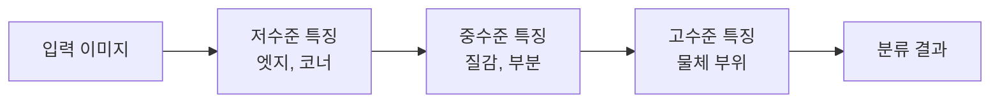
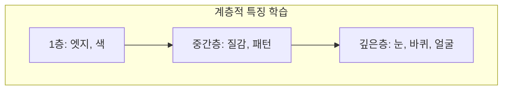

> 기하 기반 비전이 "어디에 있는가"를 풀었다면, 딥러닝 비전은 "이것이 무엇인가"를 푼다. 그 출발점이 CNN이고, CNN의 핵심 연산은 이미 Part 2에서 본 컨볼루션이다.
---
## 1. 정의
**CNN (Convolutional Neural Network)** 은 컨볼루션 층을 쌓아 이미지에서 계층적 특징을 학습하는 신경망이다. 핵심 구성 요소는 세 가지다.
- **컨볼루션 층**: 학습 가능한 커널을 슬라이딩하며 특징 맵을 만든다(Part 2-10과 동일 연산).
- **활성화 함수**: 비선형성을 더한다(주로 ReLU).
- **풀링 층**: 공간 해상도를 줄여 불변성과 효율을 높인다.
**이미지 분류(image classification)** 는 이미지 전체에 하나의 레이블(고양이, 개 등)을 부여하는 태스크다. CNN 비전의 가장 기본 문제이자, 검출·분할의 백본이 된다.
## 2. 의미 — 왜 필요한가
고전 비전(Part 2)은 특징을 사람이 설계했다(SIFT, Harris). 하지만 "고양이를 고양이로 인식하는 특징"을 손으로 설계하는 건 불가능하다. CNN은 이 특징을 **데이터로부터 학습**한다.

CNN이 강력한 이유는 특징의 계층적 학습이다. 저수준 층은 엣지·코너(Part 2의 고전 필터와 유사한 것을 스스로 학습), 중간 층은 질감·패턴, 고수준 층은 물체 부위·전체를 포착한다. 사람이 설계할 수 없던 고수준 의미 특징을 데이터가 만들어낸다. 2012년 AlexNet이 ImageNet에서 고전 방법을 압도하며 딥러닝 비전 시대가 열렸고, 검출·분할·깊이 추정 등 거의 모든 현대 비전이 CNN 백본 위에 선다.
## 3. 원리와 유도
### 3.1 왜 완전연결이 아니라 컨볼루션인가
이미지를 일반 신경망(완전연결)에 넣으면 두 문제가 있다. 첫째, 파라미터 폭발 — 224×224×3 이미지를 1000개 뉴런에 완전연결하면 1억 5천만 개 가중치다. 둘째, 위치 불변성 부재 — 고양이가 왼쪽에 있든 오른쪽에 있든 같은 고양이인데, 완전연결은 위치마다 따로 학습한다.
컨볼루션이 둘을 푼다. **가중치 공유(weight sharing)**: 같은 커널을 모든 위치에 적용하므로 파라미터가 커널 크기로 고정된다(3×3×채널). **지역 연결(local connectivity)**: 각 뉴런이 작은 수용 영역만 본다. **평행이동 등변성(translation equivariance)**: 입력이 이동하면 특징도 같이 이동한다 — 위치에 무관하게 같은 패턴을 인식한다.
### 3.2 특징 맵 크기 계산
컨볼루션 층의 출력 크기는 입력 $W$, 커널 $K$, 패딩 $P$, 스트라이드 $S$ 로 결정된다.
$$
W_{out} = \left\lfloor \frac{W - K + 2P}{S} \right\rfloor + 1
$$
예: 224 입력, 7×7 커널, 패딩 3, 스트라이드 2 → $(224-7+6)/2+1 = 112$. 이 계산은 네트워크 설계의 기본이며, 해상도가 어떻게 줄어드는지 추적하는 데 필수다.
### 3.3 ReLU와 풀링
활성화 함수 ReLU $f(x) = \max(0, x)$ 가 비선형성을 더한다. 비선형이 없으면 층을 아무리 쌓아도 하나의 선형변환과 같아진다(Part 0-1의 선형성). ReLU는 sigmoid보다 그래디언트 소실이 적고 계산이 빨라 표준이 됐다. 풀링(주로 max pooling)은 영역의 최대값만 남겨 해상도를 줄이고, 작은 위치 변화에 대한 불변성과 더 넓은 수용 영역을 제공한다.
### 3.4 학습: 역전파와 손실
분류는 마지막에 softmax로 클래스 확률을 내고, 교차 엔트로피 손실로 정답과의 차이를 측정한다.
$$
L = -\sum_c y_c \log \hat{y}_c, \qquad \hat{y}_c = \frac{e^{z_c}}{\sum_k e^{z_k}}
$$
이 손실을 역전파로 미분해 모든 커널 가중치를 경사하강으로 갱신한다. Part 0-5의 최적화가 신경망 학습의 토대다(다만 비볼록이라 SGD·Adam 등 변형을 쓴다).
## 4. 기하적 직관

CNN을 "특징의 사다리"로 보면 직관적이다. 첫 층은 Part 2의 Sobel·Harris처럼 엣지와 코너를 잡고(실제로 학습된 첫 층 커널은 이들과 비슷하게 생겼다), 위로 갈수록 이들을 조합해 질감 → 물체 부위 → 전체 물체로 추상화가 올라간다. 사람이 SIFT를 설계하던 것을, CNN은 데이터로부터 이 사다리 전체를 학습하는 셈이다.
## 5. 심화 — 비전에서의 활용
- **대표 아키텍처.** AlexNet(2012, 시작) → VGG(깊이) → ResNet(잔차 연결로 매우 깊게) → EfficientNet. ResNet의 skip connection이 깊은 망의 그래디언트 소실을 해결한 분수령.
- **전이 학습(transfer learning).** ImageNet으로 사전학습한 백본을 다른 태스크에 미세조정한다. 검출·분할이 모두 이 백본을 재활용한다.
- **ViT (Vision Transformer).** 최근엔 컨볼루션 대신 어텐션으로 이미지를 처리하는 트랜스포머가 분류에서 CNN을 능가하기도 한다. 패치를 토큰으로 다룬다.
## 6. 흔한 함정
- **※ 비선형 없는 깊이.** 활성화 함수 없이 컨볼루션만 쌓으면 전체가 하나의 선형변환과 같아 깊이의 의미가 없다(Part 0-1).
- **※ 과적합.** 파라미터가 많아 작은 데이터셋에 과적합되기 쉽다. 데이터 증강·드롭아웃·정규화가 필요.
- **※ 입력 정규화 누락.** 픽셀값을 정규화하지 않으면 학습이 불안정하다. 보통 평균 빼고 표준편차로 나눈다.
- **※ 해상도 추적 실수.** 스트라이드·풀링으로 해상도가 어떻게 줄어드는지 놓치면 층 연결이 안 맞는다. 출력 크기 공식을 꼭 확인.
## 7. 코드로 확인
아래는 특징 맵 크기 공식을 검증한 코드다.
```python
import numpy as np

# 컨볼루션 출력 크기: floor((W - K + 2P)/S) + 1
def conv_out(W, K, P, S):
    return (W - K + 2*P) // S + 1

print(conv_out(224, 7, 3, 2))   # 112 (ResNet 첫 층)
print(conv_out(112, 3, 1, 2))   # 56  (스트라이드 2 다운샘플)
print(conv_out(56, 3, 1, 1))    # 56  (해상도 유지)

# ReLU와 softmax
def relu(x): return np.maximum(0, x)
def softmax(z):
    e = np.exp(z - z.max())
    return e / e.sum()

print(relu(np.array([-2., 0., 3.])))     # [0. 0. 3.]
print(softmax(np.array([1., 2., 3.])).round(3))   # [0.09 0.245 0.665] 합=1
```
출력 크기 공식이 ResNet의 해상도 감소를 정확히 예측하고, ReLU와 softmax가 의도대로 동작함이 확인된다.
## 8. 면접 예상 질문
**Q1. 이미지에 완전연결망 대신 CNN을 쓰는 이유는?**
세 가지다. 가중치 공유로 같은 커널을 모든 위치에 적용해 파라미터가 폭증하지 않고, 지역 연결로 각 뉴런이 작은 영역만 보며, 평행이동 등변성으로 물체가 어디 있든 같은 패턴을 인식한다. 완전연결은 위치마다 따로 학습해 비효율적이고 위치 불변성이 없다.
**Q2. CNN이 학습하는 특징의 계층 구조를 설명하세요.**
저수준 층은 엣지·색·코너(Part 2 고전 필터와 유사) 같은 단순 특징을, 중간 층은 질감·패턴을, 고수준 층은 물체 부위·전체를 학습한다. 사람이 설계하던 특징을 데이터로부터 이 사다리 전체를 자동으로 학습하는 것이 CNN의 힘이다.
**Q3. 활성화 함수가 없으면 무슨 문제가 생기나요?**
비선형 활성화가 없으면 컨볼루션·완전연결을 아무리 쌓아도 전체가 하나의 선형변환과 동등해진다(선형변환의 합성은 선형). 깊이를 쌓는 의미가 사라진다. ReLU는 비선형성을 더하면서 그래디언트 소실이 적고 계산이 빨라 표준으로 쓰인다.
**Q4. ResNet의 skip connection이 해결한 문제는?**
망이 깊어질수록 그래디언트가 사라져 학습이 안 되는 문제(그래디언트 소실)와 성능 저하가 있었다. ResNet은 입력을 출력에 직접 더하는 잔차 연결로, 그래디언트가 지름길을 통해 흐르게 해 수십\~수백 층의 매우 깊은 망 학습을 가능케 했다.
## 9. 레퍼런스
- Stanford CS231n, *CNN for Visual Recognition* — [https://cs231n.github.io/](https://cs231n.github.io/)
- Krizhevsky et al., *AlexNet* (2012) — [https://papers.nips.cc/paper/4824-imagenet-classification-with-deep-convolutional-neural-networks](https://papers.nips.cc/paper/4824-imagenet-classification-with-deep-convolutional-neural-networks)
- He et al., *Deep Residual Learning (ResNet)* (2015) — [https://arxiv.org/abs/1512.03385](https://arxiv.org/abs/1512.03385)
- Goodfellow et al., *Deep Learning*, Ch.9 — [https://www.deeplearningbook.org/](https://www.deeplearningbook.org/)
