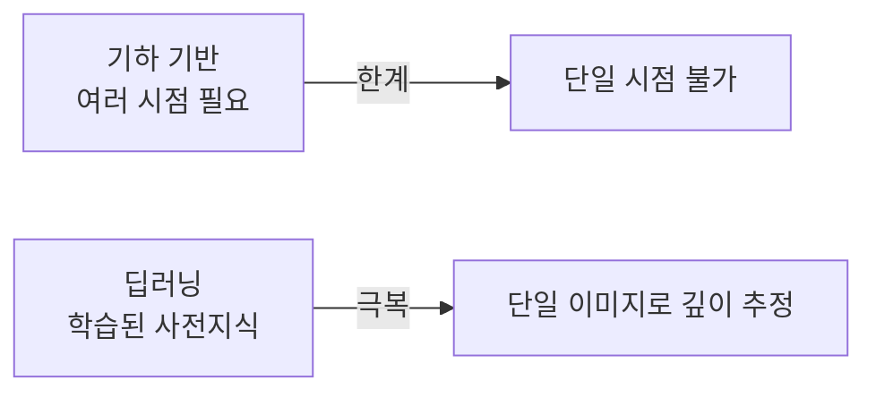
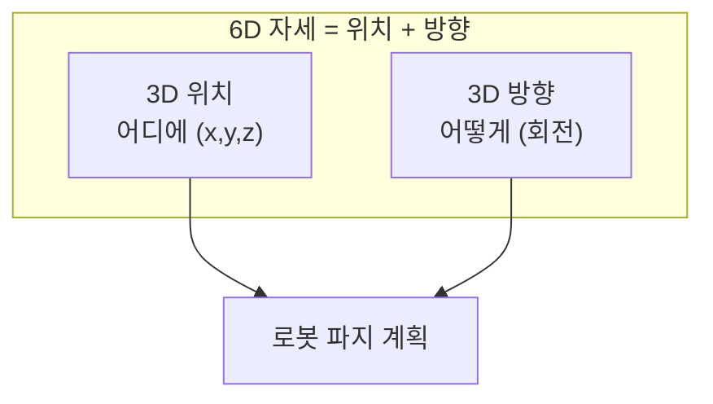

> 기하 기반 비전은 여러 시점이 있어야 깊이를 복원했다(Part 3). 딥러닝은 단일 이미지에서도 깊이를 추정하고, 물체의 완전한 6D 자세를 직접 예측한다. 기하와 학습이 만나는 지점이다.
---
## 1. 정의
**단안 깊이 추정(monocular depth estimation)** 은 단일 RGB 이미지로부터 픽셀별 깊이를 예측한다. 기하적으로는 불가능했던 일(Part 1-6)을, 학습된 사전지식으로 푼다.
**6D 자세 추정(6D pose estimation)** 은 물체의 3D 위치(3 DOF)와 3D 방향(3 DOF), 합쳐서 6 자유도의 완전한 자세 $[R|\mathbf{t}]$ 를 추정한다. 로봇이 물체를 잡으려면 어디에·어떻게 놓였는지를 모두 알아야 한다.
## 2. 의미 — 왜 필요한가
Part 1-6에서 "단일 이미지는 깊이를 못 얻는다"고 했다. 기하적으로는 맞다. 그런데 사람은 한 눈으로도 대략의 거리를 안다 — 경험으로 "이 정도 크기의 의자는 이만큼 멀다"는 사전지식이 있기 때문이다. 딥러닝은 바로 이 사전지식을 데이터로 학습한다.

이것이 중요한 이유는 기하의 한계를 넘기 때문이다. 스테레오·SLAM은 여러 시점이나 움직임이 필요한데, 학습 기반은 한 장으로 깊이를 준다(절대 스케일은 여전히 모호할 수 있지만). 6D 자세는 로봇 조작의 핵심으로, 빈 피킹(bin picking)·조립에서 물체를 정확히 잡으려면 위치뿐 아니라 방향까지 알아야 한다. 검출·분할(이전 항목)이 "무엇이 어디에"라면, 6D 자세는 "어떤 방향으로"까지 답한다.
## 3. 원리와 유도
### 3.1 단안 깊이 추정: 사전지식의 학습
단안 깊이는 기하 제약이 부족한 ill-posed 문제다. 네트워크는 RGB 이미지를 입력받아 깊이 맵을 출력하는 인코더-디코더 구조로, 대량의 RGB-깊이 쌍에서 "어떤 시각 단서가 어떤 깊이에 대응하는지"를 학습한다. 단서로는 물체 크기, 텍스처 그래디언트, 가림 관계, 소실점(Part 0-3) 등이 쓰인다. 손실은 예측 깊이와 정답의 차이지만, 단안은 절대 스케일이 모호해 스케일 불변 손실(scale-invariant loss)을 자주 쓴다.
$$
L = \frac{1}{n}\sum_i d_i^2 - \frac{\lambda}{n^2}\Big(\sum_i d_i\Big)^2, \qquad d_i = \log \hat{z}_i - \log z_i
$$
두 번째 항이 전역 스케일 차이를 상쇄해, 상대적 깊이 구조를 맞추는 데 집중하게 한다.
### 3.2 자기지도 깊이 학습
정답 깊이 없이도 학습할 수 있다. 스테레오 쌍이나 연속 프레임에서, 추정한 깊이로 한 이미지를 다른 시점으로 워핑(warping)했을 때 원본과 일치해야 한다는 광도 일관성(photometric consistency)을 손실로 쓴다(Part 3-16 직접법과 같은 원리). 깊이와 카메라 운동을 함께 추정하며, 정답 라벨 없이 영상만으로 학습한다.
### 3.3 6D 자세 추정의 두 접근
직접 회귀와 대응 기반으로 갈린다. 직접 회귀(PoseCNN 등)는 네트워크가 회전·이동을 직접 출력한다. 회전 표현으로 쿼터니언이나 6D 표현을 쓴다(Part 0-4). 대응 기반은 이미지 픽셀과 3D 모델 점의 대응을 예측한 뒤, PnP(Part 3-15)로 자세를 푼다. 후자가 기하적으로 더 정확한 경향이 있다.
### 3.4 회전 표현의 함정 (학습 관점)
자세 추정에서 회전 표현 선택이 학습 성능을 좌우한다. 쿼터니언·오일러각은 불연속성이 있어(Part 0-4) 신경망이 회귀하기 어렵다. 그래서 회전행렬의 두 열을 직접 예측하고 Gram-Schmidt로 직교화하는 연속적 6D 표현이 선호된다. "표현의 연속성이 학습 가능성을 결정한다"는 것이 핵심 통찰이며, Part 0-4의 회전 표현 트레이드오프가 딥러닝에서 다시 등장한다.
## 4. 기하적 직관

6D 자세를 "물체에 붙인 좌표계가 카메라/로봇 좌표계에서 어떻게 놓였는가"로 보면 된다(Part 0-4의 SE(3)). 위치 3개는 물체 중심이 어디 있는지, 방향 3개는 물체가 어느 쪽으로 돌아 있는지를 말한다. 로봇 손이 컵 손잡이를 정확히 잡으려면 이 6개가 모두 필요하다 — 위치만 알고 방향을 모르면 엉뚱한 각도로 손을 뻗는다.
## 5. 심화 — 비전에서의 활용
- **깊이 파운데이션 모델.** Depth Anything, MiDaS 등은 대규모 다양한 데이터로 학습해, 처음 보는 장면에도 강건한 상대 깊이를 제로샷으로 준다.
- **빈 피킹(bin picking).** 뒤섞인 부품 더미에서 6D 자세로 각 부품을 인식해 로봇이 집는다. 산업 자동화의 핵심 응용.
- **NeRF·3D Gaussian Splatting.** 여러 이미지로 연속적 3D 장면을 학습해 새 시점을 렌더링한다. 기하 복원과 학습의 융합이 만든 최신 흐름.
## 6. 흔한 함정
- **※ 단안 깊이의 절대 스케일.** 단안 추정은 보통 상대 깊이만 신뢰할 수 있다. 절대 거리가 필요하면 스케일 보정(알려진 크기·센서)이 필요하다.
- **※ 도메인 갭.** 학습 데이터와 다른 환경(조명·물체)에서 성능이 급락한다. 사전지식 기반이라 본 적 없는 분포에 약하다.
- **※ 대칭 물체의 자세 모호성.** 대칭 물체(원통·구)는 여러 회전이 같은 외형을 줘 자세가 모호하다. 손실 설계에서 대칭을 다뤄야 한다.
- **※ 회전 표현 불연속.** 쿼터니언·오일러로 직접 회귀하면 불연속점에서 학습이 불안정하다. 연속 6D 표현을 쓴다(Part 0-4).
## 7. 코드로 확인
아래는 단안 깊이의 스케일 불변 손실과 6D 회전 표현을 검증한 코드다.
```python
import numpy as np

# 3.1 스케일 불변 손실: 전역 스케일 차이에 불변
def si_loss(pred, gt, lam=0.5):
    d = np.log(pred) - np.log(gt)
    n = len(d)
    return np.mean(d**2) - lam * (np.sum(d))**2 / n**2

gt = np.array([2., 4., 8.])
# 예측이 정답의 3배(스케일만 다름)면 손실이 작아야
pred_scaled = gt * 3
print(round(si_loss(pred_scaled, gt), 6))   # ≈ 0 (스케일 차이 무시)

# 3.4 연속 6D 회전 표현 -> 회전행렬 (Gram-Schmidt)
def sixd_to_R(a1, a2):
    b1 = a1 / np.linalg.norm(a1)
    a2 = a2 - (b1 @ a2) * b1          # 직교화
    b2 = a2 / np.linalg.norm(a2)
    b3 = np.cross(b1, b2)
    return np.stack([b1, b2, b3], axis=1)

R = sixd_to_R(np.array([1., 0.1, 0.]), np.array([0.1, 1., 0.]))
print(np.allclose(R.T @ R, np.eye(3)))   # True (유효한 회전행렬)
```
스케일 불변 손실이 3배 차이를 무시(상대 구조만 봄)하고, 6D 표현이 Gram-Schmidt로 유효한 직교 회전행렬을 만드는 것이 확인된다.
## 8. 면접 예상 질문
**Q1. 기하적으로 불가능한 단안 깊이를 딥러닝이 어떻게 추정하나요?**
기하 제약만으로는 단일 이미지에서 깊이를 못 얻지만, 딥러닝은 물체 크기·텍스처 그래디언트·가림·소실점 같은 시각 단서와 깊이의 대응을 대량 데이터에서 학습한다. 사람이 한 눈으로도 거리를 짐작하는 것과 같은 원리로, 학습된 사전지식이 기하의 빈틈을 메운다.
**Q2. 단안 깊이 학습에서 스케일 불변 손실을 쓰는 이유는?**
단안은 절대 스케일이 본질적으로 모호하다(작은 물체가 가까이 vs 큰 물체가 멀리). 일반 손실은 스케일 오차에 벌점을 줘 학습을 방해한다. 스케일 불변 손실은 전역 스케일 차이를 상쇄하고 상대적 깊이 구조를 맞추는 데 집중하게 해 학습이 안정된다.
**Q3. 6D 자세 추정의 두 가지 접근은?**
직접 회귀는 네트워크가 회전·이동을 직접 출력한다(PoseCNN). 대응 기반은 이미지 픽셀과 3D 모델 점의 대응을 예측한 뒤 PnP로 자세를 푼다. 후자가 기하 제약을 활용해 더 정확한 경향이 있다. 둘 다 검출·분할로 물체를 먼저 찾은 뒤 적용한다.
**Q4. 자세 추정에서 회전을 어떤 표현으로 출력하나요? 왜죠?**
쿼터니언·오일러각은 불연속성이 있어 신경망 회귀가 어렵다(Part 0-4). 그래서 회전행렬의 두 열을 예측하고 Gram-Schmidt로 직교화하는 연속적 6D 표현을 쓴다. 표현의 연속성이 학습 가능성을 결정한다는 것이 핵심이다. 대칭 물체는 자세 모호성을 손실에서 따로 처리한다.
## 9. 레퍼런스
- Eigen et al., *Depth Map Prediction (단안 깊이)* (2014) — [https://arxiv.org/abs/1406.2283](https://arxiv.org/abs/1406.2283)
- Xiang et al., *PoseCNN* (2018) — [https://arxiv.org/abs/1711.00199](https://arxiv.org/abs/1711.00199)
- Zhou et al., *On the Continuity of Rotation Representations* (6D 회전) — [https://arxiv.org/abs/1812.07035](https://arxiv.org/abs/1812.07035)
- Yang et al., *Depth Anything* (2024) — [https://arxiv.org/abs/2401.10891](https://arxiv.org/abs/2401.10891)
