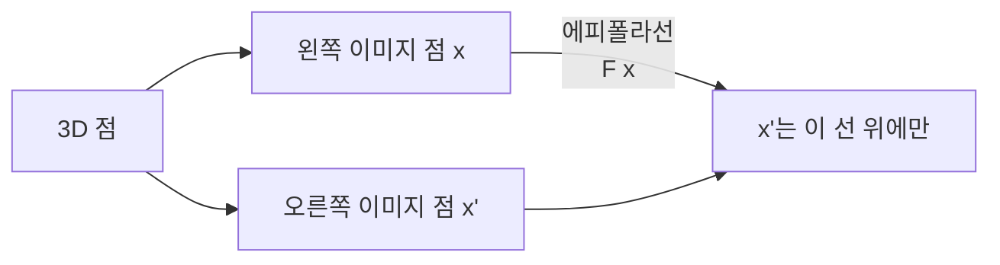
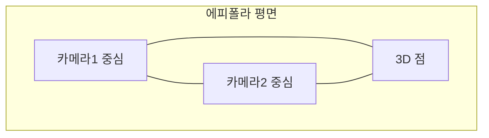

> 두 시점에서 본 같은 장면 사이에는 강력한 기하 제약이 있다. 한 이미지의 점이 다른 이미지에서 한 직선(에피폴라선) 위에만 있을 수 있다는 것. 이 제약이 스테레오·SfM·SLAM의 수학적 뼈대다.
---
## 1. 정의
**에피폴라 기하(epipolar geometry)** 는 두 카메라가 같은 장면을 볼 때 성립하는 사영기하 관계다. 한 이미지의 점 $\mathbf{x}$ 에 대응하는 점은 다른 이미지의 한 직선(에피폴라선) 위에 있어야 한다.
**Essential 행렬 **$E$ 는 정규화 좌표(내부 파라미터 제거)에서의 에피폴라 제약을 담는 $3\times3$ 행렬이다.
$$
\hat{\mathbf{x}}'^\top E\,\hat{\mathbf{x}} = 0, \qquad E = [\mathbf{t}]_\times R
$$
$R, \mathbf{t}$ 는 두 카메라 사이의 상대 회전·이동이고, $[\mathbf{t}]_\times$ 는 skew-symmetric 행렬(Part 0-1)이다.
**Fundamental 행렬 **$F$ 는 픽셀 좌표에서의 같은 제약으로, 내부 파라미터까지 포함한다.
$$
\mathbf{x}'^\top F\,\mathbf{x} = 0, \qquad F = K'^{-\top} E\, K^{-1}
$$
## 2. 의미 — 왜 필요한가
Part 1-6에서 봤듯 한 이미지는 깊이를 지운다. 깊이를 되찾으려면 두 번째 시점이 필요하고, 두 시점의 점들이 어떻게 대응되는지가 핵심 문제다. 에피폴라 기하는 이 대응을 **2D 탐색에서 1D 탐색으로** 줄여준다.

대응점을 찾을 때, 에피폴라 제약이 없으면 오른쪽 이미지 전체(2D)를 뒤져야 한다. 하지만 $F\mathbf{x}$ 가 정의하는 에피폴라선 위만 찾으면 되므로 탐색이 1D로 줄어든다. 이것이 스테레오 매칭을 실용적으로 만들고, SfM·SLAM에서 잘못된 매칭을 거르는 강력한 기하 필터가 된다. 또 $E$ 를 분해하면 두 카메라의 상대 자세 $R, \mathbf{t}$ 가 나와, 카메라 운동 추정(VO)의 출발점이 된다.
## 3. 원리와 유도
### 3.1 에피폴라 제약의 유도
두 카메라 좌표계에서 같은 3D 점을 $\mathbf{X}, \mathbf{X}'$ 라 하면 $\mathbf{X}' = R\mathbf{X} + \mathbf{t}$ (상대 자세). 양변에 $\mathbf{t}$ 와의 외적을 취하면 $\mathbf{t}$ 가 사라진다.
$$
\mathbf{t} \times \mathbf{X}' = \mathbf{t} \times (R\mathbf{X} + \mathbf{t}) = \mathbf{t} \times R\mathbf{X}
$$
여기에 $\mathbf{X}'$ 를 내적하면 좌변은 0이다($\mathbf{X}'$ 는 $\mathbf{t}\times\mathbf{X}'$ 에 수직).
$$
\mathbf{X}'^\top (\mathbf{t} \times R\mathbf{X}) = 0 \;\Longrightarrow\; \mathbf{X}'^\top [\mathbf{t}]_\times R\, \mathbf{X} = 0
$$
외적을 skew 행렬로 바꾸면(Part 0-1) $E = [\mathbf{t}]_\times R$ 이 나타난다. 정규화 좌표 $\hat{\mathbf{x}} = \mathbf{X}/Z$ 로 나눠도 스케일만 바뀌어 제약은 유지되므로 $\hat{\mathbf{x}}'^\top Ehat{\mathbf{x}} = 0$. 이 유도가 Part 0-1의 외적-skew 표현이 왜 중요한지 보여주는 결정적 사례다.
### 3.2 에피폴라선과 에피폴
$E\hat{\mathbf{x}}$ 는 두 번째 이미지에서의 에피폴라선 $\mathbf{l}'$ 이다($\mathbf{l}'^\top\hat{\mathbf{x}}' = 0$). 모든 에피폴라선은 한 점, 에피폴(epipole)에서 만난다. 에피폴은 한 카메라의 중심이 다른 이미지에 투영된 점이다. 기하적으로 에피폴라 평면(두 카메라 중심과 3D 점이 이루는 평면)이 각 이미지와 만나는 선이 에피폴라선이다.
### 3.3 8-point 알고리즘
$F$ 를 추정하는 고전적 방법이다. 제약 $\mathbf{x}'^\top F\mathbf{x} = 0$ 은 $F$ 의 9개 원소에 대해 선형이다. 대응점 한 쌍이 방정식 하나를 주므로, 8쌍이면 $A\mathbf{f} = 0$ 형태가 되어 SVD로 푼다(Part 0-2의 동차 최소제곱, 최소 특이값 방향). 핵심 후처리 두 가지: (1) 입력 좌표를 정규화해 조건수를 낮추고(Hartley normalization), (2) $F$ 는 rank 2여야 하므로 SVD로 가장 작은 특이값을 0으로 강제한다(Part 0-2의 rank enforcement).
### 3.4 E의 분해: 상대 자세 복원
$E = [\mathbf{t}]_\times R$ 을 SVD로 분해하면 $R, \mathbf{t}$ 를 복원할 수 있다. $E = U\text{diag}(1,1,0)V^\top$ 형태에서 회전·이동의 네 가지 후보가 나오고, 복원된 3D 점이 두 카메라 앞쪽(양의 깊이)에 있는 해 하나를 선택한다(cheirality 검사). 이렇게 얻은 $R, \mathbf{t}$ 가 Visual Odometry의 한 스텝이 된다.
## 4. 기하적 직관

두 카메라 중심과 3D 점, 이 세 점이 하나의 평면(에피폴라 평면)을 이룬다. 이 평면이 각 이미지 평면과 만나는 선이 에피폴라선이다. 3D 점이 어디에 있든 그 점의 이미지는 반드시 이 평면 안에 있으므로, 대응점은 에피폴라선 위에만 존재한다. 깊이가 변하면 3D 점이 광선을 따라 움직이는데, 그 투영은 에피폴라선을 따라 이동한다 — 그래서 1D 탐색으로 충분하다.
## 5. 심화 — 비전에서의 활용
- **스테레오 정렬(rectification).** 두 이미지를 변환해 에피폴라선을 수평으로 만들면, 대응점 탐색이 같은 행(row) 탐색으로 단순해진다. 스테레오 깊이의 전처리(다음 항목).
- **Visual Odometry.** 연속 프레임에서 $E$ 를 추정·분해해 카메라 운동 $R, \mathbf{t}$ 를 누적한다(Part 3-16).
- **매칭 필터.** SfM/SLAM에서 특징 매칭 후 에피폴라 제약을 만족하지 않는 쌍을 RANSAC + $F$ 로 제거한다(Part 2-12와 연결).
## 6. 흔한 함정
- **※ F와 E 혼동.** $F$ 는 픽셀 좌표, $E$ 는 정규화 좌표(내부 파라미터 제거)용이다. $E = K'^\top F K$. 내부 파라미터를 알면 $E$ 를, 모르면 $F$ 를 쓴다.
- **※ rank 2 강제 누락.** 추정된 $F$ 는 노이즈로 rank 3이 되기 쉽다. SVD로 rank 2를 강제하지 않으면 에피폴이 제대로 안 모인다.
- **※ 정규화 생략.** 8-point에서 좌표 정규화를 안 하면 조건수가 커져 해가 부정확하다(Hartley normalized 8-point 필수).
- **※ 순수 회전.** 카메라가 회전만 하고 이동이 없으면($\mathbf{t}=0$) $E$ 가 0이 되어 에피폴라 기하가 성립하지 않는다. 이 경우 호모그래피로 다뤄야 한다.
## 7. 코드로 확인
아래는 실제 NumPy로 실행해 검증한 코드다.
```python
import numpy as np
import cv2

def skew(v):
    return np.array([[0, -v[2], v[1]],
                     [v[2], 0, -v[0]],
                     [-v[1], v[0], 0]])

# 상대 자세 R, t -> Essential 행렬
R = cv2.Rodrigues(np.array([0., 0.1, 0.]))[0]
t = np.array([0.5, 0, 0.1])
E = skew(t) @ R

# 랜덤 3D 점을 두 카메라에 투영 (정규화 좌표)
np.random.seed(1)
X = np.random.randn(3, 8) * 2; X[2] += 5
x1 = X / X[2]
X2 = R @ X + t.reshape(3, 1); x2 = X2 / X2[2]

# 에피폴라 제약 x2^T E x1 = 0 검증
errs = [x2[:, i] @ E @ x1[:, i] for i in range(8)]
print(np.allclose(errs, 0, atol=1e-9))   # True
```
상대 자세로 만든 Essential 행렬이 모든 대응점에서 에피폴라 제약 $\mathbf{x}_2^\top E \mathbf{x}_1 = 0$ 을 정확히 만족함이 확인된다.
## 8. 면접 예상 질문
**Q1. 에피폴라 제약이 왜 유용한가요?**
한 이미지의 점에 대응하는 점이 다른 이미지의 에피폴라선 위에만 있다는 제약이라, 대응점 탐색을 2D에서 1D로 줄여준다. 스테레오 매칭을 실용적으로 만들고, SfM/SLAM에서 잘못된 특징 매칭을 거르는 기하 필터로 쓰인다.
**Q2. Essential 행렬과 Fundamental 행렬의 차이는?**
$E$ 는 정규화 좌표(내부 파라미터 $K$ 를 제거한)에서의 제약으로 $E = [\mathbf{t}]_\times R$ 이라 상대 자세를 직접 담는다. $F$ 는 픽셀 좌표에서의 제약으로 내부 파라미터까지 포함하며 $F = K'^{-\top}E K^{-1}$ 이다. $K$ 를 알면 $E$ 를, 모르면 $F$ 를 추정한다.
**Q3. 8-point 알고리즘으로 **$F$** 를 어떻게 구하나요?**
제약 $\mathbf{x}'^\top F\mathbf{x}=0$ 이 $F$ 원소에 선형이라, 대응점 8쌍으로 $A\mathbf{f}=0$ 을 만들고 SVD의 최소 특이값 방향으로 푼다. 핵심 후처리는 좌표 정규화(조건수 개선)와 SVD로 rank 2 강제다. $F$ 는 이론상 rank 2여야 에피폴이 한 점에 모인다.
**Q4. Essential 행렬에서 상대 자세를 어떻게 복원하나요?**
$E$ 를 SVD로 분해하면 $R, \mathbf{t}$ 의 네 가지 후보가 나온다. 각 후보로 대응점을 삼각측량해, 복원된 3D 점이 두 카메라 모두의 앞쪽(양의 깊이)에 오는 해 하나를 선택한다(cheirality 검사). 이것이 Visual Odometry의 한 스텝이다.
## 9. 레퍼런스
- Hartley & Zisserman, *Multiple View Geometry*, Ch.9 (에피폴라 기하) — [https://www.robots.ox.ac.uk/\~vgg/hzbook/](https://www.robots.ox.ac.uk/~vgg/hzbook/)
- Longuet-Higgins, *A computer algorithm for reconstructing a scene from two projections* (1981) — [https://www.nature.com/articles/293133a0](https://www.nature.com/articles/293133a0)
- 다크프로그래머, Fundamental Matrix와 Essential Matrix — [https://darkpgmr.tistory.com/83](https://darkpgmr.tistory.com/83)
