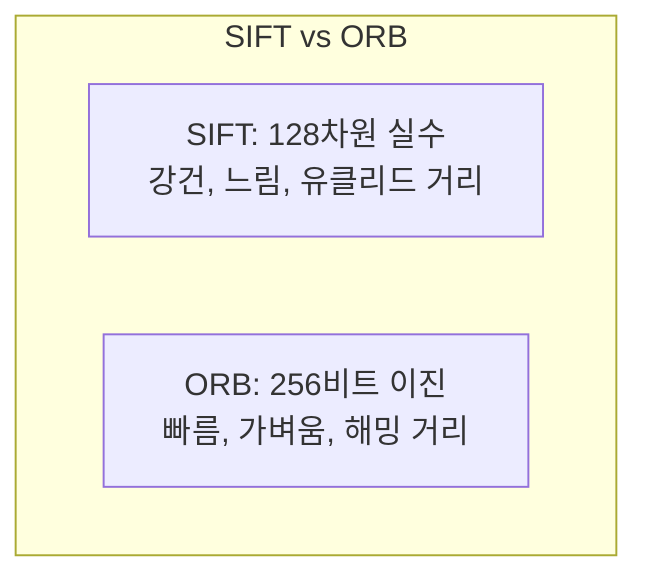

> 코너를 찾는 것만으로는 부족하다. 다른 이미지의 코너와 "같은 점인지" 매칭하려면, 각 점 주변을 숫자 벡터로 요약한 기술자(descriptor)가 필요하다. 이 기술자가 스케일·회전·조명 변화에도 같아야 매칭이 된다.
---
## 1. 정의
**특징 기술자(feature descriptor)** 는 특징점 주변 영역을 고정 길이 벡터로 인코딩한 것이다. 두 점이 같은 3D 지점이면 그 기술자가 비슷해야 한다.
**SIFT (Scale-Invariant Feature Transform)** 는 스케일 공간에서 특징을 검출하고, 그래디언트 방향 히스토그램으로 128차원 실수 기술자를 만든다. 스케일·회전 불변이며 조명 변화에 강하다.
**ORB (Oriented FAST and Rotated BRIEF)** 는 FAST 코너 검출 + 방향 부여 + BRIEF 이진 기술자를 결합한다. 256비트 이진 벡터로, SIFT보다 수십 배 빠르고 라이선스가 자유롭다.
**매칭(matching)** 은 한 이미지의 기술자를 다른 이미지의 기술자들과 비교해 가장 비슷한 것을 찾는 과정이다. SIFT는 유클리드 거리, ORB는 해밍 거리를 쓴다.
## 2. 의미 — 왜 필요한가
Harris 코너(이전 항목)는 "어디가 특징인가"만 답한다. 하지만 두 이미지를 정합하려면 "이 코너가 저 코너와 같은가"를 판단해야 한다. 그 판단의 근거가 기술자다.

핵심 도전은 **불변성(invariance)** 이다. 같은 물체라도 카메라가 가까워지면 크게(스케일), 기울면 회전돼, 조명이 바뀌면 밝기가 달라 보인다. 기술자가 이런 변화에도 일정해야 매칭이 된다. SIFT가 스케일·회전·조명 불변을 달성한 것이 컴퓨터 비전의 분수령이었고, ORB가 이를 실시간으로 만든 것이 모바일·SLAM 시대를 열었다. 파노라마, SfM, Visual SLAM, 물체 인식이 전부 이 매칭 위에 선다.
## 3. 원리와 유도
### 3.1 SIFT: 스케일 불변은 어떻게 달성되는가
이전 항목의 Harris는 고정 윈도우라 스케일이 바뀌면 무너졌다. SIFT는 **스케일 공간**에서 특징을 찾아 이를 해결한다. 가우시안 $\sigma$ 를 키우며 블러 이미지를 쌓고(Part 2-10의 스케일 공간), 인접 스케일의 차(DoG, Difference of Gaussians)에서 극값을 찾는다.
$$
\text{DoG}(x,y,\sigma) = G(x,y,k\sigma) * I - G(x,y,\sigma) * I
$$
DoG는 라플라시안(LoG)의 근사로, 공간뿐 아니라 스케일 축에서도 극값인 점을 고른다. "어느 스케일에서 가장 두드러지는가"를 함께 찾으므로, 물체 크기가 변해도 같은 특징을 검출한다. 이것이 스케일 불변의 핵심이다.
### 3.2 SIFT 기술자: 회전·조명 불변
검출된 각 점에 대해, 주변 그래디언트의 지배적 방향을 구해 그 방향을 기준으로 패치를 정렬한다(회전 불변). 그 다음 4×4 영역 각각에서 8방향 그래디언트 히스토그램을 만들어 $4\times4\times8 = 128$ 차원 벡터를 얻는다. 마지막에 벡터를 정규화해 밝기 변화에 강하게 만든다(조명 불변). 즉 "그래디언트 방향의 분포"로 영역을 요약하는 것이 핵심이다 — 밝기 절대값이 아니라 변화 패턴을 쓰므로 조명에 둔감하다.
### 3.3 ORB: 속도를 위한 이진 기술자
SIFT는 강력하지만 느리다. ORB는 실시간을 위해 두 가지를 결합한다. FAST로 코너를 빠르게 검출하고(중심 픽셀과 원형 이웃의 밝기 비교), 인텐시티 무게중심으로 방향을 부여한다. 기술자는 BRIEF — 패치 내 미리 정한 픽셀 쌍들의 밝기 대소를 비교해 0/1 비트열을 만든다.
$$
\tau(p; a, b) = \begin{cases} 1 & I(a) < I(b) \\ 0 & \text{otherwise} \end{cases}
$$
256개 쌍이면 256비트 기술자다. 비교가 비트 연산이라 매우 빠르고, 매칭은 해밍 거리(XOR 후 1의 개수)로 한다. 방향을 미리 정렬해 회전 불변성을 더한 것이 "Rotated BRIEF"다.
### 3.4 매칭과 Lowe's ratio test
기술자 간 거리로 가장 가까운 후보를 찾되, 오매칭을 거르는 게 중요하다. Lowe의 비율 검사가 표준이다. 최근접 거리 $d_1$ 과 차근접 거리 $d_2$ 의 비 $d_1/d_2$ 가 임계값(보통 0.7\~0.8)보다 작을 때만 매칭으로 인정한다. "확실히 구별되는 매칭"만 남기는 것이다. 이후 RANSAC(Part 0-5)으로 기하적 outlier를 추가로 제거한다.
## 4. 기하적 직관

기술자를 "지문"으로 생각하면 된다. 특징점 주변의 그래디언트 패턴을 고유한 지문으로 만들어, 다른 이미지에서 같은 지문을 찾는 것이 매칭이다. SIFT는 정교한 지문(128개 실수), ORB는 간략한 지문(256개 비트)이다. 정확도가 중요하면 SIFT, 속도가 중요하면(실시간 SLAM) ORB를 쓴다.
## 5. 심화 — 비전에서의 활용
- **ORB-SLAM.** ORB 특징으로 실시간 Visual SLAM을 구현한 대표 시스템. 검출·매칭·루프 클로저까지 ORB 하나로(Part 3).
- **이미지 정합·파노라마.** 두 이미지의 특징을 매칭하고 호모그래피(Part 0-3)를 추정해 이어 붙인다.
- **학습 기반 특징.** SuperPoint, SuperGlue 등은 검출·기술·매칭을 신경망으로 학습한다. 텍스처 약한 환경에서 고전 특징을 능가하며, 고전과 딥러닝의 경계에 있다(Part 4와 연결).
## 6. 흔한 함정
- **※ 거리 척도 혼동.** SIFT(실수)는 유클리드 거리, ORB(이진)는 해밍 거리를 쓴다. 이진 기술자에 유클리드를 쓰면 안 된다.
- **※ ratio test 생략.** 최근접만으로 매칭하면 오매칭이 많다. Lowe의 비율 검사로 모호한 매칭을 걸러야 한다.
- **※ 무텍스처 환경.** 특징 기반은 텍스처 없는 벽·하늘에서 특징을 못 찾는다. 이런 곳엔 직접법(direct method)이나 학습 기반 특징이 낫다.
- **※ SIFT 특허 오해.** SIFT 특허는 2020년 만료됐다. 과거엔 비상업용만 자유로웠지만 지금은 제약이 없다. ORB는 처음부터 자유 라이선스라 산업계에서 선호됐다.
## 7. 코드로 확인
아래는 OpenCV로 실행해 검증한 코드다.
```python
import numpy as np
import cv2

img = (np.random.rand(200, 200) * 255).astype(np.uint8)

# ORB: 검출 + 이진 기술자
orb = cv2.ORB_create(nfeatures=50)
kp, des = orb.detectAndCompute(img, None)
print(des.shape, des.dtype)   # (44, 32) uint8  -> 32바이트 = 256비트

# 두 이미지 매칭 (해밍 거리 + ratio test)
img2 = np.roll(img, 5, axis=1)            # 살짝 이동시킨 이미지
kp2, des2 = orb.detectAndCompute(img2, None)

bf = cv2.BFMatcher(cv2.NORM_HAMMING)      # 이진 -> 해밍 거리
matches = bf.knnMatch(des, des2, k=2)
good = [m for m, n in matches if m.distance < 0.75 * n.distance]  # Lowe ratio
print(len(good) >= 0)   # True (ratio test 통과 매칭)
```
ORB 기술자가 256비트(32바이트)임이 확인되고, 해밍 거리 + Lowe 비율 검사로 매칭이 걸러지는 흐름이 드러난다.
## 8. 면접 예상 질문
**Q1. SIFT는 어떻게 스케일 불변성을 얻나요?**
가우시안 $\sigma$ 를 키우며 블러 이미지를 쌓아 스케일 공간을 만들고, 인접 스케일의 차(DoG)에서 공간·스케일 양쪽으로 극값인 점을 찾는다. "어느 스케일에서 가장 두드러지는가"를 함께 찾으므로 물체 크기가 변해도 같은 특징을 검출한다. 고정 윈도우인 Harris와의 결정적 차이다.
**Q2. SIFT 기술자가 회전·조명에 강한 이유는?**
주변 그래디언트의 지배적 방향으로 패치를 정렬해 회전 불변을 얻고, 밝기 절대값이 아니라 그래디언트 방향 히스토그램(변화 패턴)을 쓰며 벡터를 정규화해 조명 변화에 둔감해진다. 결과는 128차원 벡터다.
**Q3. ORB가 SIFT보다 빠른 이유는?**
FAST로 코너를 빠르게 검출하고, 기술자로 BRIEF(픽셀 쌍 밝기 대소를 비트로 인코딩)를 쓴다. 256비트 이진 벡터라 매칭이 해밍 거리(XOR + 비트카운트)로 이뤄져 SIFT의 128차원 유클리드 거리보다 수십 배 빠르다. 메모리도 적게 쓴다.
**Q4. 특징 매칭에서 Lowe's ratio test란?**
최근접 거리 $d_1$ 과 차근접 거리 $d_2$ 의 비 $d_1/d_2$ 가 임계값(0.7\~0.8)보다 작을 때만 매칭으로 인정하는 방법이다. 최근접이 차근접보다 확실히 가까울 때만 받아들여 모호한 오매칭을 거른다. 이후 RANSAC으로 기하적 outlier를 추가 제거한다.
## 9. 레퍼런스
- Lowe, *Distinctive Image Features from Scale-Invariant Keypoints* (SIFT, 2004) — [https://www.cs.ubc.ca/\~lowe/papers/ijcv04.pdf](https://www.cs.ubc.ca/~lowe/papers/ijcv04.pdf)
- Rublee et al., *ORB: An efficient alternative to SIFT or SURF* (2011) — [https://www.gwylab.com/download/ORB_2012.pdf](https://www.gwylab.com/download/ORB_2012.pdf)
- Szeliski, *Computer Vision* 2nd ed., Ch.7.1 — [https://szeliski.org/Book/](https://szeliski.org/Book/)
