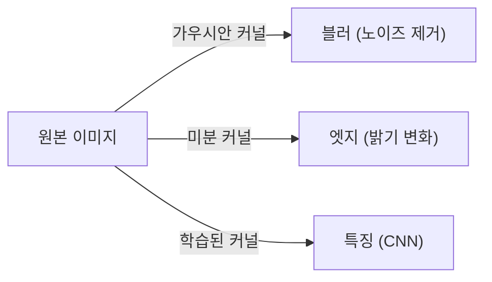
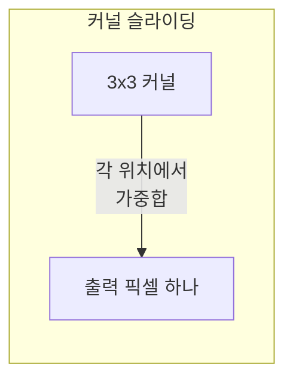

> 이미지에서 정보를 뽑는 모든 저수준 연산의 토대가 컨볼루션이다. 블러, 엣지, 코너, 그리고 CNN까지 — 전부 "작은 커널을 이미지에 미끄러뜨리는" 같은 연산이다.
---
## 1. 정의
**컨볼루션(convolution)** 은 작은 커널(필터) $h$ 를 이미지 $f$ 위로 미끄러뜨리며 각 위치에서 가중합을 계산하는 연산이다.
$$
(f * h)(x, y) = \sum_{i}\sum_{j} f(x-i,\, y-j)\, h(i, j)
$$
수학적 컨볼루션은 커널을 뒤집지만(위 식의 $-i, -j$), 영상처리에서 자주 쓰는 상관(correlation)은 뒤집지 않는다. 대칭 커널(가우시안 등)에서는 둘이 같다.
**선형 필터(linear filter)** 는 컨볼루션으로 표현되는 필터다. 커널 값에 따라 블러·미분·샤프닝 등 다른 효과를 낸다. 비선형 필터(예: 미디언)는 컨볼루션으로 표현되지 않는다.
## 2. 의미 — 왜 필요한가
원본 픽셀값 자체는 정보가 빈약하다. "이 픽셀이 밝다"는 것만으로는 엣지인지, 코너인지, 노이즈인지 알 수 없다. 의미 있는 정보는 **이웃 픽셀과의 관계**에 있다. 컨볼루션은 바로 이 "이웃 관계"를 추출하는 보편적 도구다.

같은 컨볼루션 연산이 커널만 바꾸면 전혀 다른 일을 한다. 가우시안 커널은 노이즈를 없애고, 미분 커널(Sobel)은 밝기 변화(엣지)를 잡고, 학습된 커널은 고수준 특징을 뽑는다(Part 4의 CNN). 즉 이 항목은 고전 비전의 시작이자 딥러닝 비전과 직접 이어지는 다리다. 컨볼루션을 이해하면 Harris 코너(다음 항목)도, CNN도 "커널을 미끄러뜨리는 같은 연산"으로 보인다.
## 3. 원리와 유도
### 3.1 가우시안 블러: 왜 가우시안인가
노이즈 제거에 가우시안 커널을 쓰는 데는 이유가 있다. 가우시안은 (1) 회전 대칭이라 방향 편향이 없고, (2) 공간·주파수 양쪽에서 동시에 좁아 최적의 시간-주파수 국소성을 가지며(불확정성 원리의 등호), (3) 분리 가능(separable)해 2D 컨볼루션을 1D 두 번으로 쪼갤 수 있다.
$$
G(x, y) = \frac{1}{2\pi\sigma^2} \exp\!\left(-\frac{x^2 + y^2}{2\sigma^2}\right) = \underbrace{g(x)}_{\text{1D}} \cdot \underbrace{g(y)}_{\text{1D}}
$$
분리 가능성 덕분에 $k\times k$ 커널의 연산량이 $O(k^2)$ 에서 $O(2k)$ 로 줄어든다 — 큰 커널일수록 큰 이득이다.
### 3.2 미분 필터: 엣지는 밝기의 변화
엣지는 밝기가 급격히 변하는 곳이다. 변화율은 미분이고, 이산 이미지에서 미분은 차분 커널로 근사한다. Sobel 커널은 미분과 평활화를 결합한다.
$$
S_x = \begin{bmatrix} -1 & 0 & 1 \\ -2 & 0 & 2 \\ -1 & 0 & 1 \end{bmatrix}, \qquad
S_y = \begin{bmatrix} -1 & -2 & -1 \\ 0 & 0 & 0 \\ 1 & 2 & 1 \end{bmatrix}
$$
$S_x$ 는 가로 방향 밝기 변화(세로 엣지), $S_y$ 는 세로 방향 변화(가로 엣지)를 잡는다. 그래디언트 크기 $\sqrt{S_x^2 + S_y^2}$ 가 엣지 강도, 방향 $\arctan(S_y/S_x)$ 가 엣지 방향이다. 이 그래디언트가 다음 항목 Harris 코너의 입력이 된다.
### 3.3 노이즈와 미분의 충돌, 그리고 해법
미분은 노이즈를 증폭한다(고주파를 강조하므로). 그래서 "먼저 가우시안으로 평활화하고 미분"하는 게 정석이다. 그런데 컨볼루션은 결합법칙이 성립하므로
$$
\frac{d}{dx}(G * f) = \left(\frac{d}{dx}G\right) * f
$$
"가우시안 미분(DoG/Gaussian derivative) 커널"을 미리 만들어 한 번에 적용할 수 있다. Canny 엣지 검출과 SIFT의 스케일 공간이 이 원리 위에 선다.
## 4. 기하적 직관

컨볼루션을 "스탬프 찍기"로 떠올리면 직관적이다. 커널이라는 작은 스탬프를 이미지의 모든 위치에 대고, 그 자리의 픽셀들과 스탬프 값을 곱해 더한 결과가 출력 픽셀이 된다. 커널이 "주변 평균"이면 블러, "차이 측정"이면 엣지가 나온다. CNN은 이 스탬프(커널) 자체를 데이터로부터 학습하는 것일 뿐, 연산은 동일하다.
## 5. 심화 — 비전에서의 활용
- **스케일 공간(scale space).** 가우시안 $\sigma$ 를 키우며 여러 해상도의 블러 이미지를 쌓으면 스케일 공간이 된다. SIFT가 여기서 스케일 불변 특징을 찾는다(다음다음 항목).
- **이미지 피라미드.** 블러 + 다운샘플을 반복해 다해상도 표현을 만든다. 광류·정합·검출의 효율적 전처리.
- **CNN의 컨볼루션 층.** 동일한 슬라이딩 연산이지만 커널을 역전파로 학습한다. 저수준 층은 엣지·코너 같은 고전 필터와 유사한 패턴을 학습한다(Part 4).
## 6. 흔한 함정
- **※ 컨볼루션 vs 상관.** 수학적 컨볼루션은 커널을 뒤집는다. 비대칭 커널(미분 등)에서는 부호·방향이 달라지므로 라이브러리가 무엇을 하는지 확인한다. CNN의 "convolution"은 사실 상관이다.
- **※ 경계 처리.** 커널이 이미지 가장자리를 넘어갈 때 처리(zero-pad, reflect, replicate)에 따라 결과가 달라진다. 가장자리 아티팩트의 원인.
- **※ 커널 정규화.** 블러 커널의 합이 1이 아니면 전체 밝기가 바뀐다. 평활화 커널은 합을 1로 정규화한다.
- **※ 미분 전 평활화 생략.** 노이즈 있는 이미지에 바로 미분을 적용하면 노이즈가 증폭돼 가짜 엣지가 쏟아진다. 가우시안 평활화를 먼저.
## 7. 코드로 확인
아래는 OpenCV로 실행해 검증한 코드다.
```python
import numpy as np
import cv2

# 가우시안 커널 (합 = 1, 정규화됨)
kernel = np.array([[1, 2, 1],
                   [2, 4, 2],
                   [1, 2, 1.]]) / 16
print(kernel.sum())   # 1.0

# 임펄스(중심 1)에 적용 -> 커널 모양이 그대로 퍼짐
img = np.zeros((5, 5)); img[2, 2] = 1.
out = cv2.filter2D(img, -1, kernel)
print(round(out[2, 2], 4))   # 0.25 (중심 가중치 4/16)

# Sobel로 엣지(그래디언트) 추출
edge_img = np.zeros((100, 100), np.uint8)
edge_img[:, 50:] = 255          # 세로 엣지
gx = cv2.Sobel(edge_img, cv2.CV_64F, 1, 0, ksize=3)
print(np.abs(gx).max() > 0)     # True (엣지 위치에서 큰 응답)
```
가우시안 커널이 정규화되어 밝기를 보존하고, Sobel이 밝기 변화 위치에서 강한 응답을 내는 것이 확인된다.
## 8. 면접 예상 질문
**Q1. 노이즈 제거에 왜 가우시안 커널을 쓰나요?**
가우시안은 회전 대칭이라 방향 편향이 없고, 공간·주파수 양쪽에서 동시에 국소적이라(불확정성 원리의 등호) 평활화 효과가 자연스럽다. 또 분리 가능해서 2D 컨볼루션을 1D 두 번으로 쪼갤 수 있어 $O(k^2)$ 가 $O(2k)$ 로 빨라진다.
**Q2. 엣지를 미분으로 찾는데, 왜 먼저 평활화하나요?**
미분은 고주파를 강조해 노이즈를 증폭한다. 그래서 가우시안으로 먼저 평활화한 뒤 미분한다. 컨볼루션의 결합법칙으로 "가우시안 미분 커널"을 미리 만들어 한 번에 적용할 수 있고, Canny와 SIFT가 이 원리를 쓴다.
**Q3. 컨볼루션과 상관(correlation)의 차이는?**
컨볼루션은 커널을 상하·좌우로 뒤집은 뒤 슬라이딩하고, 상관은 뒤집지 않는다. 가우시안 같은 대칭 커널에서는 결과가 같지만, 미분처럼 비대칭 커널에서는 부호·방향이 달라진다. 참고로 CNN의 "convolution layer"는 실제로는 상관 연산이다.
**Q4. 고전 필터와 CNN의 컨볼루션은 무엇이 다른가요?**
연산 자체는 동일하다(커널 슬라이딩 가중합). 차이는 커널을 누가 정하느냐다. 고전 필터는 사람이 설계하고(가우시안, Sobel 등), CNN은 역전파로 데이터에서 학습한다. 흥미롭게도 CNN의 저수준 층은 엣지·코너 같은 고전 필터와 유사한 패턴을 스스로 학습한다.
## 9. 레퍼런스
- Szeliski, *Computer Vision* 2nd ed., Ch.3 (Image Processing) — [https://szeliski.org/Book/](https://szeliski.org/Book/)
- Forsyth & Ponce, *Computer Vision: A Modern Approach*, Ch.4–5 — [http://luthuli.cs.uiuc.edu/\~daf/book/book.html](http://luthuli.cs.uiuc.edu/~daf/book/book.html)
- 다크프로그래머, 영상의 미분과 엣지 검출 — [https://darkpgmr.tistory.com/142](https://darkpgmr.tistory.com/142)
