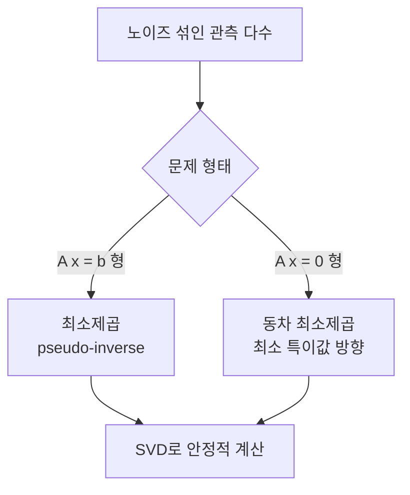

> 비전의 기하 문제는 거의 전부 "노이즈 섞인 관측에서 제약을 가장 잘 만족하는 해 찾기"로 귀결된다. 그 해를 푸는 두 도구가 SVD와 최소제곱이며, SVD는 비전의 만능 칼이다.
---
## 1. 정의
**고유분해(eigendecomposition)** 는 정방행렬 $A$ 를 고유값·고유벡터로 분해한다. $A\mathbf{v} = \lambda\mathbf{v}$ 를 만족하는 방향 $\mathbf{v}$(고유벡터)와 스칼라 $\lambda$(고유값)를 모아
$$
A = Q\Lambda Q^{-1}
$$
로 쓴다. 단, 모든 정방행렬이 대각화되지는 않으며 대칭행렬일 때만 직교행렬 $Q$ 로 깔끔하게 분해된다.
**특이값 분해(SVD)** 는 이 한계를 넘어 **정방이든 아니든 모든 **$m \times n$** 행렬**에 적용된다. 이것이 SVD가 비전에서 압도적으로 쓰이는 이유다.
$$
A = U\,\Sigma\,V^\top
$$
여기서 $U \in \mathbb{R}^{m\times m}$, $V \in \mathbb{R}^{n\times n}$ 는 직교행렬, $\Sigma$ 는 대각원소가 특이값 $\sigma_1 \geq \sigma_2 \geq \cdots \geq 0$ 인 $m\times n$ 대각행렬이다. $U$ 의 열을 left singular vector, $V$ 의 열을 right singular vector라 한다. 헷갈릴 때는 $\Sigma$ 의 왼쪽에 있는 $U$ 가 left, 오른쪽의 $V$ 가 right라고 기억하면 된다. 한 가지 주의할 점은 행렬이 singular하다(특이행렬, 역행렬 없음)는 말과 특이값 분해는 서로 다른 개념이라는 것이다(6장 함정 참고).
## 2. 의미 — 왜 필요한가
카메라 캘리브레이션, Fundamental 행렬 추정, 삼각측량, PnP, 번들 조정. 이름은 다르지만 수학적으로는 모두 과결정(overdetermined) 연립방정식을 푸는 문제다. 측정값이 미지수보다 많고 노이즈가 섞여 있어, 정확한 해는 없고 "가장 그럴듯한 해"만 있다.

SVD가 만능 칼인 이유는 이 모든 갈래를 하나로 처리하기 때문이다. 동차계 $A\mathbf{x}=\mathbf{0}$ 의 비자명해, 랭크 추정, 최근접 저랭크 근사, 의사역행렬이 전부 SVD 하나에서 떨어진다. 8-point algorithm으로 Fundamental 행렬을 구하는 순간 바로 이 도구를 쓴다.
좀 더 큰 그림에서 보면, 고유분해(EVD)와 SVD의 관계가 핵심이다. EVD는 "변환해도 방향이 안 바뀌는 축(고유벡터)과 그 축의 스케일(고유값)"을 찾는다. 하지만 비정방행렬에는 아예 적용되지 않고, 정방행렬이라도 대각화가 안 되거나 고유값이 복소수가 되는 경우가 있다. SVD는 이 모든 제약을 푸는다. 대가는 "불변 방향"이라는 직관을 일부 포기하는 대신(SVD의 입력·출력 특이벡터는 서로 다른 공간에 산다), 스케일은 항상 실수·양수로 정리된다는 안정성을 얻는다.
## 3. 원리와 유도
### 3.1 특이값² = $A^\top A$ 의 고유값
SVD의 정체를 이해하는 핵심 유도다. $A = U\Sigma V^\top$ 를 $A^\top A$ 에 대입한다.
$$
A^\top A = (U\Sigma V^\top)^\top (U\Sigma V^\top) = V\Sigma^\top U^\top U \Sigma V^\top = V(\Sigma^\top\Sigma)V^\top
$$
$U^\top U = I$ (직교성)를 썼다. 이 식은 $A^\top A$ 의 고유분해 형태이며, 따라서 $\Sigma^\top\Sigma$ 의 대각원소 $\sigma_i^2$ 이 곧 $A^\top A$ 의 고유값이다. **특이값은 **$A^\top A$** 고유값의 제곱근**이다.
### 3.2 왜 특이값은 항상 0 이상인가
$A^\top A$ 의 고유값을 $\lambda$, 고유벡터를 $\mathbf{v} \neq \mathbf{0}$ 라 하자. 정의에서 $A^\top A\mathbf{v} = \lambda\mathbf{v}$. 양변에 $\mathbf{v}^\top$ 를 곱하면
$$
\mathbf{v}^\top A^\top A\mathbf{v} = \lambda\,\mathbf{v}^\top\mathbf{v}
\;\Longrightarrow\;
\|A\mathbf{v}\|^2 = \lambda\|\mathbf{v}\|^2
$$
좌변은 제곱이라 항상 $\geq 0$, 우변의 $\|\mathbf{v}\|^2 > 0$ 이므로 $\lambda \geq 0$ 이다. 음수가 될 수 없으니 제곱근(특이값)이 실수로 잘 정의된다. ($A^\top A$ 가 positive semidefinite라는 사실의 증명이기도 하다.)
### 3.3 동차계의 해는 최소 특이값 방향
비전에서 가장 자주 쓰는 결과다. $A\mathbf{x}=\mathbf{0}$ 을 자명해 $\mathbf{x}=\mathbf{0}$ 를 피해 $\|\mathbf{x}\|=1$ 제약 하에 $\|A\mathbf{x}\|$ 를 최소화한다. $A=U\Sigma V^\top$ 와 $\mathbf{y}=V^\top\mathbf{x}$ 로 치환하면, $U$ 가 직교(노름 보존)이므로
$$
\|A\mathbf{x}\|^2 = \|U\Sigma V^\top\mathbf{x}\|^2 = \|\Sigma\mathbf{y}\|^2 = \sum_i \sigma_i^2 y_i^2, \qquad \|\mathbf{y}\|=1
$$
$\sum y_i^2 = 1$ 제약에서 $\sum \sigma_i^2 y_i^2$ 를 최소화하려면, 가장 작은 $\sigma_i$ 에 모든 가중치를 몰아야 한다. 즉 $\mathbf{y} = (0,\dots,0,1)^\top$, 되돌리면 $\mathbf{x} = V$ 의 마지막 열이다. **해는 최소 특이값에 대응하는 **$V$** 의 마지막 열**이라는 결론. DLT, 8-point, 호모그래피 추정이 전부 이 한 줄로 끝난다.
### 3.4 최소제곱은 투영이다
$A\mathbf{x}=\mathbf{b}$ 에 해가 없을 때 $\|A\mathbf{x}-\mathbf{b}\|^2$ 를 최소화한다. 잔차 $\mathbf{r}=A\mathbf{x}-\mathbf{b}$ 가 최소이려면 $\mathbf{r}$ 이 $A$ 의 열공간에 수직이어야 한다($A^\top\mathbf{r}=0$). 정리하면 정규방정식이 나온다.
$$
A^\top A\,\mathbf{x} = A^\top\mathbf{b}
$$
기하적으로는 $\mathbf{b}$ 를 $A$ 의 열공간으로 **직교투영**하는 것이다. SVD로 풀면 의사역행렬 $A^+ = V\Sigma^+ U^\top$ 로 $\mathbf{x}=A^+\mathbf{b}$ 가 되며($\Sigma^+$ 는 0 아닌 특이값의 역수), 이는 최소제곱해와 동일하다.
## 4. 기하적 직관
SVD는 "모든 선형변환은 회전 → 축별 스케일 → 회전"이라고 말한다. 단위원이 변형되는 과정을 따라가면 보인다.

$V^\top$ 는 입력을 회전(모양 불변), $\Sigma$ 는 좌표축 방향으로 $\sigma_1, \sigma_2$ 만큼 늘려 원을 타원으로, $U$ 는 출력을 다시 회전한다. **선형변환에 의한 도형의 형태 변화는 오로지 특이값으로만 결정된다.** 고유값이 "불변 방향(고유벡터)의 스케일"이라면, 특이값은 "변환 자체의 스케일"이다.
## 5. 심화 — 비전에서의 활용
- **Truncated SVD와 저랭크 근사.** 큰 특이값 몇 개만 남기고 나머지를 버리면 $\|A-A'\|$ 를 최소화하는 rank-$t$ 근사가 된다(Eckart–Young 정리). 데이터 압축, 노이즈 제거, PCA의 토대다.
- **랭크 강제(rank enforcement).** Fundamental 행렬은 이론상 rank 2여야 하는데 추정값은 rank 3로 나온다. SVD 후 가장 작은 특이값을 0으로 만들어 rank 2를 강제하는 후처리가 필수다(Part 3).
- **조건수와 수치 안정성.** 조건수 $\kappa = \sigma_{\max}/\sigma_{\min}$ 이 크면 해가 노이즈에 민감하다. 0에 가까운 특이값을 임계치(tolerance)로 잘라내는 것이 안정적 pseudo-inverse의 핵심이다.
## 6. 흔한 함정
- **※ 정규방정식의 수치 불안정.** $A^\top A$ 를 직접 만들면 조건수가 제곱($kappa^2$)돼 정밀도가 망가진다. "정규방정식은 칠판용, 구현은 QR/SVD"로 기억한다.
- **※ 특이값과 고윳값 혼동.** 특이값은 항상 $\geq 0$ 이고 모든 행렬에 존재한다. 고윳값은 음수·복소수도 되고 정방행렬에만 있다. 둘은 "특이값 = $A^\top A$ 고윳값의 제곱근"으로 연결된다.
- **※ singular value ≠ singular matrix.** 특이값분해의 "singular"와 역행렬 없는 "특이행렬(singular matrix, $\det=0$)"은 다른 말이다. 단, 정방행렬의 특이값에 0이 있으면 그 행렬은 특이행렬이다.
- **※ 스케일 정규화 누락.** DLT/8-point에서 입력 좌표를 정규화하지 않으면 조건수가 커져 해가 부정확해진다. Hartley의 normalized 8-point가 이를 푼 고전이다.
## 7. 코드로 확인
아래는 실제 NumPy로 실행해 검증한 코드다.
```python
import numpy as np

# 3.1 특이값^2 = A^T A 의 고유값
A = np.array([[3., 1.],
              [1., 3.],
              [0., 2.]])
U, S, Vt = np.linalg.svd(A, full_matrices=False)
eig = np.linalg.eigvalsh(A.T @ A)[::-1]
print(S**2)   # [18.3246  5.6754]
print(eig)    # [18.3246  5.6754]  (동일)

# 3.3 동차계 A x = 0 의 해 = V의 마지막 열
M = np.array([[1., 2., 3.],
              [2., 4., 6.0001],
              [1., 1., 1.]])
_, S2, Vt2 = np.linalg.svd(M)
x = Vt2[-1]                      # 최소 특이값 방향
print(np.linalg.norm(M @ x))     # ≈ 1.8e-5 (0에 근접)

# 3.4 pseudo-inverse 최소제곱 (다크프로그래머 인구 예제 재현)
yr  = np.array([1930,1940,1949,1960,1970,1980,1990,2000,2010.])
pop = np.array([2044,2355,2017,2499,3144,3741,4339,4599,4799.])
Amat = np.vstack([yr**2, yr, np.ones_like(yr)]).T   # 9x3
coef = np.linalg.pinv(Amat) @ pop
pred = coef @ np.array([2020**2, 2020, 1.])
print(round(pred, 1))   # 5645.1 만명 (그 글의 결과와 일치)
```
특이값²과 $A^\top A$ 고유값이 정확히 일치하고, 동차계 해가 최소 특이값 방향임이 확인되며, full SVD 인구 예측이 다크프로그래머 글의 5,645만명과 같게 나온다.
## 9. 면접 예상 질문
**Q1. SVD와 고유분해(EVD)의 차이는?**
EVD는 정방행렬에만, 그중에서도 대각화 가능한 일부에만 적용된다. 반면 SVD는 정방·비정방 가리지 않고 모든 행렬에 존재한다. 또 고유값은 음수·복소수도 되지만 특이값은 항상 0 이상의 실수다. 둘은 "특이값 = $A^\top A$ 고유값의 제곱근"으로 연결된다.
**Q2. **$A\mathbf{x}=\mathbf{0}$** 형태의 동차계를 왜 SVD로 푸는가? 해는 어디에 있나?**
자명해 $\mathbf{x}=\mathbf{0}$ 을 피해 $\|\mathbf{x}\|=1$ 제약 하에 $\|A\mathbf{x}\|$ 를 최소화하는 문제이고, 해는 가장 작은 특이값에 대응하는 $V$ 의 마지막 열이다. 이유는 $\|A\mathbf{x}\|^2 = \sum \sigma_i^2 y_i^2$ 를 $\sum y_i^2=1$ 제약에서 최소화하려면 가장 작은 $\sigma_i$ 방향으로 몰아야 하기 때문이다. 8-point, DLT, 호모그래피 추정이 모두 이 구조다.
**Q3. 정규방정식 **$A^\top A\mathbf{x}=A^\top\mathbf{b}$** 을 직접 풀면 안 되는 이유는?**
$A^\top A$ 를 명시적으로 만들면 조건수(condition number)가 제곱되어($\kappa \to \kappa^2$) 수치 정밀도가 악화된다. 그래서 실무에서는 $A^\top A$ 를 형성하지 않고 QR 분해나 SVD로 직접 푸는 게 정석이다. "정규방정식은 칠판용, 구현은 QR/SVD".
**Q4. Fundamental 행렬 추정 후 왜 SVD로 rank를 2로 강제하나?**
Fundamental 행렬은 이론상 rank 2(행렬식 0)여야 하지만, 노이즈 섮인 데이터로 추정하면 보통 rank 3이 나온다. SVD로 분해한 뒤 가장 작은 특이값을 0으로 강제하고 다시 합성하면, 원래 추정값에 가장 가까운 rank 2 행렬을 얻는다(Eckart–Young). 이렇게 해야 모든 에피폴라선이 한 점(에피폴)에서 만난다.
## 10. 레퍼런스
- 다크프로그래머, *특이값 분해(SVD)의 활용* — [https://darkpgmr.tistory.com/106](https://darkpgmr.tistory.com/106)
- Hartley & Zisserman, *Multiple View Geometry*, Appendix A4–A5 — [https://www.robots.ox.ac.uk/\~vgg/hzbook/](https://www.robots.ox.ac.uk/~vgg/hzbook/)
- Gilbert Strang, MIT 18.06 *Linear Algebra* — [https://math.mit.edu/\~gs/](https://math.mit.edu/~gs/)
- Szeliski, *Computer Vision* 2nd ed., Appendix B — [https://szeliski.org/Book/](https://szeliski.org/Book/)
