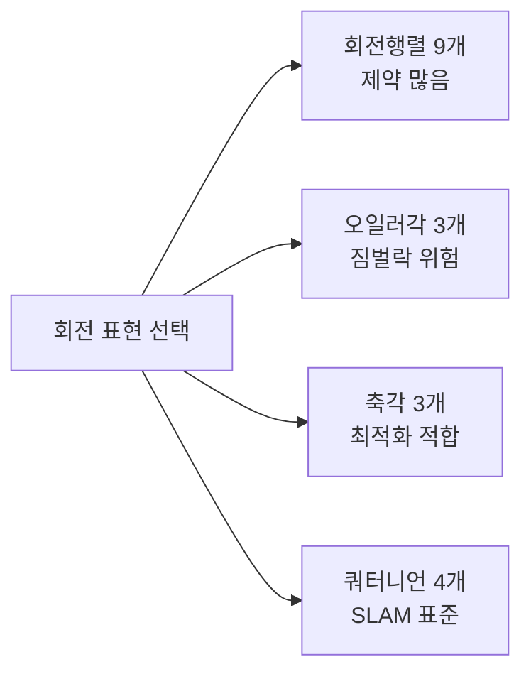
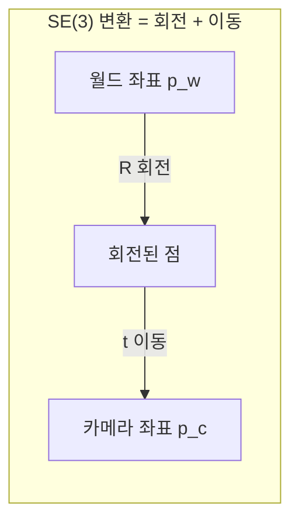

> 카메라의 위치와 자세는 곧 강체 변환이다. 로보틱스 배경이 있다면 SE(3)는 익숙하겠지만, 비전에서 중요한 건 이 변환이 투영·최적화와 어떻게 맞물리는가, 그리고 회전을 어떤 표현으로 들고 다녀야 수치적으로 안정적인가이다.
---
## 1. 정의
**강체 변환(rigid transformation)** 은 거리와 각도를 보존하는 변환, 즉 회전과 평행이동의 조합이다. 3D 점은 다음처럼 변환된다.
$$
\mathbf{p}' = R\,\mathbf{p} + \mathbf{t}, \qquad R \in SO(3),\ \mathbf{t} \in \mathbb{R}^3
$$
$SO(3)$** (특수직교군)** 는 회전행렬들의 집합으로, 두 조건으로 정의된다.
$$
SO(3) = \{ R \in \mathbb{R}^{3\times3} \mid R^\top R = I,\ \det R = +1 \}
$$
$R^\top R = I$ 는 정규직교성(길이·각도 보존), $\det R = +1$ 은 반사가 아닌 순수 회전(오른손 좌표계 유지)을 뜻한다.
$SE(3)$** (특수유클리드군)** 는 강체 변환 전체의 집합이며, 동차좌표로 올리면 $4\times4$ 행렬 하나로 표현된다.
$$
T = \begin{bmatrix} R & \mathbf{t} \\ \mathbf{0}^\top & 1 \end{bmatrix} \in SE(3)
$$
카메라 외부 파라미터 $[R|\mathbf{t}]$ 가 정확히 이 구조다. 동차좌표(앞 항목) 덕분에 회전과 이동이 한 행렬로 합쳐지고, 변환의 연쇄가 행렬 곱이 된다.
## 2. 의미 — 왜 필요한가
비전·로보틱스에서 "자세(pose)"가 등장하는 모든 곳이 $SE(3)$ 다. 카메라 외부 파라미터, Visual Odometry의 프레임 간 운동, SLAM의 키프레임 포즈, 손-눈 캘리브레이션이 전부 "강체가 공간에 어떻게 놓였는가"의 문제다.

핵심 쟁점은 회전 표현의 선택이다. 회전은 본질적으로 3 자유도인데, 이를 표현하는 방식이 여럿이고 각각 자유도·특이점·보간·미분 가능성에서 트레이드오프가 다르다. 번들 조정이나 자세 추정에서 어떤 표현을 쓰느냐가 수렴성과 직결된다. 예를 들어 오일러각으로 최적화하면 짐벌락에서 터지고, 쿼터니언은 특이점이 없어 SLAM의 사실상 표준이 된다.
## 3. 원리와 유도
### 3.1 SE(3)의 합성과 역변환
두 강체 변환의 합성은 행렬 곱이다($T_2 T_1$ 은 $T_1$ 먼저 적용). 역변환은 단순히 $R^\top$ 만 쓰는 게 아니라 이동항이 함께 바뀐다. $T$ 의 역을 직접 유도해보자. $\mathbf{p}' = R\mathbf{p}+\mathbf{t}$ 를 $\mathbf{p}$ 에 대해 풀면 $\mathbf{p} = R^\top(\mathbf{p}'-\mathbf{t}) = R^\top\mathbf{p}' - R^\top\mathbf{t}$ 이므로
$$
T^{-1} = \begin{bmatrix} R^\top & -R^\top\mathbf{t} \\ \mathbf{0}^\top & 1 \end{bmatrix}
$$
이동항이 $-R^\top\mathbf{t}$ 로 바뀐다는 점이 월드↔카메라 좌표 전환에서 부호 실수의 단골 원인이다.
### 3.2 로드리게스 공식: 축각에서 회전행렬로
회전을 축 $\hat{\mathbf{k}}$(단위벡터)와 각도 $\theta$ 로 표현하는 것이 축각(axis-angle)이다. 이로부터 회전행렬을 만드는 것이 로드리게스 공식이다.
$$
R = I + \sin\theta\,[\hat{\mathbf{k}}]_\times + (1-\cos\theta)\,[\hat{\mathbf{k}}]_\times^2
$$
여기서 $[\hat{\mathbf{k}}]_\times$ 는 1번 항목에서 본 skew-symmetric 행렬이다. 이 공식이 중요한 이유는 Lie군과 직접 연결되기 때문이다. $\mathfrak{so}(3)$(회전의 Lie 대수, skew 행렬들의 공간)에서 갱신량을 다루고 $R = \exp([\boldsymbol{\omega}]_\times)$ 로 다시 군에 올리는 방식이 번들 조정·pose graph 최적화의 표준이다.
### 3.3 회전 표현 4종의 트레이드오프
| 표현 | 변수 수 | 장점 | 단점 |
| --- | --- | --- | --- |
| 회전행렬 | 9 | 합성·적용 직접적 | 제약 6개, 변수로 과잉 |
| 오일러각 | 3 | 직관적, 최소 | 짐벌락, 불연속 |
| 축각 | 3 | 최소, Lie대수 직결 | $\theta=0$ 근처 특이 |
| 쿼터니언 | 4 | 특이점 없음, 보간 매끄러움 | 노름 제약 1개, 부호 모호성 |
자세 추정·SLAM에서는 쿼터니언이 사실상 표준이고, 최적화 변수로는 축각(Lie 대수)이 자주 쓰인다. 오일러각은 사람이 읽을 때만 쓴다.
### 3.4 왜 오일러각으로 최적화하면 안 되는가 (짐벌락)
오일러각은 세 축 회전을 순차 적용하는데, 중간 축이 $\pm90°$ 가 되면 첫 축과 셋째 축의 회전축이 일치해버려 한 자유도를 잃는다. 이것이 짐벌락(gimbal lock)이다. 이 지점에서 표현이 불연속·특이해져, 누적이나 보간 시 해가 터진다. 쿼터니언은 4차원 단위구 위에 회전을 매끄럽게 매핑해 이 문제가 없다.
## 4. 기하적 직관

회전행렬의 각 열은 "회전 후 좌표축이 가는 곳"이다(1번 항목의 원리). $R$ 의 1·2·3열이 각각 변환된 x·y·z축이며, 정규직교성은 이 세 축이 여전히 단위길이의 직교 기저임을 보장한다. 쿼터니언 $\mathbf{q} = (w, x, y, z)$ 는 이 회전을 4차원 단위구 위의 한 점으로 보는 관점으로, 보간(SLERP)이 구 위의 최단 호를 따라 매끄럽게 이뤄진다.
## 5. 심화 — 비전에서의 활용
- **번들 조정의 회전 변수.** 수백\~수천 개 카메라 포즈를 동시 최적화할 때, 회전을 $\mathfrak{so}(3)$(축각)로 매개변수화해 제약 없이 갱신하고 $\exp$ 로 군에 되돌린다. 회전행렬 9개를 직접 최적화하면 제약 6개를 따로 관리해야 해 비효율적이다.
- **SLERP 보간.** 키프레임 사이 자세를 부드럽게 보간할 때 쿼터니언 구면 선형보간을 쓴다. 오일러각 선형보간은 짐벌락과 불연속으로 떨림이 생긴다.
- **재정규화.** VO/SLAM에서 프레임마다 회전을 누적하면 부동소수점 오차로 $R^\top R = I$ 가 깨진다. SVD로 가장 가까운 직교행렬에 투영($R \leftarrow UV^\top$)해 복원한다.
## 6. 흔한 함정
- **※ 역변환의 이동항.** $T^{-1}$ 의 이동항은 $\mathbf{t}$ 가 아니라 $-R^\top\mathbf{t}$ 다. 회전만 전치하고 이동을 그대로 두면 틀린다.
- **※ 오일러각으로 누적·보간.** 짐벌락과 불연속 때문에 터진다. 내부 표현은 쿼터니언·회전행렬로, 오일러각은 사람이 읽을 때만.
- **※ 회전행렬 드리프트.** 곱을 반복하면 직교성이 수치적으로 깨진다. 주기적 재정규화가 필요하다.
- **※ active vs passive 컨벤션.** $R$ 이 "월드→카메라"인지 "카메라→월드"인지, 점을 돌리는지 축을 돌리는지에 따라 $R$ 과 $R^\top$ 이 뒤바뀐다. 논문마다 다르므로 반드시 확인한다.
- **※ 쿼터니언 부호 모호성.** $\mathbf{q}$ 와 $-\mathbf{q}$ 는 같은 회전을 나타낸다(double cover). 평균·거리 계산 시 반구를 통일하지 않으면 엉뚱한 결과가 나온다.
## 7. 코드로 확인
아래는 실제 NumPy로 실행해 검증한 코드다.
```python
import numpy as np

def skew(v):
    return np.array([[0, -v[2], v[1]],
                     [v[2], 0, -v[0]],
                     [-v[1], v[0], 0]])

# 3.2 로드리게스 공식: 축각 -> 회전행렬
def rodrigues(axis, theta):
    k = axis / np.linalg.norm(axis)
    K = skew(k)
    return np.eye(3) + np.sin(theta)*K + (1-np.cos(theta))*(K @ K)

R = rodrigues(np.array([0, 0, 1.]), np.deg2rad(30))   # z축 30도 회전

# 3.1 SE(3) 역변환: 이동항이 -R^T t 로 바뀜
def SE3(R, t):
    T = np.eye(4); T[:3,:3] = R; T[:3,3] = t; return T

def SE3_inv(T):
    R, t = T[:3,:3], T[:3,3]
    Ti = np.eye(4); Ti[:3,:3] = R.T; Ti[:3,3] = -R.T @ t
    return Ti

T = SE3(R, np.array([1., 2., 3.]))
print(np.allclose(SE3_inv(T) @ T, np.eye(4)))   # True

# 3.3 회전행렬 드리프트 재정규화 (SVD)
R_noisy = R + 1e-3 * np.random.randn(3, 3)
U, _, Vt = np.linalg.svd(R_noisy)
R_fixed = U @ Vt
print(np.allclose(R_fixed.T @ R_fixed, np.eye(3)))   # True
```
로드리게스 공식이 올바른 회전을 만들고, SE(3) 역변환이 $-R^\top\mathbf{t}$ 항으로 정확히 복원되며, 드리프트된 회전행렬이 SVD로 직교성을 회복하는 것이 확인된다.
## 8. 면접 예상 질문
**Q1. **$SO(3)$** 의 정의는? 두 조건의 의미는?**
$R^\top R = I$ 와 $\det R = +1$ 을 만족하는 $3\times3$ 행렬들의 집합이다. 앞 조건은 정규직교성으로 길이·각도를 보존함을, 뒤 조건은 반사(거울상)가 아닌 순수 회전, 즉 오른손 좌표계가 유지됨을 뜻한다($\det = -1$ 이면 반사가 섞인 것).
**Q2. **$SE(3)$** 변환 **$T$** 의 역변환은 어떻게 구하나요?**
$T = [R\,|\,\mathbf{t}]$ 의 역은 회전을 전치하고 이동항을 $-R^\top\mathbf{t}$ 로 바꾼 것이다. 단순히 $R^\top$ 만 적용하고 $\mathbf{t}$ 를 그대로 두면 틀린다. $\mathbf{p}' = R\mathbf{p}+\mathbf{t}$ 를 $\mathbf{p}$ 에 대해 풀면 바로 나온다.
**Q3. 자세 추정에서 왜 오일러각 대신 쿼터니언을 쓰나요?**
오일러각은 짐벌락(중간 축이 $\pm90°$ 일 때 한 자유도 상실)과 표현 불연속이 있어 누적·보간 시 터진다. 쿼터니언은 4차원 단위구에 회전을 매끄럽게 매핑해 특이점이 없고, SLERP로 부드러운 보간이 가능하며 수치적으로 안정적이다. 노름 제약 1개만 관리하면 된다.
**Q4. 번들 조정에서 회전을 어떻게 매개변수화하나요? 왜 그런가요?**
보통 축각, 즉 Lie 대수 $\mathfrak{so}(3)$ 로 매개변수화한다. 회전행렬 9개를 직접 최적화하면 직교성 제약 6개를 따로 관리해야 하지만, 축각 3개는 제약 없이 자유롭게 갱신하고 $\exp([\boldsymbol{\omega}]_\times)$ 로 군에 되돌릴 수 있어 최적화가 깔끔하다.
## 9. 레퍼런스
- Corke, *Robotics, Vision and Control*, Ch.2 — [https://petercorke.com/rvc/](https://petercorke.com/rvc/)
- Lynch & Park, *Modern Robotics*, Ch.3 — [https://hades.mech.northwestern.edu/index.php/Modern_Robotics](https://hades.mech.northwestern.edu/index.php/Modern_Robotics)
- Solà, *A micro Lie theory for state estimation in robotics* — [https://arxiv.org/abs/1812.01537](https://arxiv.org/abs/1812.01537)
- 다크프로그래머, 회전 변환 행렬 — [https://darkpgmr.tistory.com/81](https://darkpgmr.tistory.com/81)
