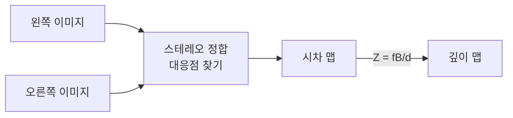
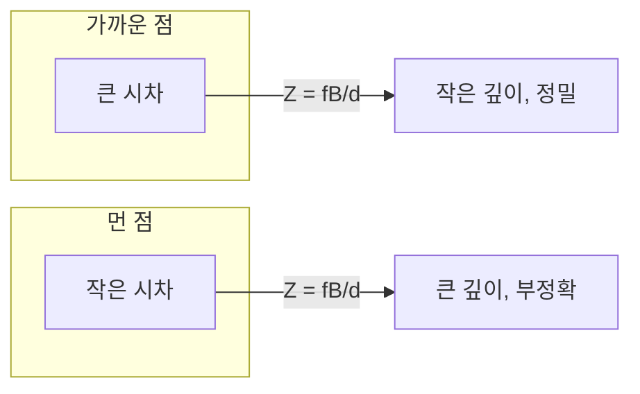

> 두 카메라의 시차로 깊이를 복원하는 것이 스테레오다. 사람의 두 눈과 같은 원리. 핵심은 "좌우 이미지에서 같은 점을 어떻게 찾고, 그 시차로 깊이를 어떻게 계산하는가"다.
---
## 1. 정의
**스테레오 비전(stereo vision)** 은 일정 간격(baseline)으로 떨어진 두 카메라의 이미지에서 같은 점의 위치 차이(시차)를 측정해 깊이를 복원하는 방법이다.
**시차(disparity)** $d$ 는 같은 3D 점이 좌우 이미지에 맺히는 가로 위치의 차이다. 정렬된(rectified) 스테레오에서 깊이는 시차에 반비례한다.
$$
Z = \frac{f \cdot B}{d}
$$
$f$ 는 픽셀 단위 초점거리, $B$ 는 baseline이다.
**스테레오 정합(stereo matching)** 은 좌우 이미지에서 대응점을 찾아 시차 맵(disparity map)을 만드는 과정이다. 에피폴라 기하(이전 항목)로 탐색이 1D로 줄어든다.
## 2. 의미 — 왜 필요한가
모노큘러는 깊이를 못 얻는다(Part 1-6). 스테레오는 두 시점을 동시에 확보해 **한 순간에** 깊이를 복원한다 — 움직일 필요가 없다는 게 모노큘러 SLAM 대비 장점이다.

스테레오가 중요한 이유는 절대 스케일을 준다는 것이다. baseline $B$ 를 물리적으로 알기 때문에($Z = fB/d$), 모노큘러의 스케일 모호성(Part 1-9)이 없다. 그래서 로봇이 "저 물체가 정확히 몇 미터 앞"인지 알 수 있다. 패시브 방식이라 야외에서도 작동하고, 실내 RGB-D가 약한 강한 조명 환경에 강하다.
## 3. 원리와 유도
### 3.1 시차에서 깊이로
정렬된 두 카메라(광축 평행, 같은 높이)에서, 3D 점 $(X, Y, Z)$ 가 좌우 이미지에 맺히는 가로 위치를 보자. 왼쪽은 $u_L = f X/Z + c_x$, 오른쪽은 baseline $B$ 만큼 떨어졌으므로 $u_R = f(X-B)/Z + c_x$. 시차는
$$
d = u_L - u_R = \frac{fX}{Z} - \frac{f(X-B)}{Z} = \frac{fB}{Z} \;\Longrightarrow\; Z = \frac{fB}{d}
$$
깊이가 시차에 반비례한다. 가까운 점(작은 $Z$)은 시차가 크고, 먼 점은 시차가 작다. 무한히 먼 점은 시차 0이다.
### 3.2 정렬(rectification)이 필요한 이유
일반적인 두 카메라에서는 에피폴라선이 비스듬하다(이전 항목). 정렬은 두 이미지를 호모그래피로 변환해 에피폴라선을 **수평으로** 만든다. 그러면 대응점이 정확히 같은 행(row)에 있게 되어, 시차 탐색이 1D 가로 탐색으로 단순해진다. 위의 $Z = fB/d$ 공식도 정렬을 전제로 한다.
### 3.3 정합 비용과 시차 최적화
각 픽셀에서 시차를 정하려면, 왼쪽 픽셀과 후보 오른쪽 픽셀들의 유사도를 측정한다. 비용 함수로 SAD(절대차 합), SSD(제곱차 합), NCC(정규화 상관) 등을 쓴다. 단순히 픽셀별로 최소 비용을 고르면(local) 노이즈에 약하다. 그래서 전역 최적화가 쓰인다.
$$
E(d) = \underbrace{\sum_p C(p, d_p)}_{\text{데이터 항}} + \underbrace{\sum_{p,q} V(d_p, d_q)}_{\text{평활화 항}}
$$
데이터 항은 정합 비용, 평활화 항은 이웃 시차가 비슷하도록 강제한다(물체 표면은 매끄럽다는 가정). SGM(Semi-Global Matching)이 이 균형을 효율적으로 푸는 대표 방법이다.
### 3.4 깊이 정밀도와 baseline
$Z = fB/d$ 를 $d$ 로 미분하면 깊이 정밀도가 드러난다.
$$
\frac{\partial Z}{\partial d} = -\frac{fB}{d^2} = -\frac{Z^2}{fB}
$$
깊이 오차가 $Z^2$ 에 비례한다 — 멀수록 급격히 부정확해진다. baseline $B$ 를 키우면 정밀도가 좋아지지만, 너무 크면 좌우 이미지의 공통 시야가 줄고 가림(occlusion)이 늘어난다. 측정 거리에 맞는 baseline 선택이 설계의 핵심이다.
## 4. 기하적 직관

엄지손가락을 눈앞에 들고 양 눈을 번갈아 감아보면 손가락이 크게 점프한다(큰 시차). 멀리 있는 건물은 거의 안 움직인다(작은 시차). 이 시차의 크기가 곧 거리 정보다. 스테레오 카메라는 이 두 눈의 시차를 픽셀 단위로 측정해 거리로 환산하는 것이다.
## 5. 심화 — 비전에서의 활용
- **SGM (Semi-Global Matching).** 여러 방향의 1D 경로 최적화로 전역 최적화를 근사한다. 정확도와 속도의 균형이 좋아 실시간 스테레오의 표준.
- **액티브 스테레오.** 무텍스처 면에서 대응점을 못 찾는 약점을, 적외선 패턴을 투사해 인공 텍스처를 만들어 해결한다(Intel RealSense 방식).
- **학습 기반 스테레오.** PSMNet, RAFT-Stereo 등 신경망이 정합 비용·시차를 학습해, 무텍스처·반사 영역에서 고전 방법을 능가한다(Part 4와 연결).
## 6. 흔한 함정
- **※ 정렬 생략.** 정렬 안 된 이미지에 $Z = fB/d$ 를 쓰면 틀린다. 에피폴라선이 수평이어야 같은 행 탐색이 성립한다.
- **※ 무텍스처·반복 패턴.** 흰 벽은 대응점이 모호하고, 벽돌 같은 반복 패턴은 오정합을 일으킨다. 액티브 스테레오나 평활화로 완화한다.
- **※ 가림(occlusion).** 한 카메라에만 보이는 영역은 시차를 정할 수 없다. 좌우 일관성 검사(left-right consistency)로 검출해 무효 처리한다.
- **※ baseline 무조건 크게.** baseline이 크면 먼 거리 정밀도는 좋아지나 공통 시야가 줄고 가림이 늘며 근거리 매칭이 어려워진다. 용도에 맞춰 선택한다.
## 7. 코드로 확인
아래는 깊이 공식과 정밀도를 검증한 코드다.
```python
import numpy as np

# 시차 -> 깊이: Z = f * B / d
f, B = 800., 0.12       # 초점거리(px), baseline 12cm
for d in [40, 20, 10, 5]:
    Z = f * B / d
    dZ = Z**2 / (f * B)   # 1px 시차 오차당 깊이 오차
    print(f"시차 {d:2d}px -> 깊이 {Z:5.2f}m, 1px당 깊이오차 {dZ:.3f}m")
# 시차 40px -> 2.40m, 오차 0.06m
# 시차  5px -> 19.20m, 오차 3.84m  (먼 거리에서 급증)
```
깊이가 시차에 반비례하고, 1픽셀 시차 오차가 유발하는 깊이 오차가 거리 제곱에 비례해 멀수록 급증하는 것이 수치로 확인된다.
## 8. 면접 예상 질문
**Q1. 스테레오에서 시차와 깊이의 관계와 그 유도는?**
정렬된 두 카메라에서 같은 점의 좌우 가로 위치 차가 시차 $d$ 이고, $u_L - u_R = fB/Z$ 에서 $Z = fB/d$ 가 나온다. 깊이는 시차에 반비례한다. 가까운 점은 시차가 크고 먼 점은 작으며, 무한원점은 시차 0이다.
**Q2. 스테레오 정렬(rectification)을 왜 하나요?**
일반 두 카메라는 에피폴라선이 비스듬해 대응점 탐색이 복잡하다. 정렬은 두 이미지를 호모그래피로 변환해 에피폴라선을 수평으로 만들어, 대응점이 같은 행에 오게 한다. 그러면 시차 탐색이 1D 가로 탐색이 되고 $Z=fB/d$ 공식도 성립한다.
**Q3. 스테레오가 먼 거리에서 부정확한 이유는?**
$Z = fB/d$ 를 미분하면 $\partial Z/\partial d = -Z^2/(fB)$ 로, 깊이 오차가 거리 제곱에 비례한다. 먼 물체는 시차가 작아 1픽셀 오차가 큰 깊이 변동을 일으킨다. baseline $B$ 나 초점거리 $f$ 를 키우면 개선되지만 다른 트레이드오프가 생긴다.
**Q4. 무텍스처 영역에서 스테레오가 실패하는 이유와 대처는?**
흰 벽처럼 텍스처가 없으면 좌우 대응점이 모호해 시차를 정할 수 없다. 대처로는 평활화 항을 가진 전역 최적화(SGM), 적외선 패턴을 투사하는 액티브 스테레오, 또는 학습 기반 스테레오 네트워크가 있다. 가림 영역은 좌우 일관성 검사로 걸러낸다.
## 9. 레퍼런스
- Szeliski, *Computer Vision* 2nd ed., Ch.12 (스테레오) — [https://szeliski.org/Book/](https://szeliski.org/Book/)
- Hirschmüller, *Semi-Global Matching* (2008) — [https://core.ac.uk/download/pdf/11134866.pdf](https://core.ac.uk/download/pdf/11134866.pdf)
- Hartley & Zisserman, *Multiple View Geometry*, Ch.11 — [https://www.robots.ox.ac.uk/\~vgg/hzbook/](https://www.robots.ox.ac.uk/~vgg/hzbook/)
