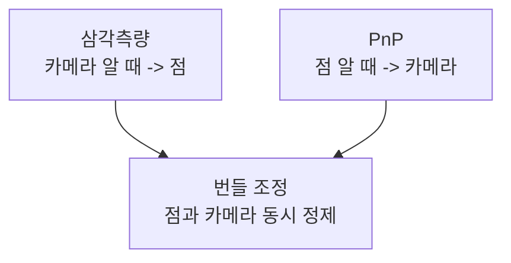
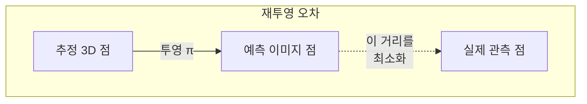

> 3D 복원의 세 가지 핵심 도구. 삼각측량은 점의 위치를, PnP는 카메라의 자세를, 번들 조정은 둘 다를 동시에 정제한다. SfM과 SLAM의 계산 엔진이다.
---
## 1. 정의
**삼각측량(triangulation)** 은 두 개 이상의 시점에서 본 같은 점의 이미지 좌표와 카메라 자세로부터 3D 위치를 복원한다. 카메라 자세를 알 때 점을 구한다.
**PnP (Perspective-n-Point)** 는 알려진 3D 점들과 그 이미지 투영의 대응으로부터 카메라 자세 $[R|\mathbf{t}]$ 를 구한다. 점을 알 때 카메라를 구한다.
**번들 조정(bundle adjustment)** 은 모든 카메라 자세와 모든 3D 점을 **동시에** 최적화해 전체 재투영 오차를 최소화한다.
$$
\min_{\{R_i, \mathbf{t}_i\},\, \{\mathbf{X}_j\}} \sum_{i,j} \big\| \mathbf{x}_{ij} - \pi(R_i, \mathbf{t}_i, \mathbf{X}_j) \big\|^2
$$
$\pi$ 는 투영 함수(Part 1), $\mathbf{x}_{ij}$ 는 카메라 $i$ 에서 관측된 점 $j$ 의 이미지 좌표다.
## 2. 의미 — 왜 필요한가
이 셋은 "점과 카메라"라는 두 미지수를 푸는 세 가지 방식이다. 무엇을 알고 무엇을 구하느냐로 갈린다.

SfM·SLAM의 전형적 흐름이 이 셋의 조합이다. 초기에 에피폴라 기하(Part 3-13)로 두 프레임의 상대 자세를 얻고, 삼각측량으로 초기 3D 점을 만들고, 새 프레임이 들어오면 PnP로 그 자세를 구하고, 주기적으로 번들 조정으로 누적 오차를 정제한다. 번들 조정이 특히 중요한 이유는, 개별 단계의 오차가 쌓이는 드리프트를 전역 최적화로 잡아주기 때문이다. 이것이 정확한 SfM·SLAM의 핵심이다.
## 3. 원리와 유도
### 3.1 삼각측량: 두 광선의 교점
각 카메라에서 이미지 점은 3D 광선을 정의한다(Part 1-6, 픽셀=광선). 두 광선의 교점이 3D 점이다. 노이즈 때문에 광선이 정확히 만나지 않으므로 최소제곱으로 푼다. 투영행렬 $P_1, P_2$ 와 관측 $\mathbf{x}_1, \mathbf{x}_2$ 에 대해, $\mathbf{x} \sim P\mathbf{X}$ 에서 외적으로 동차 방정식을 세운다.
$$
\mathbf{x}_i \times (P_i \mathbf{X}) = 0
$$
각 카메라가 2개의 독립 방정식을 주므로, 두 시점이면 $A\mathbf{X} = 0$ (4×4)이 되어 SVD의 최소 특이값 방향으로 $\mathbf{X}$ 를 구한다(Part 0-2). 이를 선형 삼각측량(DLT)이라 한다.
### 3.2 PnP: 3D-2D 대응에서 자세로
$n$ 개의 3D 점 $\mathbf{X}_j$ 와 그 투영 $\mathbf{x}_j$, 그리고 내부 파라미터 $K$ 를 알 때 $[R|\mathbf{t}]$ 를 구한다. 최소 3점(P3P)이면 유한 개의 해가 나오고, 4점 이상이면 유일해로 좁혀진다. P3P는 각 3D 점과 카메라 중심 사이 거리를 코사인 법칙으로 푸는 기하 문제다. 실용적으로는 EPnP 같은 선형 방법으로 초기해를 얻고, 재투영 오차를 비선형 최적화로 정제한다. AR에서 마커 위에 가상 물체를 정확히 얹는 것, 로봇이 알려진 물체로 자기 위치를 아는 것이 PnP다.
### 3.3 번들 조정: 거대한 비선형 최소제곱
번들 조정은 Part 0-5의 비선형 최소제곱을 대규모로 푼 것이다. 재투영 오차를 Levenberg-Marquardt로 최소화한다. 변수가 수천\~수백만 개(카메라 수×6 + 점 수×3)라 핵심은 **희소성(sparsity)** 이다. 한 점은 일부 카메라에만 보이므로 야코비안 $J$ 가 매우 희소하고, $J^\top J$ 가 블록 구조를 가진다. Schur complement로 점 변수를 먼저 소거해 카메라 변수만 푸는 트릭이 대규모 문제를 가능케 한다.
```plain text
# 번들 조정 핵심 흐름 (의사코드)
초기화: SfM/SLAM 초기 추정으로 카메라 자세, 3D 점 설정
반복 (수렴할 때까지):
    각 관측 (i,j)에 대해 재투영 오차 r_ij = x_ij - π(cam_i, X_j) 계산
    희소 야코비안 J 구성 (카메라·점 블록)
    Schur complement로 점 변수 소거 -> 축소된 카메라 시스템
    LM 갱신: (J^T J + λI) Δ = -J^T r 풀어 자세·점 갱신
    λ 조정 (오차 줄면 감소, 늘면 증가)
```
### 3.4 왜 동시 최적화인가
삼각측량과 PnP를 번갈아 하면 각자의 오차가 누적된다(드리프트). 번들 조정은 모든 카메라와 점을 하나의 비용 함수에서 동시에 움직여, 전역적으로 일관된 해를 찾는다. 한 점의 위치를 바꾸면 그걸 보는 모든 카메라의 오차가 함께 고려된다 — 이 결합이 정확도의 원천이다.
## 4. 기하적 직관

번들 조정의 핵심 개념은 재투영 오차다. 추정한 3D 점을 추정한 카메라로 다시 이미지에 투영하면 "예측 위치"가 나온다. 이것과 "실제 관측 위치"의 차이가 재투영 오차다. 모든 점·카메라에 대해 이 오차의 제곱합을 최소화하는 것이 번들 조정이다. "조정(adjustment)"이라는 이름은 모든 광선 다발(bundle)을 동시에 미세 조정한다는 데서 왔다.
## 5. 심화 — 비전에서의 활용
- **SfM 파이프라인.** COLMAP 등은 특징 매칭 → 두 뷰 초기화 → 삼각측량 → PnP로 뷰 추가 → 번들 조정 반복으로 대규모 3D 복원을 한다.
- **SLAM 백엔드.** 번들 조정의 슬라이딩 윈도우 버전(local BA)으로 실시간 정제, 루프 클로저 시 전역 BA(Part 3-16).
- **로버스트 번들 조정.** 재투영 오차에 Huber 손실(Part 0-5)을 적용해 매칭 outlier의 영향을 줄인다.
## 6. 흔한 함정
- **※ 삼각측량의 약한 기하.** 두 카메라가 거의 같은 위치이거나(작은 baseline) 점이 너무 멀면 광선이 거의 평행해 삼각측량이 불안정하다(작은 시차 = 큰 깊이 오차, 이전 항목과 같은 원리).
- **※ PnP 최소점·퇴화.** P3P는 3점으로 풀리지만 점들이 한 직선/평면에 가까우면 퇴화한다. 충분히 분산된 점이 필요.
- **※ 번들 조정 초기화.** 비볼록 최적화라 초기값이 나쁘면 지역 최소에 빠진다. SfM/에피폴라 기하의 좋은 초기 추정이 필수(Part 0-5의 GN 발산과 연결).
- **※ 희소성 무시.** 번들 조정을 밀집 행렬로 풀면 수천 카메라에서 계산이 불가능하다. Schur complement·희소 솔버(Ceres, g2o)가 필수.
## 7. 코드로 확인
아래는 OpenCV로 실행해 검증한 코드다.
```python
import numpy as np
import cv2

# 상대 자세와 두 카메라 투영행렬
R = cv2.Rodrigues(np.array([0., 0.1, 0.]))[0]
t = np.array([0.5, 0, 0.1])
P1 = np.hstack([np.eye(3), np.zeros((3, 1))])
P2 = np.hstack([R, t.reshape(3, 1)])

# 실제 3D 점 -> 두 이미지에 투영
np.random.seed(1)
X = np.random.randn(3, 8) * 2; X[2] += 5
x1 = (X / X[2])[:2]
X2 = R @ X + t.reshape(3, 1); x2 = (X2 / X2[2])[:2]

# 삼각측량으로 3D 복원
pts4d = cv2.triangulatePoints(P1, P2, x1, x2)
pts3d = pts4d[:3] / pts4d[3]
print(round(np.linalg.norm(pts3d - X), 4))   # 0.0 (정확히 복원)

# PnP: 3D-2D 대응으로 카메라 자세 복원
ok, rvec, tvec = cv2.solvePnP(X.T, x1.T, np.eye(3), None)
print(ok, tvec.ravel().round(3))   # True [0. 0. -0.] (카메라1 원점)
```
삼각측량이 3D 점을 오차 0으로 복원하고, PnP가 대응으로부터 카메라 자세를 정확히 찾는 것이 확인된다.
## 8. 면접 예상 질문
**Q1. 삼각측량, PnP, 번들 조정의 차이는?**
세 가지 모두 "점과 카메라"를 다루지만 무엇을 알고 구하느냐가 다르다. 삼각측량은 카메라 자세를 알 때 3D 점을, PnP는 3D 점을 알 때 카메라 자세를, 번들 조정은 둘 다를 동시에 최적화한다. SfM/SLAM은 이 셋을 조합한다.
**Q2. 삼각측량이 불안정해지는 경우는?**
두 카메라의 baseline이 작거나(거의 같은 위치) 점이 너무 멀면 두 광선이 거의 평행해진다. 작은 시차가 큰 깊이 오차를 낳는 스테레오와 같은 원리로, 광선 교점의 깊이 방향 불확실성이 커진다. 충분한 baseline과 시점 변화가 필요하다.
**Q3. 번들 조정에서 재투영 오차란 무엇이고 왜 최소화하나요?**
추정한 3D 점을 추정한 카메라로 이미지에 다시 투영한 위치와 실제 관측 위치의 차이다. 이 오차의 제곱합을 모든 점·카메라에 대해 최소화하면, 모든 변수가 전역적으로 일관된 해를 얻는다. 개별 단계 오차가 쌓이는 드리프트를 잡아준다.
**Q4. 번들 조정이 대규모 문제에서도 가능한 이유는?**
야코비안이 매우 희소하기 때문이다. 한 3D 점은 일부 카메라에만 보이므로 $J^\top J$ 가 블록 구조를 가진다. Schur complement로 점 변수를 먼저 소거해 카메라 변수만 푸는 축소를 하고, 희소 선형대수 솔버(Ceres, g2o)를 쓰면 수천 카메라·수백만 점도 처리할 수 있다.
## 9. 레퍼런스
- Hartley & Zisserman, *Multiple View Geometry*, Ch.12 (삼각측량), Ch.18 (번들 조정) — [https://www.robots.ox.ac.uk/\~vgg/hzbook/](https://www.robots.ox.ac.uk/~vgg/hzbook/)
- Triggs et al., *Bundle Adjustment — A Modern Synthesis* (2000) — [https://hal.inria.fr/inria-00548290/document](https://hal.inria.fr/inria-00548290/document)
- Lepetit et al., *EPnP* (2009) — [https://www.epfl.ch/labs/cvlab/software/multi-view-stereo/epnp/](https://www.epfl.ch/labs/cvlab/software/multi-view-stereo/epnp/)
