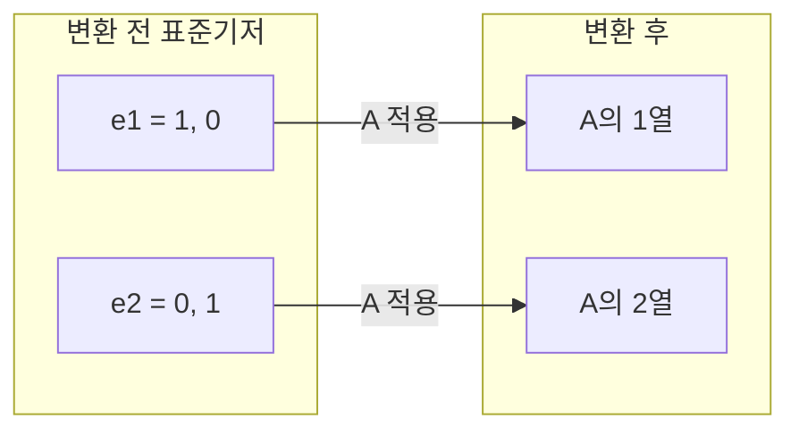

> 로보틱스 비전의 모든 연산은 "좌표계 사이를 오가는 점"의 문제다. 그 점을 옮기는 언어가 벡터와 행렬이고, 그 무대가 좌표계다. 이 글은 그 셋을 비전·로보틱스의 시각에서 다시 정의한다.
---
## 1. 정의
**벡터(vector)** 는 크기와 방향을 가진 양이며, 좌표계가 정해지면 숫자들의 순서쌍으로 표현된다. 추상대수에서는 덧셈과 스칼라 곱이 정의된 벡터공간의 원소를 벡터라 하지만, 비전·로보틱스에서는 거의 항상 $\mathbb{R}^2$ 또는 $\mathbb{R}^3$ 의 구체적 좌표를 가리킨다. 중요한 건 같은 숫자쌍이 두 가지 전혀 다른 대상을 표현한다는 점이고, 이 구분이 끝까지 따라온다.
$$
\underbrace{\mathbf{p} = \begin{bmatrix} x \\ y \\ z \end{bmatrix}}_{\text{점: 공간 속 위치}}
\qquad
\underbrace{\mathbf{d} = \begin{bmatrix} d_x \\ d_y \\ d_z \end{bmatrix}}_{\text{방향: 두 점의 차이}}
$$
점은 "어디에 있는가"(절대 위치)이고 방향은 "어디로 향하는가"(두 점의 차이)다. 두 점을 빼면 방향이 나오고($\mathbf{d} = \mathbf{p}_2 - \mathbf{p}_1$), 점에 방향을 더하면 새 점이 나온다. 그런데 방향끼리는 더해도 되지만 점끼리 더하는 건 기하적으로 무의미하다. 이 비대칭이 나중에 동차좌표에서 점=1, 방향=0이라는 마지막 성분으로 형식화된다.
**행렬(matrix)** 은 벡터를 다른 벡터로 보내는 **선형변환**이다. $m \times n$ 행렬 $A$ 는 $n$ 차원 벡터를 받아 $m$ 차원 벡터를 내놓는 함수 $A: \mathbb{R}^n \to \mathbb{R}^m$ 이다.
$$
\mathbf{y} = A\mathbf{x}, \qquad A \in \mathbb{R}^{m \times n}
$$
여기서 선형(linear)이라는 말은 두 성질, $A(\mathbf{x}+\mathbf{x}') = A\mathbf{x} + A\mathbf{x}'$ (가산성)과 $A(c\mathbf{x}) = cA\mathbf{x}$ (동차성)를 만족한다는 뜻이다. 이 단순한 제약이 "직선은 직선으로, 원점은 원점으로 가며, 평행선은 평행을 유지한다"는 강력한 구조를 만든다. 회전·스케일·전단·투영이 모두 이 틀 안에 들어오지만, 평행이동(translation)만은 원점을 옮기므로 엄밀히는 선형변환이 아니다 — 이 예외가 동차좌표를 도입하는 결정적 동기가 된다.
**좌표계(coordinate frame)** 는 원점 하나와 기저벡터들의 집합이다. 3D라면 원점 $O$ 와 세 축 $\{\mathbf{e}_1, \mathbf{e}_2, \mathbf{e}_3\}$ 이 한 좌표계를 이룬다. 같은 물리적 점이라도 어느 좌표계에서 보느냐에 따라 숫자 표현이 완전히 달라진다. 비전에서는 최소 세 개의 좌표계 — 월드(world), 카메라(camera), 이미지(image) — 가 동시에 등장하고, 로보틱스를 더하면 로봇 베이스·엔드이펙터 좌표계까지 붙는다. 따라서 "이 좌표가 어느 프레임 기준인가"를 늘 의식하는 것이 비전·로보틱스 사고의 기본기다.
## 2. 의미 — 왜 필요한가
비전·로보틱스에서 일어나는 거의 모든 일은 좌표 변환의 연쇄로 환원된다. 카메라는 3차원 세계를 2차원 이미지로 눌러 담고, 로봇은 그 이미지에서 얻은 정보로 다시 3차원 공간에서 움직여야 한다. 그 사이를 잉는 것이 전부 좌표 변환이다.

3D 월드의 점이 카메라가 보는 점이 되고, 그 점이 이미지 평면의 픽셀이 되고, 다시 로봇이 행동할 베이스 좌표로 환산된다. 이 사슬의 각 화살표가 행렬 연산이다. 그래서 핀홀 모델의 투영행렬, 에피폴라 기하의 Essential 행렬, SLAM의 번들 조정이 전부 이 토대 위에 선다.
왜 하필 벡터와 행렬인가? 대안을 생각해보면 답이 나온다. 각 점을 개별 좌표 공식으로 일일이 쓰면 수식이 폭발하고, 회전과 이동을 합성할 때마다 삼각함수가 얽힌다. 행렬은 이 복잡함을 "변환표" 하나로 압축하고, 행렬 곱이라는 단일 연산으로 변환을 연쇄·합성할 수 있게 한다. 수십 단계의 좌표 변환을 행렬 몇 개의 곱으로 적는 것 — 이게 선형대수가 비전의 언어가 된 이유다.
핵심은 두 가지 시각 전환이다. 첫째, **행렬을 "숫자 표"가 아니라 "공간을 변형하는 함수"로** 본다. 둘째, **좌표를 "절대값"이 아니라 "선택한 기저에 대한 상대 표현"으로** 본다. 이 두 전환이 안 되면 모든 수식이 외워야 할 기호로 남고, 되면 그림으로 읽힌다. 이 글의 능동·수동 변환, 기저 변환, 투영 개념이 전부 이 두 전환의 구체적 사례다.
## 3. 원리와 유도
### 3.1 행렬의 열은 기저벡터의 행선지다
행렬을 이해하는 가장 강력한 한 줄이다. 표준기저 $\mathbf{e}_1 = (1,0)^\top$, $\mathbf{e}_2 = (0,1)^\top$ 에 행렬 $A$ 를 적용해보자.
$$
A = \begin{bmatrix} a_{11} & a_{12} \\ a_{21} & a_{22} \end{bmatrix}, \qquad
A\mathbf{e}_1 = \begin{bmatrix} a_{11} \\ a_{21} \end{bmatrix}, \quad
A\mathbf{e}_2 = \begin{bmatrix} a_{12} \\ a_{22} \end{bmatrix}
$$
$A\mathbf{e}_1$ 은 정확히 $A$ 의 **1열**, $A\mathbf{e}_2$ 는 $A$ 의 **2열**이다. 즉 행렬의 각 열은 "그 기저벡터가 변환 후 도착하는 위치"다. 임의의 벡터 $\mathbf{x} = x_1\mathbf{e}_1 + x_2\mathbf{e}_2$ 는 선형성에 의해
$$
A\mathbf{x} = x_1(A\mathbf{e}_1) + x_2(A\mathbf{e}_2)
$$
가 되므로, 변환된 기저만 알면 모든 점의 행선지가 결정된다. 회전행렬을 보면 "1열이 변환 후 x축이 가는 곳"이라고 즉시 읽히는 이유다.
### 3.2 내적: 투영의 대수
두 벡터의 내적은 한 벡터를 다른 벡터 방향으로 투영한 길이와 직결된다.
$$
\mathbf{a} \cdot \mathbf{b} = \sum_i a_i b_i = \|\mathbf{a}\|\,\|\mathbf{b}\|\cos\theta
$$
이 등식이 성립하는 이유는 코사인 법칙에서 따라온다. $\|\mathbf{a}-\mathbf{b}\|^2 = \|\mathbf{a}\|^2 + \|\mathbf{b}\|^2 - 2\|\mathbf{a}\|\|\mathbf{b}\|\cos\theta$ 를 좌변에서 성분으로 전개하면 교차항이 정확히 $-2\,\mathbf{a}\cdot\mathbf{b}$ 로 나온다. 따라서 $\mathbf{b}$ 를 단위벡터 $\hat{\mathbf{a}}$ 에 투영한 성분은 $\mathbf{b}\cdot\hat{\mathbf{a}}$ 다. 에피폴라 제약과 광선-평면 교차가 이 투영 위에 선다.
### 3.3 외적: 법선의 대수, 그리고 행렬로의 변신
외적 $\mathbf{a} \times \mathbf{b}$ 는 두 벡터에 동시에 수직인 벡터(법선·회전축)이며 크기는 $\|\mathbf{a}\|\|\mathbf{b}\|\sin\theta$ (평행사변형 넓이)다. 비전에서 결정적으로 중요한 점은, 외적을 **행렬 곱으로** 바꿔 쓸 수 있다는 것이다.
$$
\mathbf{a} \times \mathbf{b} = [\mathbf{a}]_\times\, \mathbf{b}, \qquad
[\mathbf{a}]_\times = \begin{bmatrix} 0 & -a_3 & a_2 \\ a_3 & 0 & -a_1 \\ -a_2 & a_1 & 0 \end{bmatrix}
$$
이 skew-symmetric 행렬 $[\mathbf{a}]_\times$ 덕분에 "외적"이라는 비선형처럼 보이는 연산이 선형대수에 그대로 녹아든다. Essential 행렬 $E = [\mathbf{t}]_\times R$ 이 정확히 이 형태이며, Part 3에서 다시 만난다.
### 3.4 좌표 변환은 기저 변환이다
같은 점 $P$ 의 월드 좌표 $\mathbf{p}_w$ 와 카메라 좌표 $\mathbf{p}_c$ 의 관계는 회전과 이동의 합이다.
$$
\mathbf{p}_c = R\,\mathbf{p}_w + \mathbf{t}
$$
여기서 $R$ 의 각 열은 "월드 좌표계의 기저축이 카메라 좌표계에서 어떻게 보이는가"다(3.1의 원리). 역변환은 단순히 $R^\top$ 만 쓰는 게 아니라 이동항이 함께 바뀐다.
$$
\mathbf{p}_w = R^\top(\mathbf{p}_c - \mathbf{t}) = R^\top\mathbf{p}_c - R^\top\mathbf{t}
$$
이 $-R^\top\mathbf{t}$ 를 빠뜨리는 것이 좌표 변환에서 가장 흔한 실수다.
## 4. 기하적 직관
행렬을 "기저의 행선지표"로 보면, 변환 전후를 다음처럼 읽을 수 있다.

임의의 정방행렬은 공간을 회전·스케일·전단의 조합으로 변형한다. 직관을 잡는 가장 좋은 그림은 **"이 행렬이 단위원을 어떤 타원으로 보내는가"** 이다. 이 그림이 바로 다음 항목 SVD의 핵심 결론으로 직결된다.
$$
A = U\,\Sigma\,V^\top \quad\text{(회전} \to \text{축별 스케일} \to \text{회전)}
$$
## 5. 심화 — 비전에서의 활용
- **투영행렬.** 카메라의 전체 투영은 $\mathbf{x} \sim K[R\,|\,\mathbf{t}]\,\mathbf{X}$ 로, 내부행렬 $K$ 와 외부행렬 $[R|\mathbf{t}]$ 의 곱이다. 이 글의 좌표변환($R,\mathbf{t}$)이 Part 1 핀홀 모델의 외부 파라미터 그 자체다.
- **Essential/Fundamental 행렬.** 두 카메라 사이의 에피폴라 제약 $\mathbf{x}'^\top E\,\mathbf{x} = 0$ 에서 $E = [\mathbf{t}]_\times R$. 3.3의 skew 표현이 없으면 이 식을 선형으로 다룰 수 없다.
- **최소제곱과 SVD.** 노이즈 섞인 관측에서 변환을 추정하는 문제는 전부 $\|A\mathbf{x}-\mathbf{b}\|$ 최소화로 귀결되고, 그 도구가 다음 항목 SVD다.
## 6. 흔한 함정
- **※ 행렬 곱 순서.** $AB \neq BA$ 이며 $AB\mathbf{x}$ 는 $B$ 를 **먼저** 적용한다. "먼저 적용하는 변환이 오른쪽"을 좌표 연쇄에서 거꾸로 쓰면 전체가 틀어진다.
- **※ active vs passive.** 점을 회전시키는 $R$ 과 좌표축을 회전시키는 $R$ 은 서로 전치($R^\top$) 관계다. 논문마다 컨벤션이 다르므로 항상 "무엇이 움직이는가"를 먼저 고정한다.
- **※ 역변환의 이동항.** $\mathbf{p}_w = R^\top(\mathbf{p}_c-\mathbf{t})$ 에서 $-R^\top\mathbf{t}$ 를 빠뜨리지 않는다.
- **※ 정규직교성 붕괴.** 회전행렬은 $R^\top R = I,\ \det R = 1$ 을 만족하지만 부동소수점 누적 연산으로 이 성질이 미세하게 깨진다. SLAM에서 주기적 재정규화가 필요한 이유다.
- **※ 점과 방향 혼동.** 평행이동은 점에는 적용되지만 방향(차이 벡터)에는 적용되면 안 된다. 동차좌표에서 점=1, 방향=0으로 구분하는 근본 이유다(다음다음 항목).
## 7. 코드로 확인
```python
import numpy as np

# 3.1 행렬의 열 = 기저벡터의 행선지
A = np.array([[2., 1.],
              [0., 3.]])
print(A @ np.array([1., 0.]))   # [2. 0.] -> A의 1열
print(A @ np.array([0., 1.]))   # [1. 3.] -> A의 2열

# 3.3 외적을 skew-symmetric 행렬로 재현
def skew(v):
    return np.array([[0, -v[2], v[1]],
                     [v[2], 0, -v[0]],
                     [-v[1], v[0], 0]])

a = np.array([1., 2., 2.])
b = np.array([2., 0., 0.])
print(np.cross(a, b))     # [ 0.  4. -4.]
print(skew(a) @ b)        # [ 0.  4. -4.]  (동일)

# 3.4 좌표 변환과 올바른 역변환
theta = np.deg2rad(30)
R = np.array([[np.cos(theta), -np.sin(theta), 0],
              [np.sin(theta),  np.cos(theta), 0],
              [0, 0, 1.]])
t = np.array([1., 2., 0.])
p_w = np.array([3., 1., 0.])

p_c = R @ p_w + t                 # 월드 -> 카메라
p_w_back = R.T @ (p_c - t)        # 역변환: -R^T t 항 주의
print(np.allclose(p_w, p_w_back)) # True

# 회전행렬 성질
print(np.allclose(R @ R.T, np.eye(3)))   # True
print(round(np.linalg.det(R), 6))        # 1.0
```
실행하면 외적과 skew 행렬 곱이 정확히 일치하고, 역변환이 원래 좌표를 복원하며, 회전행렬의 직교성과 행렬식 1이 확인된다.
## 9. 면접 예상 질문
**Q1. 행렬을 곱한다는 것을 기하적으로 설명해보세요.**
행렬의 각 열은 표준기저벡터가 변환 후 도착하는 위치다. 따라서 $AB$ 는 "먼저 $B$ 로 공간을 변형한 뒤, 그 결과에 다시 $A$ 를 적용"하는 함수의 합성이다. 행렬 곱이 교환되지 않는 이유도 여기서 나온다. 변환을 적용하는 순서가 다르면 결과가 다르기 때문이다(예: 회전 후 이동 vs 이동 후 회전).
**Q2. 점(point)과 방향(direction)을 구분해야 하는 이유는?**
평행이동에 대한 반응이 다르기 때문이다. 점은 이동하면 위치가 바뀌지만, 방향(두 점의 차이)은 이동에 불변이어야 한다. 다시 말해 법선벡터나 광선 방향에 translation을 적용하면 틀린다. 동차좌표에서 점의 마지막 성분을 1, 방향을 0으로 두면 이 구분이 자동으로 처리된다($w=0$ 이면 translation 항이 곡해지므로).
**Q3. 월드→카메라 변환이 **$\mathbf{p}_c = R\mathbf{p}_w + \mathbf{t}$** 일 때, 카메라→월드 변환은?**
$\mathbf{p}_w = R^\top(\mathbf{p}_c - \mathbf{t}) = R^\top\mathbf{p}_c - R^\top\mathbf{t}$ 이다. 핵심은 회전만 $R^\top$ 으로 되돌리면 되는 게 아니라, 이동항이 $-R^\top\mathbf{t}$ 로 바뀐다는 점이다. 단순히 $R^\top\mathbf{p}_c + \mathbf{t}$ 로 쓰는 것이 흔한 실수다.
**Q4. 회전행렬의 조건은 무엇이며, 왜 수치 연산에서 문제가 되나?**
$R^\top R = I$ (정규직교)과 $\det R = +1$ (반사가 아닌 순수 회전)이다. 부동소수점 연산을 반복하면(예: VO·SLAM에서 프레임마다 회전을 누적) 이 성질이 미세하게 깨져 $R$ 이 더 이상 정확한 회전이 아니게 된다. 그래서 주기적으로 가장 가까운 직교행렬로 재정규화(SVD 이용)해야 한다.
## 10. 레퍼런스
- Szeliski, *Computer Vision: Algorithms and Applications* 2nd ed., Ch.2 — [https://szeliski.org/Book/](https://szeliski.org/Book/)
- 3Blue1Brown, *Essence of Linear Algebra* (기하적 직관) — [https://www.3blue1brown.com/topics/linear-algebra](https://www.3blue1brown.com/topics/linear-algebra)
- Hartley & Zisserman, *Multiple View Geometry*, Ch.2 — [https://www.robots.ox.ac.uk/\~vgg/hzbook/](https://www.robots.ox.ac.uk/~vgg/hzbook/)
- 다크프로그래머, 선형대수학 시리즈 — [https://darkpgmr.tistory.com/103](https://darkpgmr.tistory.com/103)
