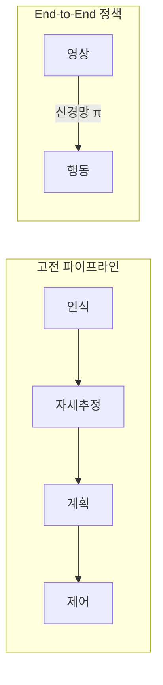
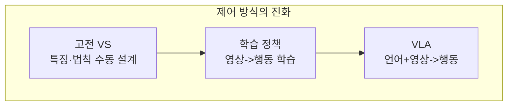

> 고전 Visual Servoing은 특징과 제어 법칙을 사람이 설계했다. 학습 기반 정책은 영상에서 행동까지를 하나의 신경망으로 학습한다. 이 로드맵의 마지막이자, 비전과 로보틱스가 완전히 융합되는 최전선이다.
---
## 1. 정의
**Visuomotor policy (시각-운동 정책)** 는 카메라 영상(관측)을 입력받아 로봇의 행동(관절 토크, 그리퍼 명령 등)을 직접 출력하는 학습된 함수다.
$$
\mathbf{a}_t = \pi_\theta(\mathbf{o}_t)
$$
$\mathbf{o}_t$ 는 시점 $t$ 의 관측(이미지 등), $\mathbf{a}_t$ 는 행동, $\pi_\theta$ 는 신경망 정책이다. 지각과 제어를 분리하지 않고 **end-to-end**로 학습한다.
**VLA (Vision-Language-Action) 모델**은 여기에 언어 명령까지 더해, "빨간 컵을 집어"라는 지시와 영상을 받아 행동을 생성하는 최신 패러다임이다.
## 2. 의미 — 왜 필요한가
고전 파이프라인은 인식 → 자세 추정 → 동작 계획 → 제어로 단계가 분리돼 있다(앞선 모든 Part). 각 단계가 독립적이라 오차가 누적되고, 단계 간 인터페이스를 사람이 설계해야 한다. End-to-end 학습은 이 전체를 하나로 최적화한다.

이 접근이 강력한 이유는 task에 최적화된 표현을 스스로 학습하기 때문이다. 사람이 "어떤 특징을 봐야 하는가"를 정하지 않아도, 정책이 과제 수행에 필요한 시각 단서를 데이터로부터 찾는다. 또 분리된 파이프라인이 놓치는 미묘한 시각-운동 협응(예: 부드러운 천 접기, 미끄러운 물체 잡기)을 학습으로 포착한다. 로봇 파운데이션 모델은 이 로드맵 전체(기하·인식·제어)를 흡수해 하나의 모델로 통합하려는 시도다.
## 3. 원리와 유도
### 3.1 학습 방식: 모방 vs 강화
두 갈래가 있다. 모방 학습(imitation learning)은 사람 시연 데이터에서 "이 관측에 이 행동"을 지도학습으로 따라 한다. 가장 단순한 형태가 행동 복제(behavior cloning)다.
$$
\min_\theta \sum_t \|\pi_\theta(\mathbf{o}_t) - \mathbf{a}_t^{\text{demo}}\|^2
$$
강화 학습(RL)은 보상을 통해 시행착오로 정책을 개선한다. 실제 로봇에서 RL은 비싸고 위험해, 시뮬레이션 학습 후 현실 전이(sim-to-real)를 자주 쓴다. 최근 주류는 대규모 시연 데이터 기반 모방 학습이다.
### 3.2 분포 이동 문제 (covariate shift)
행동 복제의 근본 난점이다. 학습 데이터는 전문가의 "좋은" 상태만 담는데, 실행 중 작은 오차로 본 적 없는 상태에 빠지면 정책이 더 큰 오차를 내며 발산한다. 한 번 궤도를 벗어나면 회복 데이터가 없어 복구를 못 한다. DAgger(전문가에게 교정 라벨을 추가로 받음) 같은 방법이나, 다음의 강건한 정책 표현으로 완화한다.
### 3.3 Diffusion Policy: 행동을 생성으로
최근 강력한 접근이다. 행동을 직접 회귀하는 대신, 노이즈에서 행동 시퀀스를 점진적으로 복원하는 확산 모델(diffusion)로 정책을 표현한다. 다봉(multimodal) 행동 분포(같은 상황에서 여러 올바른 행동)를 포착하고, 행동 시퀀스를 한꺼번에 예측해 부드럽고 일관된 동작을 낸다. 단일 행동 회귀가 평균으로 뭉개지는 문제를 해결한다.
### 3.4 VLA: 파운데이션 모델의 로보틱스 적용
대규모 비전-언어 모델(VLM)을 로봇 행동까지 확장한 것이 VLA다(RT-2, OpenVLA 등). 인터넷 규모로 사전학습된 시각-언어 이해 위에, 로봇 시연으로 행동 출력을 학습한다. 언어로 과제를 지시할 수 있고(자연어 일반화), 본 적 없는 물체·상황에도 사전학습 지식으로 대응하는 일반화가 강점이다. Part 4의 인식 모델이 행동까지 확장된 형태다.
## 4. 기하적 직관

진화의 흐름으로 보면 명확하다. 고전 Visual Servoing(이전 항목)은 "어떤 특징을 보고 어떻게 움직일지"를 사람이 수식으로 설계했다. 학습 정책은 그 설계를 데이터로 대체했다. VLA는 거기에 언어 이해와 대규모 사전지식을 더해, "빨간 컵 집어" 같은 추상 지시도 수행한다. 갈수록 사람의 수동 설계가 줄고 데이터·규모가 그 자리를 채운다.
## 5. 심화 — 최전선
- **RT-2, OpenVLA.** 웹 규모 VLM을 로봇 행동으로 파인튜닝. 자연어 지시와 미관측 물체 일반화를 보인다.
- **Diffusion Policy, ACT.** 행동 시퀀스를 생성 모델로 예측해 정밀 조작(천 접기, 조립)에서 강력하다.
- **로봇 파운데이션 모델.** 다양한 로봇·과제 데이터로 학습한 범용 정책(예: π0, RT-X). 한 모델로 여러 로봇·과제를 다루려는 시도. 이 로드맵의 기하·인식·제어가 하나로 수렴하는 지점.
## 6. 흔한 함정
- **※ 분포 이동.** 행동 복제는 본 적 없는 상태에서 발산한다. 충분한 데이터 다양성, 회복 시연, DAgger 등으로 완화.
- **※ 시뮬-현실 갭(sim-to-real).** 시뮬레이션에서 학습한 정책이 현실에서 실패한다. 도메인 무작위화(domain randomization)로 줄인다.
- **※ 데이터 비용.** 로봇 시연 데이터 수집이 비싸고 느리다. 대규모 정책의 가장 큰 병목.
- **※ 해석 불가능성.** end-to-end 정책은 왜 그 행동을 했는지 설명하기 어렵다. 안전이 중요한 응용에서 검증·디버깅이 까다롭다.
- **※ 기하 무시 오해.** 학습이 기하를 대체하는 게 아니다. 좌표 변환·투영·자세(Part 0~4)의 이해는 정책 설계·디버깅·평가에 여전히 필수다.
## 7. 핵심 개념 정리 (의사코드)
행동 복제 정책의 학습·실행 흐름이다(전체 구현은 매우 길어 핵심만 의사코드로).
```plain text
# Behavior Cloning 학습 (의사코드)
데이터: 전문가 시연 {(관측 o_t, 행동 a_t)}
정책 π_θ: 이미지 인코더(CNN/ViT) + 행동 디코더
반복:
    배치 {(o, a)} 샘플링
    예측 â = π_θ(o)
    손실 L = || â - a ||^2   (또는 확산 모델 손실)
    θ <- θ - lr * ∇L
실행 (로봇에서):
    매 스텝: o_t 관측 -> a_t = π_θ(o_t) -> 로봇 실행 -> 다음 관측
```
확산 정책은 마지막 손실을 "노이즈 예측 손실"로 바꾸고, 실행 시 노이즈에서 행동 시퀀스를 반복 복원하는 점만 다르다. 핵심 구조(관측 인코딩 → 행동 출력)는 동일하다.
## 8. 면접 예상 질문
**Q1. End-to-end visuomotor 학습이 고전 파이프라인보다 나은 점과 위험은?**
나은 점은 인식-계획-제어를 하나로 최적화해 단계별 오차 누적이 없고, 과제에 최적인 시각 표현을 스스로 학습하며, 미묘한 시각-운동 협응을 포착한다는 것이다. 위험은 분포 이동에 약하고, 데이터 비용이 크며, 해석이 어려워 안전 검증이 까다롭다는 점이다.
**Q2. 행동 복제의 분포 이동(covariate shift) 문제란?**
학습 데이터는 전문가의 좋은 상태만 담는데, 실행 중 작은 오차로 본 적 없는 상태에 빠지면 정책이 큰 오차를 내며 발산하고 회복 데이터가 없어 복구하지 못한다. DAgger(교정 라벨 추가), 데이터 다양성 증대, 강건한 정책 표현으로 완화한다.
**Q3. Diffusion Policy가 단순 행동 회귀보다 나은 점은?**
같은 상황에 여러 올바른 행동이 있는 다봉 분포를 포착한다. 단순 회귀는 여러 정답을 평균 내 뭉개버리지만, 확산 모델은 노이즈에서 행동을 생성해 다양한 모드를 표현한다. 또 행동 시퀀스를 한꺼번에 예측해 부드럽고 일관된 동작을 낸다.
**Q4. VLA 모델의 핵심 아이디어와 강점은?**
웹 규모로 사전학습한 비전-언어 모델에 로봇 시연을 더해 행동 출력까지 학습한 것이다. 자연어로 과제를 지시할 수 있고, 사전학습된 시각-언어 지식 덕분에 본 적 없는 물체·상황에도 일반화한다. Part 4의 인식 파운데이션 모델이 행동 영역으로 확장된 형태다.
## 9. 레퍼런스
- Levine et al., *End-to-End Training of Deep Visuomotor Policies* (2016) — [https://arxiv.org/abs/1504.00702](https://arxiv.org/abs/1504.00702)
- Chi et al., *Diffusion Policy* (2023) — [https://arxiv.org/abs/2303.04137](https://arxiv.org/abs/2303.04137)
- Brohan et al., *RT-2: Vision-Language-Action Models* (2023) — [https://arxiv.org/abs/2307.15818](https://arxiv.org/abs/2307.15818)
- Kim et al., *OpenVLA* (2024) — [https://arxiv.org/abs/2406.09246](https://arxiv.org/abs/2406.09246)
